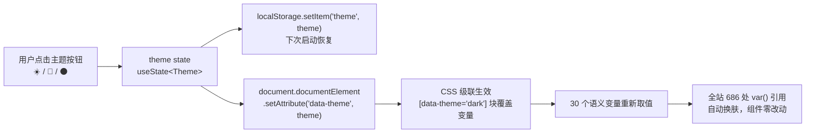
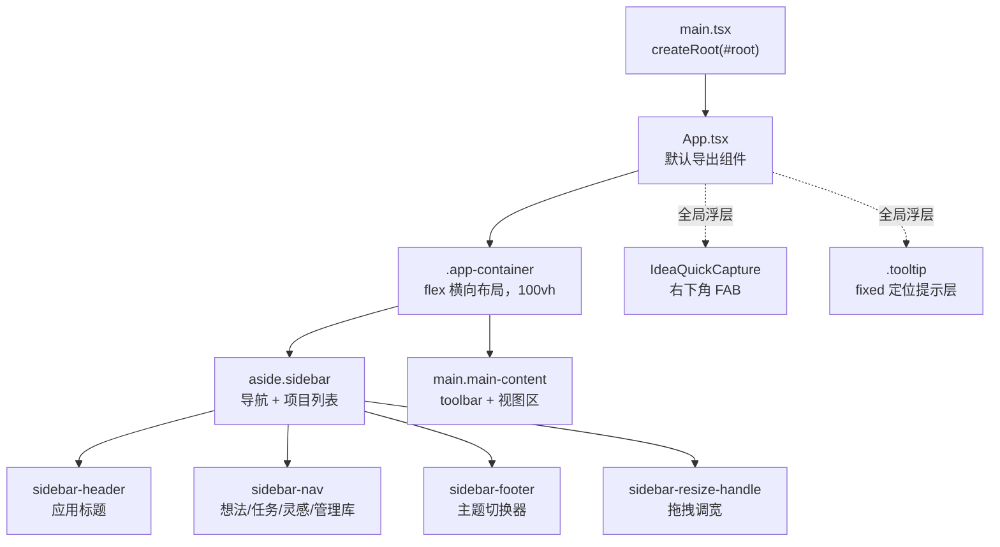

本页解析 super-cli Web 看板的**多主题换肤机制**与**全局 UI 体系**。你将理解一个初学者友好的核心设计：React 端只维护一个字符串状态并把它写到 `<html>` 的 `data-theme` 属性上，所有颜色、阴影、圆角的切换全部交由 CSS 自定义属性（CSS Variables）完成——不引入任何 UI 框架，也没有 styled-components 之类的 CSS-in-JS 方案。我们还会覆盖支撑所有页面的全局布局骨架、通用按钮类、全局浮层组件与状态持久化分工。

## 一、主题机制总览：一个属性，全线换肤

整套主题系统建立在一个简单的级联原理上：CSS 选择器 `[data-theme="dark"]` 可以命中 `<html data-theme="dark">`，并为其中的自定义属性重新赋值；而页面内所有组件的样式都写成 `color: var(--text-primary)` 这样的引用，因此**变量一变，全站外观随之更新**。React 在这条链路里只负责两件事：记录用户选了哪个主题（存入 `localStorage`），以及把主题名同步到 `<html>` 元素上。



主题类型的定义极其克制，只有三个字面量：`type Theme = 'light' | 'dark' | 'deep'`。组件状态在初始化时直接从 `localStorage` 读取上次的_choice_，读不到就回退到 `'light'`，保证首帧就是正确主题、不会闪一下默认样式。随后一个 `useEffect` 在主题变化时执行两个动作——`document.documentElement.setAttribute('data-theme', theme)` 与 `localStorage.setItem('theme', theme)`——完成 DOM 同步与持久化。

Sources: [App.tsx](src/web/src/App.tsx#L33-L33), [App.tsx](src/web/src/App.tsx#L121-L121), [App.tsx](src/web/src/App.tsx#L267-L270)

## 二、三套主题：同一组变量名，三套取值

三套主题全部定义在 [index.css](src/web/src/index.css) 的开头，各占一个 `[data-theme="…"]` 选择器块，**变量名完全一致、取值各不相同**。这是换肤机制的关键纪律：新增主题只需照抄一份键名清单再改色值，任何使用 `var()` 的组件无需感知。

| 主题 | `data-theme` 值 | 主背景 `--bg-primary` | 强调色 `--accent` | 设计倾向 |
|------|-----------------|----------------------|-------------------|----------|
| 亮色 | `light` | `#faf7f2`（暖米色） | `#b8860b`（暗金色） | 暖调纸质感，代码注释自述"参考截图的暖米色" |
| 暗色 | `dark` | `#1c1c1e`（中性深灰） | `#6ba0ff`（柔和蓝） | iOS 风格的灰阶体系 |
| 深色 | `deep` | `#1a1a2e`（深藏蓝） | `#4f8cff`（亮蓝） | 注释标注"original dark blue"，项目最初的深色方案 |

每个主题块定义 **30 个语义变量**，可分为六类。注意其中一组特殊的消息气泡变量（`--msg-user-bg` 等）专为会话阅读视图设计——用户消息与 AI 回复用不同底色和左边框区分，这个视觉规则在三套主题下都成立，只是色值不同。

| 变量类别 | 代表变量 | 作用 |
|----------|----------|------|
| 背景层 | `--bg-primary` / `--bg-secondary` / `--bg-card` / `--bg-sidebar` / `--bg-input` / `--bg-tooltip` | 从页面底色到卡片、输入框、提示层的分层底色 |
| 边框层 | `--border-color` / `--border-light` / `--border-active` | 常规分隔线、弱化线与激活态描边 |
| 文字层 | `--text-primary` / `--text-secondary` / `--text-muted` / `--text-tooltip` | 三级文字灰阶；工具提示文字与提示底色在主题内成对反转 |
| 强调色 | `--accent` / `--accent-light` / `--accent-bg` | 主操作色及其亮变体、浅底色 |
| 阴影 | `--shadow-sm` / `--shadow-md` / `--shadow-lg` | 三档投影，深色主题下透明度更高 |
| 圆角 | `--radius`(10px) / `--radius-sm`(6px) / `--radius-xs`(4px) | 统一的圆角刻度，三主题取值相同 |

Sources: [index.css](src/web/src/index.css#L7-L109), [index.css](src/web/src/index.css#L9-L41), [index.css](src/web/src/index.css#L44-L75), [index.css](src/web/src/index.css#L78-L109)

## 三、变量的消费规模与子系统扩展

这套变量并非只在少数几处使用——对整个样式表做统计，`var(--…)` 引用共出现 **686 次**，覆盖从布局到卡片再到徽章的所有视觉细节。消费最多的是语义灰阶与强调色，这也印证了"颜色全部来自变量"的设计约束确实被执行到位：

| 排名 | 变量 | 引用次数 | 排名 | 变量 | 引用次数 |
|------|------|---------|------|------|---------|
| 1 | `--text-muted` | 129 | 6 | `--radius-sm` | 46 |
| 2 | `--border-color` | 110 | 7 | `--bg-input` | 43 |
| 3 | `--accent` | 72 | 8 | `--bg-card` | 25 |
| 4 | `--text-primary` | 66 | 9 | `--radius-xs` | 23 |
| 5 | `--text-secondary` | 49 | 10 | `--bg-secondary` | 18 |

变量体系还支持**按子系统扩展**：微信看板板块在自己专属的 `[data-theme="light"]` / `[data-theme="dark"]` 规则里追加了 `--wx-warn` 警示色，各主题给出一档色值（亮色 `#9c6728`、暗色 `#d5a253`），配合 `color-mix()` 函数生成半透明底色。这说明变量清单是开放的——局部功能可以按同样的命名约定追加自己的主题化变量，而不破坏全局机制。

Sources: [index.css](src/web/src/index.css#L4211-L4212), [index.css](src/web/src/index.css#L3932-L3965)

## 四、主题之外：固定的设计令牌

并非所有颜色都随主题切换。与 8 家 CLI Provider 绑定的**品牌识别色**、Issue 看板的**状态色**与**优先级色**定义在 [constants.ts](src/web/src/constants.ts) 中，作为 TypeScript 常量直接内联到组件样式上。这类"令牌"刻意不进 CSS 变量体系——Provider 身份色与 Issue 状态色承载的是**语义信息**（"这是 Claude Code 的会话"、"这个任务被阻塞了"），若随主题变色反而会破坏辨识度。

| 令牌组 | 内容 | 示例 |
|--------|------|------|
| `PROVIDER_COLORS` | 8 家 Provider 各一个品牌色 | `claude-code: '#d97706'`、`qoder: '#7c3aed'`、`codex: '#059669'` |
| `PROVIDER_LABELS` | 两字母缩写徽章文案 | `CC` / `QD` / `CX` / `KM` / `PI` / `OC` / `WB` / `TC` |
| `ISSUE_COLUMNS` | 7 个看板列的标签与状态色 | 需求池灰 `#6b7280`、进行中蓝 `#3b82f6`、阻塞红 `#ef4444` |
| `ISSUE_PRIORITY_META` | 4 级优先级色 | 紧急红 `#ef4444`、高橙 `#f97316`、中蓝 `#3b82f6`、低灰 `#9ca3af` |

由此形成清晰的双轨制：**主题变量管"明暗氛围"，固定令牌管"语义识别"**，两者在各组件上叠加使用。

Sources: [constants.ts](src/web/src/constants.ts#L3-L40)

## 五、主题切换器：侧边栏底部的分段控件

切换器位于侧边栏底部（`.sidebar-footer`），是三个并排的 emoji 按钮——☀️ 亮色、🌙 暗色、🌑 深色——各自 `onClick` 直接调用 `setTheme(...)`。视觉上它是一个**分段控件**：容器用 `--bg-input` 做凹陷底、内部仅 2px 间距；未选中的按钮透明度压到 0.5，选中项恢复不透明并以 `--bg-card` 打底、附加小阴影，形成"拨杆"式的选中反馈。三个按钮的激活态样式完全由 CSS 类 `theme-btn active` 控制，与主题切换逻辑零耦合。

```tsx
<div className="theme-switcher">
  <button className={`theme-btn ${theme === 'light' ? 'active' : ''}`} onClick={() => setTheme('light')} title="亮色">☀️</button>
  <button className={`theme-btn ${theme === 'dark' ? 'active' : ''}`}  onClick={() => setTheme('dark')}  title="暗色">🌙</button>
  <button className={`theme-btn ${theme === 'deep' ? 'active' : ''} `} onClick={() => setTheme('deep')}  title="深色">🌑</button>
</div>
```

Sources: [App.tsx](src/web/src/App.tsx#L919-L925), [index.css](src/web/src/index.css#L215-L248)

## 六、全局 UI 骨架：一个单文件样式表与三层布局

整个前端**没有使用任何 CSS 框架或 CSS Modules**——全部样式集中在 [index.css](src/web/src/index.css) 一个文件里，共约 4564 行，靠 `/* ====== 分节注释 ====== */` 划分出 45+ 个区段（Layout、Sidebar、Toolbar、Board、Detail Panel、Responsive…）。这种"单文件 + 注释目录"的组织方式对初学者很友好：`grep "====== index.css"` 即可得到一张样式地图。样式的加载入口有两条：`main.tsx` 在挂载 React 根节点前引入它，`App.tsx` 也有一份 `import './index.css'`。



布局基座是 `body` 上的一次性全局设定：系统字体栈（`-apple-system` 优先，并显式包含 `PingFang SC` 等中文字体）、`overflow: hidden` 锁定页面滚动、`100vh` 撑满视口，滚动全部交给内部面板完成。`.app-container` 以 flex 横向排列侧边栏与主内容区，构成经典的双栏工作台。

Sources: [main.tsx](src/web/src/main.tsx#L1-L10), [index.css](src/web/src/index.css#L111-L142), [App.tsx](src/web/src/App.tsx#L31-L31), [App.tsx](src/web/src/App.tsx#L710-L713)

## 七、全局工具类：一套按钮家族

[index.css](src/web/src/index.css) 末尾定义了一组**跨页面复用的按钮工具类**，所有视图（任务看板、配置库、灵感等）直接引用，不再各自造按钮。它们全部基于主题变量取色，因此自动获得换肤能力；唯一的例外是危险按钮，红边红字使用固定色值以保持警示语义的稳定性。

| 类名 | 背景 | 边框/文字 | 典型用途 |
|------|------|-----------|----------|
| `.btn` | `var(--bg-secondary)` | `var(--border-color)` | 次级操作（取消、次要动作） |
| `.btn-primary` | `var(--accent)` + 白字 | 同 `--accent` | 主操作（保存、记录、确认） |
| `.btn-danger` | 透明 | 固定红 `#d64545` | 删除、归档等破坏性操作 |
| `.btn-sm` | `var(--bg-secondary)` | `var(--border-color)` | 紧凑场景的小号次级按钮 |

四个类共享统一的内边距、圆角（8px/6px）与 0.15s 过渡，hover 态分别采用描边加深、`filter: brightness(1.12)`、淡红底色三种策略，禁用态统一为半透明 + `not-allowed` 光标。

Sources: [index.css](src/web/src/index.css#L4416-L4450)

## 八、全局浮层与跨视图交互组件

除了按钮类，还有几个组件被设计为**应用级单例**，直接挂在 `App` 组件顶层，任何视图下都可用：

**想法速记 FAB**（`IdeaQuickCapture`）。右下角一个 48px 圆形浮动按钮（💡），点击展开一个 340px 宽的速记面板：`textarea` 自动聚焦，`⌘/Ctrl + Enter` 保存、`Escape` 关闭；保存成功后短暂显示"已记录 <编号>"并自动收起，同时派发 `super-cli:idea-captured` 自定义事件通知灵感页刷新。FAB 与面板均用 `position: fixed` 定位、`z-index: 1500` 置顶，保证浮在任何视图之上。

**工具提示层**（`.tooltip`）。一个 `position: fixed`、`pointer-events: none` 的浮层，特别之处在于它使用 `--bg-tooltip` / `--text-tooltip` 这对变量：亮色主题下是深底白字、暗色主题下反转为浅底深字——无论哪个主题都保证与页面底色形成强对比。

**全局滚动条**。三个 `::-webkit-scrollbar` 规则把滚动条统一为 6px 细条，轨道透明、滑块用 `var(--border-color)` 着色——这也是主题变量覆盖到的最"边角"的细节。

**侧边栏拖拽调宽**。侧边栏右缘有一条拖拽手柄，`mousedown` 后监听 document 级 `mousemove`，宽度被钳制在 180–400px 区间；`mouseup` 时把最终宽度写入 `localStorage('sidebar-width')`，下次启动从该值恢复（默认 240px）。

Sources: [App.tsx](src/web/src/App.tsx#L71-L118), [index.css](src/web/src/index.css#L4386-L4414), [index.css](src/web/src/index.css#L1652-L1674), [index.css](src/web/src/index.css#L3283-L3288), [App.tsx](src/web/src/App.tsx#L220-L223), [App.tsx](src/web/src/App.tsx#L615-L633)

## 九、状态持久化分工：URL 管分享，localStorage 管偏好

全局 UI 体系里一个值得学习的架构决策是**把"可分享上下文"与"个人视图偏好"分存两处**。`App` 组件内的注释明确写下这条规则：URL 只承载可分享的上下文，视图偏好放在 localStorage。落到实现上，`?mode=` / `?project=` / `?provider=` / `?session=` 四个参数驱动应用模式与选中对象（其中项目用 `p1`、`p2` 这类短 ID 保持链接简洁），而看板视图模式、排序方式、任务页签、分组开关、主题、侧边栏宽度等一律走 localStorage。

| 数据 | 存储位置 | 键名 / 参数 |
|------|----------|-------------|
| 应用模式（想法/任务/灵感/配置库/系统） | URL | `?mode=task` 等，初始化时解析 |
| 选中项目 / Provider 筛选 / 选中会话 | URL | `?project=p3` / `?provider=claude-code,codex` / `?session=…` |
| 主题 | localStorage | `theme` |
| 侧边栏宽度 | localStorage | `sidebar-width` |
| 视图模式 / 排序 / 任务页签 / 按日分组 | localStorage | `view-mode` / `sort-mode` / `task-tab` / `group-by-date` |

分工的理由：URL 里的状态要能粘贴给别人复现同一个界面，所以只放"看什么"；localStorage 里的状态是个体审美与习惯，换台电脑就不必一致，所以放"怎么看"。主题状态正是按这条规则归入后者的。

Sources: [App.tsx](src/web/src/App.tsx#L228-L252), [App.tsx](src/web/src/App.tsx#L125-L143)

## 十、侧边导航的折叠分组与响应式适配

侧边导航由两类条目构成："想法"与"任务"是平铺的顶级按钮；"灵感"与"管理库"是**可折叠分组**（`.nav-group`），组内再挂子项（如灵感组下的"个人微信看板"）。折叠状态用一个 `Set<string>`（`collapsedNav`）管理，初始折叠两组；交互上有两条细心规则——点击分组本体直接跳转到该分组对应视图并展开它，点右侧箭头（chevron）才做纯折叠切换，箭头图标用 `transform: rotate(-90deg)` 的 CSS 过渡表达折叠方向。

响应式方面，样式表设了**两个断点、三档布局**：

| 断点 | 侧边栏形态 | 其他调整 |
|------|-----------|----------|
| ≥ 1024px（桌面） | 常驻双栏，可拖拽调宽 | 细节面板与主区并排，带拖拽手柄 |
| 768–1023px（平板） | 变为 `position: fixed` 抽屉，默认 `translateX(-100%)` 藏在屏外，`.open` 时滑入并加投影 | 顶栏出现汉堡按钮；抽屉打开时全屏半透明遮罩（`sidebar-backdrop`）拦截点击；细节面板固定为 380px 右抽屉 |
| < 768px（手机） | 抽屉宽度锁为 280px | `.app-container` 转为纵向布局，MCP 表格隐去次要列 |

汉堡按钮、遮罩与抽屉动画都是纯 CSS 过渡实现，React 侧只维护一个 `sidebarOpen` 布尔值。

Sources: [App.tsx](src/web/src/App.tsx#L124-L124), [App.tsx](src/web/src/App.tsx#L727-L749), [index.css](src/web/src/index.css#L4315-L4339), [index.css](src/web/src/index.css#L2612-L2683), [index.css](src/web/src/index.css#L2685-L2700), [App.tsx](src/web/src/App.tsx#L713-L713), [App.tsx](src/web/src/App.tsx#L927-L928)

## 小结：这套体系值得带走的三个设计模式

回顾全篇，super-cli 的前端样式架构可以浓缩为三个可迁移的模式。其一，**单属性换肤**：React 与视觉的唯一耦合点是 `data-theme` 属性，三套主题 30 个变量对齐命名，新增主题零组件改动；其二，**双轨令牌**：氛围色走 CSS 变量随主题变，语义色（Provider 品牌、Issue 状态）走 TS 常量保持恒定；其三，**存储二分**：URL 存可分享上下文、localStorage 存个人偏好，主题属于后者。配合单文件 CSS 的分节注释目录、四件套按钮工具类和 fixed 定位的全局浮层，这个没有引入任何 UI 框架的前端依然做到了视觉一致与主题完备。

若想继续深入，建议按以下路径阅读：先回到前端总纲 [React 应用架构：单页路由与视图组织](22-react-ying-yong-jia-gou-dan-ye-lu-you-yu-shi-tu-zu-zhi) 了解 `App` 之外还有哪些视图，再看上一篇 [项目文件浏览器：按需加载、语法高亮与 Markdown 渲染](25-xiang-mu-wen-jian-liu-lan-qi-an-xu-jia-zai-yu-fa-gao-liang-yu-markdown-xuan-ran) 体会详情面板如何复用本页的全局骨架，随后进入配置章节 [Harness 配置读取：MCP、Rules、Hooks 与 Permissions](27-harness-pei-zhi-du-qu-mcp-rules-hooks-yu-permissions) 开始探索"管理库"视图背后的数据层。