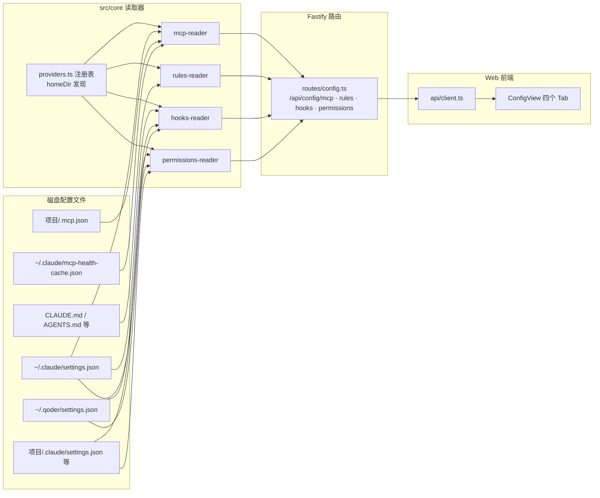
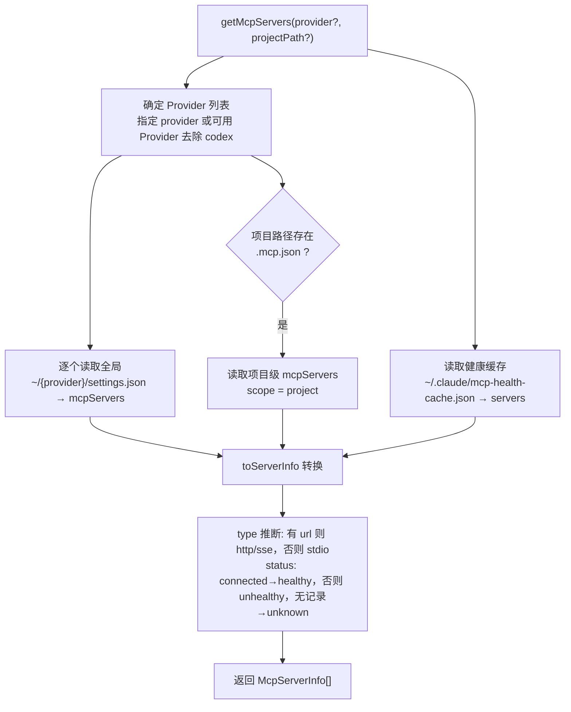

每个 AI CLI 工具（本文称之为 **Harness**）都会在自己的家目录与项目目录中维护一套配置：MCP 服务器、规则文件、Hooks 钩子与权限策略。这些配置散落在 `~/.claude`、`~/.qoder` 等不同位置，格式与作用域规则各异。super-cli 在 `src/core/` 中实现了四个专职读取器——`mcp-reader`、`rules-reader`、`hooks-reader`、`permissions-reader`——将它们统一为一套"双作用域（global / project）+ 多 Provider 聚合"的读取与（部分）写入接口，再通过 Fastify 路由暴露给 Web 看板的配置视图。本文按"注册表基石 → 四个读取器 → HTTP API → 前端消费"的顺序逐层拆解。

## 统一配置读取层的定位

这四个读取器共享同一个架构心智模型：以 Provider 注册表为发现机制，以"全局作用域 + 项目作用域"为统一的坐标系统，向下游输出结构化对象。MCP 与 Rules 是**可读写**的（Web 界面可以直接增删改），而 Hooks 与 Permissions 是**只读**的（仅解析展示）。整个子系统没有任何缓存或索引——每次请求都直接读磁盘文件，这与其"配置查看器"的低频访问特征相匹配。

Sources: [mcp-reader.ts](src/core/mcp-reader.ts#L1-L137), [routes/config.ts](src/server/routes/config.ts#L7-L10)

## 基石：Provider 注册表与可用性探测

四个读取器都依赖 `providers.ts` 提供的两个函数：`getAvailableProviders()` 返回**家目录真实存在**的 Provider 列表（`PROVIDER_CONFIGS.filter(p => existsSync(p.homeDir))`），`getProviderHome()` 把 Provider ID 解析为家目录绝对路径。这是一种巧妙的零配置探测：只要某个 Harness 安装过（家目录存在），它就自动进入扫描范围；反之未安装的 Harness 不会产生任何读取噪音。

| Provider | 家目录 | 命令 | 备注 |
|---|---|---|---|
| claude-code | `~/.claude` | `claude` | 额外承载 MCP 健康缓存 |
| qoder | `~/.qoder` | `qodercli` | 全局规则读 `AGENTS.md` |
| codex | `~/.codex` | `codex` | **被 MCP/Hooks/Permissions 读取器显式排除** |
| kimi / pi / opencode / workbuddy / traecode | `~/.kimi` 等 | 各自命令 | 仅参与 Session 索引，不在本文四读取器范围 |

值得注意的是排除逻辑的语义：MCP、Hooks、Permissions 三个读取器在扫描全部 Provider 时都会执行 `.filter(p => p.id !== 'codex')`——因为 Codex CLI 不使用 `settings.json` 这一 JSON 配置约定，其配置格式（TOML）无法被这套解析器处理。

Sources: [providers.ts](src/core/providers.ts#L29-L111), [providers.ts](src/core/providers.ts#L119-L121), [mcp-reader.ts](src/core/mcp-reader.ts#L81-L83), [hooks-reader.ts](src/core/hooks-reader.ts#L61-L63), [permissions-reader.ts](src/core/permissions-reader.ts#L24-L26)

## MCP 读取器：双作用域聚合与健康状态融合

`mcp-reader.ts` 是四个读取器中功能最完整的：既有读取也有完整的增删改与跨 Provider 复制。读取遵循两条固定路径——**全局作用域**从每个 Provider 的 `<homeDir>/settings.json` 中提取 `mcpServers` 键；**项目作用域**从项目的 `.mcp.json` 文件中提取同名键（`.mcp.json` 是 Claude Code 发起的项目级 MCP 约定，因此项目作用域的归属 Provider 被硬编码为 `provider ?? 'claude-code'`）。

类型推断与状态融合发生在 `toServerInfo` 中：当配置含 `url` 字段时，按 `type === 'sse'` 判定为 `sse` 或默认 `http`，否则判定为 `stdio`；健康状态则从 Claude Code 家目录下的 `mcp-health-cache.json` 的 `servers` 映射中查表——命中且 `status === 'connected'` 记为 `healthy`，命中但非 connected 记为 `unhealthy`，未命中记为 `unknown`。也就是说，健康信息当前**只来源于 Claude Code 的缓存**，其他 Provider 的 MCP 服务器一律显示 `unknown`。

写入路径由四个导出函数构成：`addMcpServer` / `updateMcpServer`（两者等价，都是"读取-合并-整体覆写"）、`deleteMcpServer`，以及 `copyMcpServer`（从源 Provider 的全局 `mcpServers` 取出单个条目写入目标 Provider）。传递 `projectPath` 时写入项目级 `.mcp.json`，否则写入全局 `settings.json`；特别注意 `copyMcpServer` 只处理**全局作用域**的复制。所有写操作都采用"读出整个 `mcpServers` 对象 → 修改 → 以两空格缩进重新序列化写回"的策略，保留文件中其他顶层键不受影响。

Sources: [mcp-reader.ts](src/core/mcp-reader.ts#L18-L30), [mcp-reader.ts](src/core/mcp-reader.ts#L56-L75), [mcp-reader.ts](src/core/mcp-reader.ts#L77-L101), [mcp-reader.ts](src/core/mcp-reader.ts#L103-L136), [types.ts](src/core/types.ts#L344-L355)

## Rules 读取器：从固定约定到启发式扫描

`rules-reader.ts` 处理的是 Markdown 规则文件，其全局与项目作用域的策略截然不同。**全局作用域**使用白名单式的硬编码规格：仅当 `claude-code` 可用时登记其家目录下的 `CLAUDE.md`，仅当 `qoder` 可用时登记其家目录下的 `AGENTS.md`，其余 Provider 没有全局规则文件约定。

**项目作用域**则采用"已知名单 + 目录扫描"的两段式启发：先检查四个已知规则文件名（`CLAUDE.md`、`AGENTS.md`、`.cursorrules`、`.github/copilot-instructions.md`），再扫描项目根目录下**其余所有 `.md` 文件**——显式排除 `README.md` 以避免把项目说明文档误判为规则。每条规则文件用 `provider:scope:文件名` 三段式构造唯一 ID，并记录 `exists` 标志（全局文件允许"登记但不存在"，前端据此显示占位；项目扫描出的文件必然存在）。

内容层面的读写由 `getRuleContent` / `saveRuleContent` 承担：前者对不存在的路径返回空字符串，后者在写入前用 `mkdir(dir, { recursive: true })` 确保父目录存在。这两个函数直接接收**绝对路径**参数，路由层原样透传——这是本地单用户工具的取舍：路径信任完全交给了调用方。

| 作用域 | 来源 | 存在性语义 |
|---|---|---|
| global | `~/.claude/CLAUDE.md`、`~/.qoder/AGENTS.md` | 登记即列出，`exists` 可为 false |
| project | 四个已知规则名 + 根目录其余 `.md`（排除 README.md） | 扫描命中，`exists` 恒为 true |

Sources: [rules-reader.ts](src/core/rules-reader.ts#L14-L30), [rules-reader.ts](src/core/rules-reader.ts#L32-L52), [rules-reader.ts](src/core/rules-reader.ts#L54-L97), [types.ts](src/core/types.ts#L357-L364)

## Hooks 读取器：三级结构的解析

`hooks-reader.ts` 定义了四个读取器中最丰富的自有类型体系：`HookEventGroup`（事件 → 匹配器数组）→ `HookMatcher`（匹配器 → 钩子数组）→ `HookEntry`（单条钩子的 `type`/`command`/`url`/`tool`/`timeout`）。这正好对应 Harness 原生 `settings.json` 中 `hooks` 键的三级嵌套结构。解析器 `parseHooksObject` 做了防御性归一化：匹配器缺失时补默认值 `'*'`，钩子类型缺失时补 `'command'`，非数组结构直接跳过。

作用域解析与 MCP 读取器同构：全局扫描每个可用 Provider（除 codex）家目录的 `settings.json`；项目作用域则把 Provider ID 映射为项目内的隐藏目录——`claude-code → .claude`、`qoder → .qoder`、其余一律回退到 `.codex`（由于 codex 已被过滤，这个回退分支在实践中只对未实现项目级配置的 Provider 生效，属于保守的兜底写法）。只有当文件存在**且**含有非空 `hooks` 键时，才会产出一条带 `configPath` 溯源信息的 `HooksConfig`。该模块没有任何写函数，是纯只读视图。

Sources: [hooks-reader.ts](src/core/hooks-reader.ts#L7-L30), [hooks-reader.ts](src/core/hooks-reader.ts#L38-L57), [hooks-reader.ts](src/core/hooks-reader.ts#L59-L95)

## Permissions 读取器：allow / deny / additionalDirectories

`permissions-reader.ts` 是四者中最精简的（63 行），它读取 `settings.json` 中的 `permissions` 键并抽取三个字段：`allow` 与 `deny` 两个规则数组（非数组时归一化为空数组），以及可选的 `additionalDirectories`。作用域解析逻辑与 Hooks 读取器**逐行同构**——同样的全局 `settings.json` 扫描、同样的 `.claude / .qoder / .codex` 项目目录映射、同样的"有 `permissions` 键才产出条目"的稀疏输出策略，同样只读。`PermissionsConfig` 中的 `configPath` 字段记录了每条配置的来源文件，使前端可以标注"这条 allow 规则来自全局还是项目"。

Sources: [permissions-reader.ts](src/core/permissions-reader.ts#L7-L14), [permissions-reader.ts](src/core/permissions-reader.ts#L22-L62)

## HTTP API 与前端消费

四个读取器全部经由 `src/server/routes/config.ts` 注册的路由暴露，统一支持两个查询参数：`provider`（限定单一 Provider）与 `project`（附加项目作用域扫描）。Hooks 与 Permissions 只有 GET；Rules 多一对内容读写端点；MCP 拥有完整的 CRUD 加复制端点，形成四者中最重的 API 面。

| 端点 | 方法 | 读取器函数 | 能力 |
|---|---|---|---|
| `/api/config/mcp` | GET | `getMcpServers` | 聚合列出（含健康状态） |
| `/api/config/mcp/:provider` | POST | `addMcpServer` | 新增（全局或项目） |
| `/api/config/mcp/:provider/:id` | PUT / DELETE | `updateMcpServer` / `deleteMcpServer` | 更新 / 删除 |
| `/api/config/mcp/copy` | POST | `copyMcpServer` | 跨 Provider 复制（仅全局） |
| `/api/config/rules` | GET | `getRuleFiles` | 列出规则文件 |
| `/api/config/rules/content` | GET / PUT | `getRuleContent` / `saveRuleContent` | 按**绝对路径**读写内容 |
| `/api/config/hooks` | GET | `getHooks` | 只读列出 |
| `/api/config/permissions` | GET | `getPermissions` | 只读列出 |

前端侧，`src/web/src/api/client.ts` 为每个端点提供了对应的封装函数（`fetchMcpServers`、`fetchRules`、`fetchHooks`、`fetchPermissions` 等），`ConfigView.tsx` 用一个 `ConfigTab` 联合类型（`'skills' | 'mcp' | 'rules' | 'hooks' | 'permissions' | 'agents'`）驱动六个配置 Tab 的切换，本文的四个读取器正好对应其中四个 Tab。MCP Tab 是唯一具备完整编辑能力的视图——支持新增、更新、删除与跨 Provider 复制；Rules Tab 提供内联编辑器；Hooks 与 Permissions Tab 仅做结构化展示。

Sources: [routes/config.ts](src/server/routes/config.ts#L211-L288), [routes/config.ts](src/server/routes/config.ts#L257-L269), [client.ts](src/web/src/api/client.ts#L146-L226), [ConfigView.tsx](src/web/src/ConfigView.tsx#L12-L123)

## 四个读取器的设计共性

把四个模块并置观察，可以提炼出一组清晰的设计决策，它们共同构成了"Harness 配置读取"这一子系统的边界：

| 维度 | mcp-reader | rules-reader | hooks-reader | permissions-reader |
|---|---|---|---|---|
| 配置载体 | `settings.json` + `.mcp.json` | Markdown 约定文件 | `settings.json` 的 `hooks` 键 | `settings.json` 的 `permissions` 键 |
| 全局作用域 | 各 Provider `settings.json` | 仅 claude-code / qoder | 同左 | 同左 |
| 项目作用域 | 项目 `.mcp.json` | 已知名单 + 根目录 `.md` 扫描 | 项目内 `.claude`/`.qoder`/`settings.json` | 同 hooks |
| 读 | ✅ | ✅ | ✅ | ✅ |
| 写 | ✅ 增删改 + 跨 Provider 复制 | ✅ 内容读写 | ❌ | ❌ |
| 排除 codex | ✅ | ❌（按白名单登记） | ✅ | ✅ |
| 输出类型 | `McpServerInfo`（含健康状态） | `RuleFile` | `HooksConfig` | `PermissionsConfig` |

三个共性贯穿始终。**其一是"读时直读"**：没有任何缓存层，每次 API 调用都触发真实的文件系统读取，配置文件的修改即时可见。**其二是"稀疏产出"**：文件不存在或目标键缺失时静默跳过而非报错，读取器永远返回"当前真实存在的配置"快照。**其三是"溯源内嵌"**：每条输出都携带 `provider`、`scope`、`configPath` 等元数据，让 UI 无需二次推断即可标注数据来源。另外值得一提的是，与 `agents.json` 查看路由会做环境变量脱敏（`redactAgentEnv`）不同，MCP 服务器的 `env` 字段是**原样透传**的——本地工具的信任边界划定在"本机用户"这一层。

Sources: [routes/config.ts](src/server/routes/config.ts#L16-L28), [mcp-reader.ts](src/core/mcp-reader.ts#L63-L74)

## 延伸阅读

理解了这套读取器之后，建议沿以下路径继续深入：`providers.ts` 注册表的完整设计（包括 Session 存储布局与启动参数）在 [多 Provider 抽象：注册表设计与 8 家 CLI 工具适配](7-duo-provider-chou-xiang-zhu-ce-biao-she-ji-yu-8-jia-cli-gong-ju-gua-pei) 中展开；与本文同属"配置体系"但管理 super-cli 自身持久化状态的 `ConfigManager` 在 [用户配置系统与使用统计输出](28-yong-hu-pei-zhi-xi-tong-yu-shi-yong-tong-ji-shu-chu) 中解析；同页面的 Skills Tab 背后的跨 Provider Skill 安装机制见 [super-cli-taskboard Skill 的分发与跨 Provider 安装](17-super-cli-taskboard-skill-de-fen-fa-yu-kua-provider-an-zhuang)；而消费这些 API 的前端视图组织方式，可参考 [React 应用架构：单页路由与视图组织](22-react-ying-yong-jia-gou-dan-ye-lu-you-yu-shi-tu-zu-zhi)。