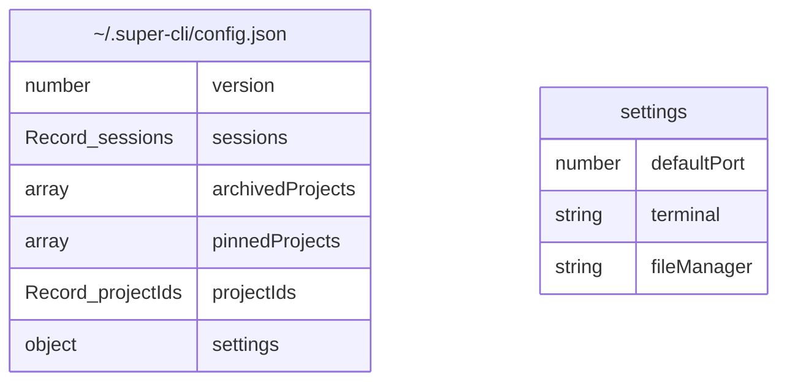
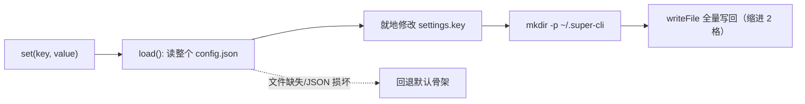
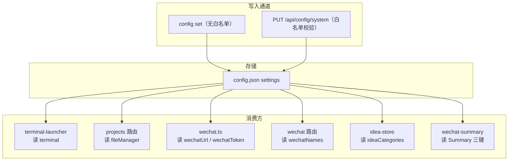
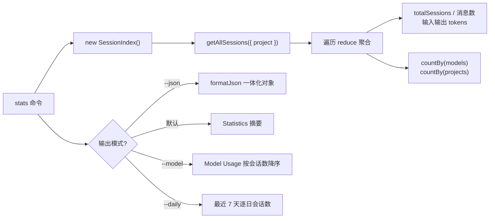

每个 CLI 工具都需要回答两个问题：**"用户偏好怎么存"** 与 **"用过多少"**。本页聚焦 super-cli 自身的答案：一套以 `~/.super-cli/config.json` 为单一存储的用户配置系统，以及一个把 Session 索引聚合为使用统计的 `stats` 命令。配置系统采用"极简核心 + 白名单校验"的双层设计——核心只有一个 42 行的 `ConfigManager` 类，所有类型安全和输入校验都由消费方与 Web API 承担。统计输出则完全复用 Session 索引引擎，不引入任何新数据源。读完本页，你将理解配置文件的数据模型、读写路径、全部 settings 键的流向，以及统计数字是如何计算出来的。注意区分：读取各 AI 工具自身的 MCP/Rules/Hooks 配置属于 Harness 配置范畴，详见 [Harness 配置读取：MCP、Rules、Hooks 与 Permissions](27-harness-pei-zhi-du-qu-mcp-rules-hooks-yu-permissions)。

Sources: [config.ts](src/core/config.ts#L1-L42)

## 一、数据模型：AppConfig 与配置文件位置

配置文件的位置由 [paths.ts](src/core/paths.ts#L37-L43) 统一约定：`getSuperCliHome()` 返回 `~/.super-cli`，`getSuperCliConfigPath()` 在其下拼接 `config.json`。这个目录还承载其他持久化数据（`issues.json`、`ideas.json`、`agents.json`、`runs/`），它们与 config.json 并列共存，构成 super-cli 的全部用户态数据。

配置文件的整体结构由 `AppConfig` 接口定义，包含三个层次：**元信息**（`version`）、**项目相关状态**（`sessions` 会话标签、`archivedProjects` 归档、`pinnedProjects` 置顶、`projectIds` 短 ID 映射）、以及**用户设置**（`settings`）。本页的核心是 `settings` 对象——类型声明中它只有三个键：`defaultPort`、`terminal`、`fileManager`。这是一个值得记住的细节，后文会看到类型声明与实际 schema 之间的落差。

Sources: [paths.ts](src/core/paths.ts#L37-L43), [types.ts](src/core/types.ts#L252-L265)

## 二、ConfigManager：42 行的极简存取层

`ConfigManager` 的设计哲学是**零缓存、全量读写、静默容错**。`load()` 方法尝试读取并解析配置文件，任何失败（文件不存在、JSON 损坏）都回退到一个默认骨架 `{ version: 1, sessions: {}, settings: {} }`——这意味着损坏的配置永远不会让命令崩溃，只会"丢失"设置回到出厂状态。`set()` 的写入流程体现了防御式编程：先读出完整配置，就地修改单个键，然后 `mkdir` 确保目录存在（首次使用时 `~/.super-cli` 可能还不存在），最后以两空格缩进格式化写回整个 JSON。

需要注意的是，每次 `get`、`set`、`getAll` 都会触发一次完整的文件读取，没有任何内存缓存。对于配置这种低频访问场景，这个取舍用微小的性能代价换来了**无过期状态**的正确性——多个进程（CLI 命令、Web 服务）并发使用时，读到的一定是磁盘上的最新值。

Sources: [config.ts](src/core/config.ts#L12-L31)

## 三、CLI config 命令：四件套 show / set / get / path

CLI 侧通过 `registerConfigCommand` 暴露四个子命令，在 [cli/index.ts](src/cli/index.ts#L34) 中与 `stats` 等命令一同注册。`set` 命令有一个对新手友好的细节：参数值会先尝试 `JSON.parse`，成功则存入解析后的类型（数字、布尔、嵌套 JSON），失败则原样存为字符串——所以 `config set defaultPort 3300` 存的是数字 `3300` 而非字符串 `"3300"`。

| 子命令 | 参数 | 行为 | 输出特点 |
|---|---|---|---|
| `config show` | `--json` 可选 | 列出全部 settings | 人读模式带 Path 前缀与 cyan 键名；`--json` 走 `formatJson` |
| `config set <key> <value>` | 两个位置参数 | JSON.parse 优先，失败存字符串 | 绿色确认 `Set key = value` |
| `config get <key>` | 一个位置参数 | 读取单个键 | `JSON.stringify` 输出；未设置时显示暗色 `(not set)` |
| `config path` | 无 | 仅打印配置文件路径 | 纯路径，便于脚本拼接 |

注意 CLI 的 `set` **没有任何键名白名单**——你可以写入任意键值（这正是 wechat 系列设置通过 Web UI 或手工 CLI 写入的通道之一），校验职责完全移交给了 Web API 侧。

Sources: [config.ts](src/cli/commands/config.ts#L6-L56), [output.ts](src/cli/output.ts#L9-L11)

## 四、settings 键全景：白名单校验与消费方

配置的"权威校验层"位于 Web 路由 `PUT /api/config/system`：它维护一张**白名单验证表**，只有表内的键才能写入，且每个键都有独立的值校验器（类型、长度、枚举范围）。`terminal` 键的合法值严格对应 [TerminalType](src/core/types.ts#L3-L3) 联合类型的五个成员：ghostty、iterm2、terminal、kitty、warp。未知键返回 `UNKNOWN_SETTING`，值不合法返回 `INVALID_SETTING`，均为 400 错误。

| settings 键 | 校验规则 | 消费方 | 缺省/回退行为 |
|---|---|---|---|
| `defaultPort` | 数字且 0 < v < 65536 | **无运行时读取点** | 类型中声明，仓库内暂无消费 |
| `terminal` | 五个 TerminalType 枚举之一 | `terminal-launcher.ts` 交互式启动终端 | 非法值回退 `'terminal'`（macOS Terminal.app） |
| `fileManager` | 字符串，长度 ≤ 100 | Web 路由"在文件管理器打开项目" | 空 = 系统默认（mac `open` / win `explorer` / linux `xdg-open`） |
| `wechatUrl` | 字符串，长度 ≤ 200 | `WechatClient.fromConfig()` | 回退 `DEFAULT_BASE_URL` |
| `wechatToken` | 字符串，长度 ≤ 200 | `WechatClient.fromConfig()` 的 Bearer Token | 空 = 不带 Authorization 头 |
| `wechatNames` | 字符串，长度 ≤ 500 | 微信路由的 @-mention 识别 | 按逗号分割并 trim，空则无识别名单 |
| `ideaCategories` | 数组 ≤ 20 项，每项含 string 类 key/label 且 project 以 `/` 开头 | `idea-store` 的分类下拉 | 结构非法回退 `DEFAULT_IDEA_CATEGORIES` |
| `wechatSummaryPrompt/Runtime/Model` | **不在白名单内**（只能经 CLI 或手写文件配置） | `getSummaryConfig()` | prompt 回退内置默认，runtime 回退 `'pi'` |

三个值得注意的**防御式回退**模式：`terminal-launcher` 用 `isValidTerminal` 过滤后再默认（[terminal-launcher.ts](src/core/terminal-launcher.ts#L102-L107)）；`idea-store` 对 `ideaCategories` 逐项校验结构，任何一项不合格就整体放弃回退内置分类（[idea-store.ts](src/core/idea-store.ts#L100-L115)）；`wechat-summary` 用 `SUMMARY_RUNTIMES.some(...)` 确认 runtime 是可识别的运行时 ID（[wechat-summary.ts](src/core/wechat-summary.ts#L40-L51)）。它们的共同点是：**不信任配置文件的内容**，因为 CLI `set` 通道允许写入任意值。

关于类型与现实的落差，有两点对理解代码有帮助。其一，`AppConfig.settings` 类型只声明了 3 个键，但白名单实际接受 8 个，wechat/idea 系列消费方都是通过 `(config.settings ?? {}) as Record<string, unknown>` 这种类型断言绕过声明来读取的——`settings` 实质是一个**宽松 schema 的键值袋**，类型声明只是"最核心三键"的文档化快照。其二，`defaultPort` 是唯一一个"可写不可读"的键：白名单放行、类型声明存在，但整个仓库没有读取它的代码，属于预留字段。

Sources: [routes/config.ts](src/server/routes/config.ts#L139-L171), [wechat.ts](src/core/wechat.ts#L198-L207), [routes/wechat.ts](src/server/routes/wechat.ts#L150-L153), [projects.ts](src/server/routes/projects.ts#L155-L166)

## 五、Web 端配置 API 与数据文件查看器

`server/routes/config.ts` 中注册的 `GET /api/config/system` 是 Web 设置页的数据来源，返回值远不止 settings 本身，而是一次打包了**配置全貌**：settings 对象、配置文件路径、`~/.super-cli` 主目录路径、五个数据文件的存在性与字节数（`config.json`、`issues.json`、`ideas.json`、`agents.json`、`runs`）、全部会话标签、归档/置顶项目列表、以及运行平台。其中数据文件大小通过递归的 `pathSize` 函数计算，`runs` 作为目录会累加其下所有文件。

配套的 `GET /api/config/system/files/:name` 允许浏览器直接查看数据文件内容，但有三道安全闸门：**白名单**——只放行四个固定文件名，其余返回 404；**脱敏**——`agents.json` 中的 agent 环境变量在返回前被 `redactAgentEnv` 替换为 `***`，防止 API 密钥经查看器泄露；**文件名校验**——`runs` 目录下的文件必须匹配 `/^[\w-]+\.json$/` 正则，杜绝路径穿越。另有 `POST /api/config/system/reveal` 调用系统 `open` 命令在 Finder 中直接展示配置目录。

Sources: [routes/config.ts](src/server/routes/config.ts#L48-L137), [routes/config.ts](src/server/routes/config.ts#L17-L28)

## 六、stats 命令：从 Session 索引到统计输出

`stats` 命令的实现思路可以概括为一句话：**从 Session 索引取全部会话元数据，reduce 聚合，双模式输出**。它不读取任何新数据——每一条统计数字都来自 `SessionMetadata` 中已有的字段：`userMessageCount`、`assistantMessageCount`、`totalInputTokens`、`totalOutputTokens`、`models[]`、`lastTimestamp`。数据获取经由 `new SessionIndex().getAllSessions({ project })`，`-p/--project` 选项被索引层转换为对 `session.project` 的子串过滤（大小写不敏感）。Session 索引本身的构建、TTL 缓存与失效机制是独立主题，详见 [Session 索引引擎：TTL 缓存、mtime 失效与后台预热](8-session-suo-yin-yin-qing-ttl-huan-cun-mtime-shi-xiao-yu-hou-tai-yu-re)。

聚合逻辑是一组平铺的 `reduce`：四个总量指标直接对全部会话求和；`models` 用 `flatMap` 摊平所有会话的模型数组后按出现次数计数——注意这里统计的是**"会话用过该模型的次数"**而非调用次数；`projects` 同理按会话的项目路径计数。

| 选项 | 作用 | 输出位置 |
|---|---|---|
| （无选项） | 基础摘要：会话数、用户/助手消息数、输入/输出 tokens | `Statistics` 区块，tokens 经 `toLocaleString` 千分位格式化 |
| `-p, --project <path>` | 按项目路径子串过滤 | 影响所有统计范围 |
| `--model` | 模型使用分布 | 追加 `Model Usage` 区块，按会话数降序 |
| `--daily` | 最近活动趋势 | 追加 `Recent Activity` 区块，仅展示最近 7 天 |
| `--json` | 机器可读输出 | 输出包含上述全部聚合值的单个 JSON 对象 |

`--daily` 的实现是一个独立的 `getDailyBreakdown` 纯函数：跳过没有 `lastTimestamp` 的会话，取时间戳前 10 位（`YYYY-MM-DD`）作为日期键，用 `Map` 累加会话数，最后按日期字符串字典序排序——因为 ISO 日期的字典序就是时间序，所以无需真正解析日期。排序结果调用 `slice(-7)` 只保留最近 7 天。

Sources: [stats.ts](src/cli/commands/stats.ts#L6-L73), [session-index.ts](src/core/session-index.ts#L154-L166), [types.ts](src/core/types.ts#L55-L76)

## 七、设计观察与延伸阅读

把配置与统计两条线放在一起看，super-cli 体现了一种一致的小工具哲学：**核心层做最少的事，把复杂度推向边界**。`ConfigManager` 不做校验、不做缓存、不做锁——校验交给 Web 白名单，正确性交给消费方回退，并发安全则默认为低频场景可接受（Issue 看板那边采用了完全不同的乐观锁策略，对比阅读 [乐观锁机制：version 字段与多 Agent 并发写安全](13-le-guan-suo-ji-zhi-version-zi-duan-yu-duo-agent-bing-fa-xie-suo-an-quan) 会很有启发）。`stats` 命令不建新数据源、不做增量统计——一切依赖 Session 索引的现成元数据，一行 reduce 解决战斗。对新手而言，这两处代码（[config.ts](src/core/config.ts#L1-L42) 与 [stats.ts](src/cli/commands/stats.ts#L1-L74)）加起来不到 120 行，是理解整个项目"边界清晰、职责单一"风格的最佳入门样本。

如果你想把本页知识延伸到具体场景，建议按以下路径继续：想理解 `terminal` 设置如何驱动真实的终端启动流程，请阅读 [交互式启动与 macOS 终端集成（Ghostty / iTerm2 / Warp 等）](20-jiao-hu-shi-qi-dong-yu-macos-zhong-duan-ji-cheng-ghostty-iterm2-warp-deng)；想了解 `ideaCategories` 在 Idea 捕获中的角色，请阅读 [Idea 到 Task 的转化管线：捕获、分类与 promote](21-idea-dao-task-de-zhuan-hua-guan-xian-bu-huo-fen-lei-yu-promote)；wechat 系列设置的完整应用场景在 [微信看板集成：wx-cli 时间线聚合与日报生成](29-wei-xin-kan-ban-ji-cheng-wx-cli-shi-jian-xian-ju-he-yu-ri-bao-sheng-cheng)；而 `stats` 所依赖的底层索引机制与解析细节分别在 [Session 索引引擎：TTL 缓存、mtime 失效与后台预热](8-session-suo-yin-yin-qing-ttl-huan-cun-mtime-shi-xiao-yu-hou-tai-yu-re) 与 [异构 Session 文件解析：JSONL 流式读取与格式差异](9-yi-gou-session-wen-jian-jie-xi-jsonl-liu-shi-du-qu-yu-ge-shi-chai-yi) 中展开。