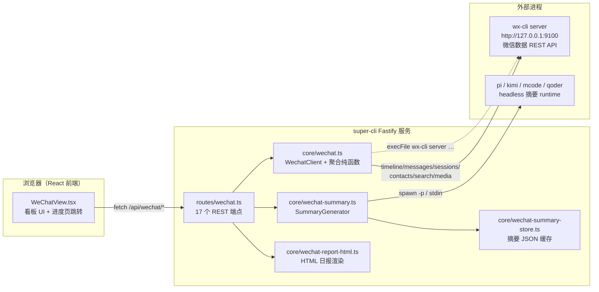
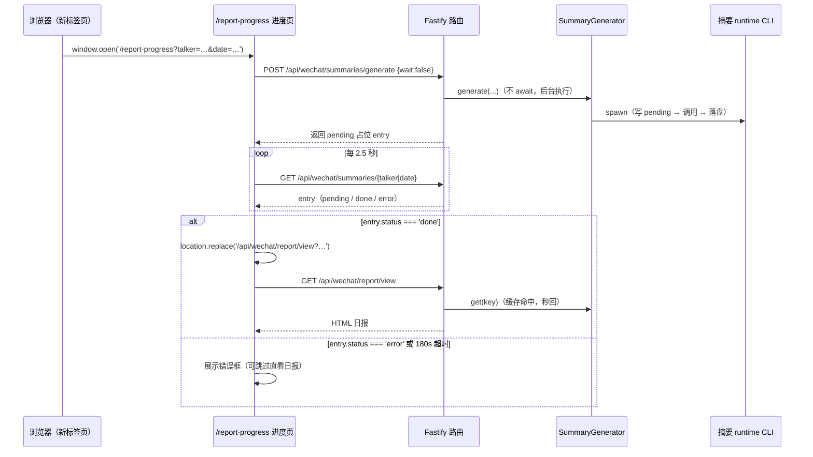

super-cli 的"个人微信看板"是一个完全独立的功能板块——它不接入项目、任务或想法数据，而是复用本机 `wx-cli` 工具暴露的只读 HTTP API，把微信聊天记录转化为两类产出：**每日消息看板**（统计卡、24 小时时段分布、活跃会话、@我 消息、链接情报）与**单群 AI 日报**（摘要 + 结构化 Markdown/HTML 报告）。本章按照数据流动的方向，逐层拆解从 wx-cli 时间线拉取、看板聚合、AI 摘要生成到日报渲染的完整链路。理解本章的前提是已掌握三层协作模式与配置系统，建议先读 [三层架构：CLI、Fastify 服务与 React 前端如何协作](6-san-ceng-jia-gou-cli-fastify-fu-wu-yu-react-qian-duan-ru-he-xie-zuo) 与 [用户配置系统与使用统计输出](28-yong-hu-pei-zhi-xi-tong-yu-shi-yong-tong-ji-shu-chu)。

## 设计原则：无状态聚合 + 有状态摘要

微信看板在数据持久化上做了一个刻意的二分：**消息数据永不落盘，只有 AI 摘要落盘**。`src/core/wechat.ts` 的模块头注释明确了这一契约——它是对本地 wx-cli HTTP 服务（默认 `http://127.0.0.1:9100`）的"薄聚合层"，看板的每次请求都会实时分页拉取 wx-cli 的 timeline API 并即时计算统计值；而唯一有状态的产物是 AI 摘要缓存（`~/.super-cli/wechat-summaries.json`），由独立的 `WechatSummaryStore` 管理。这个设计让看板始终保持与微信数据同步（无失效问题），同时把昂贵的 LLM 调用成本通过缓存摊销（每个会话每天只生成一次）。

与 super-cli 其余部分（读取各家 provider 的 session 文件）不同，微信看板的外部依赖是**进程外的第三方服务**：`wx-cli` 负责解密本地微信数据库并暴露 REST 接口，super-cli 只做 HTTP 消费者。二者通过三个配置项耦合：`wechatUrl`（服务地址）、`wechatToken`（Bearer 令牌）、`wechatNames`（"我"的名字列表，用于 @ 提及检测）。

Sources: [wechat.ts](src/core/wechat.ts#L1-L19), [wechat-summary-store.ts](src/core/wechat-summary-store.ts#L1-L7)

## 分层架构总览

整条链路跨越 6 个文件、3 个进程边界，可以用下面的架构图概括。左半部分是 super-cli 进程内的代码分层，右半部分是两个外部依赖：wx-cli server（持有微信解密数据）与四个可选的摘要 runtime CLI（持有模型能力）。



Fastify 服务在启动时通过 `registerWechatRoutes(app)` 挂载全部微信路由，路由模块内部自持有 `SummaryGenerator` 单例，使 in-flight 去重 Map 与磁盘缓存的生命周期与服务器一致。前端通过 `src/web/src/api/client.ts` 中一组类型化封装函数访问这 17 个端点。

Sources: [server/index.ts](src/server/index.ts#L21-L47), [routes/wechat.ts](src/server/routes/wechat.ts#L160-L166), [client.ts](src/web/src/api/client.ts#L599-L688)

## wx-cli 客户端：HTTP 聚合层与 BigInt 精度防护

`WechatClient` 是整条链路的数据入口。它通过静态工厂 `fromConfig()` 从 `~/.super-cli/config.json` 读取 `wechatUrl` 与 `wechatToken`（缺省回落到 `http://127.0.0.1:9100`），所有请求经私有 `get<T>()` 方法发出，自动附加 `Authorization: Bearer` 头并设置 30 秒超时；错误响应体被截断到 300 字符——因为 wx-cli 的错误体可能是一份完整联系人导出，直接抛出会污染日志。

这段代码里藏着一个值得注意的工程细节：**微信消息的 `server_id` 是 19 位大整数，超出 JavaScript `Number.MAX_SAFE_INTEGER`（约 16 位）**。如果直接 `JSON.parse`，精度会静默丢失（例如 `...407` 变成 `...400`），后续按 `server_id` 拉取媒体文件就会 404。解决方案是在解析前用正则把所有 15 位以上的 `server_id` 数值先加上引号，强制降级为字符串保留：

```typescript
// server_id values are 19-digit big-ints; JSON.parse would silently lose
// precision (e.g. ...407 -> ...400) and break media lookups. Quote them first.
const text = await res.text();
const safe = text.replace(/"server_id"\s*:\s*(\d{15,})/g, '"server_id":"$1"');
return JSON.parse(safe) as T;
```

客户端封装了 7 个 wx-cli 端点，覆盖看板与日报的全部数据需求：

| 客户端方法 | wx-cli 端点 | 用途 | 分页策略 |
|---|---|---|---|
| `getStatus()` | `GET /api/v1/health` | 就绪状态、版本、当前账号 | 单次，失败返回 `{reachable:false}` 而非抛错 |
| `timeline(since, until)` | `GET /api/v1/timeline` | 全量时间线（看板聚合输入） | 每页 1000 条，最多 30 页 |
| `chatMessages(contact, …)` | `GET /api/v1/messages` | 单会话消息（日报输入） | 同上 |
| `search(q)` | `GET /api/v1/search` | 消息全文检索（FTS） | 单次，limit 50 |
| `sessions(limit)` | `GET /api/v1/sessions` | 会话列表（群总数基数） | 单次，limit 1000 |
| `contacts(search)` | `GET /api/v1/contacts` | 联系人匹配（搜索联想） | 单次，limit 20 |
| `fetchMedia(serverId, talker)` | `GET /api/v1/media` | 图片/文件二进制流 | 流式，60 秒超时 |

Sources: [wechat.ts](src/core/wechat.ts#L190-L226), [wechat.ts](src/core/wechat.ts#L246-L310)

## 时间线分页拉取与看板聚合算法

`timeline()` 与 `chatMessages()` 采用同一套游标分页循环：以 `offset` 递增翻页（每页 `PAGE_LIMIT = 1000` 条、`order: 'asc'` 升序），直到 `paging.has_more` 为假或触及 `MAX_PAGES = 30` 上限（即单次请求最多聚合 3 万条消息）。时间范围的换算由 `dayRange()` 完成——把 `YYYY-MM-DD` 字符串解释为**本地时区**的 `[00:00, 次日 00:00)` 区间，再转为 epoch 秒的 `{since, until}`。

拿到原始消息数组后，`aggregateDashboard()` 以**单次遍历 + 多 Map 归并**的方式产出整个看板数据结构 `WechatDashboard`，时间复杂度 O(n)：

- **hourly**：固定长度 24 的计数数组，按消息 `create_time` 的本地小时归桶，驱动 24 小时趋势柱状图；
- **chatMap**：以 `talker`（会话 ID，群聊带 `@chatroom` 后缀）为键聚合活跃会话，记录消息数、最后活跃时间与发送者集合；
- **peopleMap**：只统计**他人发出**的消息（通过 `isMine()` 判定：`direction === 'outgoing'` 或 `sender === myWxid`），并保留一个 `Set` 在收尾时折叠为跨会话数 `chatCount`；
- **mentions**：通过 `isMentionOfMe()` 检测非自己消息中包含 `@我的名字` 的片段，作为"待处理"信号；
- **linkMap**：用正则 `URL_RE` 从 snippet 中抽取 URL，以 URL 全文为键去重并累加 `count`，同时剥离 URL 后的剩余文本作为链接标题。

判定"是不是我"与"是否 @ 我"只依赖两个输入：`direction`/`wxid` 等值比较，以及对 `wechatNames` 列表的子串匹配（`snippet.includes('@' + name)`）——这是纯文本启发式，不解析微信的 XML 提及结构，代价是可能对同名昵称产生误报，收益是零额外 API 依赖。

Sources: [wechat.ts](src/core/wechat.ts#L414-L429), [wechat.ts](src/core/wechat.ts#L431-L545), [wechat.ts](src/core/wechat.ts#L17-L19)

## wx-cli server 的托管生命周期

super-cli 不仅消费 wx-cli 的 HTTP API，还托管它的进程生命周期。`getWxServerStatus()` 通过 `execFile('wx-cli', ['server', 'status', '--format', 'json'])` 查询运行状态（PID、健康度、版本、日志路径），`startWxServer()` 执行 `wx-cli server run` 后进入 **500ms 间隔的就绪轮询循环**，直到 `running && ready` 或超时；`stopWxServer()` 对称地执行 `server stop`。三个函数都把 ENOENT 翻译成友好的"wx-cli 未安装"提示，让前端能区分"没装"与"没跑"两种离线形态。

Sources: [wechat.ts](src/core/wechat.ts#L342-L412)

## AI 摘要管线：四运行时 headless 调用

日报的"AI 总结"不是调用某个云端 API，而是**spawn 本地编码 CLI 的一次性无头会话**。`wechat-summary.ts` 定义了 4 个候选 runtime，每个对应一份 `RUNNER_SPECS` 调用规格——关键差异在于 prompt 的传递通道与参数：

| Runtime | 命令 | 参数 | Prompt 通道 | 备注 |
|---|---|---|---|---|
| `pi`（默认） | `pi` | `-p --no-session --no-tools` | stdin 管道 | 避开 argv 长度限制 |
| `mcode` | `mcode` | `exec --input -` | stdin 管道 | `-` 表示从标准输入读 |
| `qoder` | `qodercli` | `-p` | stdin 管道 | — |
| `kimi` | `kimi` | `-p` | **argv 追加** | kimi 无 stdin 模式，且需输出清洗 |

所有 runtime 都支持可选的 `--model` 覆盖（仅当 `wechatSummaryModel` 非空时追加）。执行器 `execCli()` 用 `spawn` 包裹了三层防御：150 秒超时（超时先 `SIGTERM` 再拒绝）、ENOENT 翻译为"未安装"提示、非零退出码携带 stderr 拒绝。kimi 的输出经过 `cleanOutput()` 特殊处理——剥离 `• ` 前缀和 `To resume this session:` 尾部噪声。

Prompt 本身是一段可配置模板（`wechatSummaryPrompt`），默认要求"200 字以内中文摘要，提炼主要话题、关键结论和值得关注的事项"，四个占位符在 `buildSummaryPrompt()` 中做全文替换：`{chatName}`、`{date}`、`{messageCount}`、`{messages}`。其中 `{messages}` 由 `buildMessagesContext()` 生成——把消息渲染为 `[HH:MM] 发送者: snippet` 的行式文本，并施加**双重上限**：最多最近 400 条消息、累计不超过 48,000 字符，防止超长群聊撑爆模型上下文。`checkRuntimes()` 用 `which` 并发探测四个命令是否在 PATH 中，供设置面板展示安装状态。

Sources: [wechat-summary.ts](src/core/wechat-summary.ts#L15-L39), [wechat-summary.ts](src/core/wechat-summary.ts#L66-L92), [wechat-summary.ts](src/core/wechat-summary.ts#L94-L151), [wechat-summary.ts](src/core/wechat-summary.ts#L41-L63)

## 摘要缓存：`talker|date` 复合键与 in-flight 去重

`SummaryGenerator` 是缓存感知的生成器，围绕两个键控机制展开。其一是**磁盘缓存**：`WechatSummaryStore` 把条目持久化到 `~/.super-cli/wechat-summaries.json`，唯一键为 `` `${talker}|${date}` ``（一个会话一天一条），条目携带 `status: 'pending' | 'done' | 'error'` 与生成元信息（runtime、消息数、时间戳），读取后常驻内存单例，`upsert()` 以 merge-patch 语义更新。其二是**in-flight 去重**：`generate()` 把每次生成任务存入 `Map<key, Promise>`，同键的并发调用直接共享同一个 Promise——这防止了"看板设置页和日报页同时触发两次 LLM 调用"的竞态；任务结束后自动从 Map 清理。

`doGenerate()` 的执行序列体现了状态机式的容错：非强制模式下先查缓存（`done` 即短路返回）→ 写入 `pending` 占位 → 组装 prompt 并调用 runtime → 成功则落盘 `done`，任何异常都落盘 `error` 并携带错误消息（不会抛出到调用方）。缓存的重新生成通过 `force: true` 绕过两级短路。

Sources: [wechat-summary.ts](src/core/wechat-summary.ts#L153-L233), [wechat-summary-store.ts](src/core/wechat-summary-store.ts#L34-L101)

## 日报构建：buildDailyReport 的消息分类学

如果说看板聚合是"统计视角"，`buildDailyReport()` 就是"内容视角"——它把单会话消息按**微信消息类型学**分流为五类素材。遍历中按 `msg_type` 与 `sub_type` 二级判定：

- **图片**（`msg_type === 3`）：记录 `server_id` 供后续媒体代理取图；
- **文件**（`msg_type 49` + `sub_type 6`）：从 `content.File` 取标题/扩展名/体积，snippet 兜底；
- **小程序**（`sub_type 33/36`）：`content` 为 null，标题只能从 snippet 剥离 `[小程序]` 前缀获得；
- **富链接分享**（`sub_type 3/4/5`，文章/音乐/视频）：从 `content.Link` 或 `content.AppGeneric` 取结构化标题与 URL；
- **纯文本中的裸 URL**：正则抽取，且对 wx-cli 返回的 XML 转义（`&amp;`）做反转义，并**过滤 `stodownload` 媒体 CDN 链接**（微信图片下载地址过期极快，属噪声）。

日报的一个精心设计是**图片上下文重建**：对每张图片向前后两个方向扫描最近一条文本消息（`nearestText()`），生成 `↑ 前一句 / ↓ 后一句` 的引用对——这让人在看图表格中能推断图片的语境。全文各节施加 `MAX_SECTION_ITEMS = 50` 的截断上限，超出部分以"…其余 N 条略"计数行代替。

Sources: [wechat.ts](src/core/wechat.ts#L564-L666), [wechat.ts](src/core/wechat.ts#L582-L586)

日报的最终产物 `WechatReport` 同时携带 **Markdown 全文**（`markdown` 字段）与**结构化数据**（images/files/miniApps/links/topMembers/stats），供三种消费路径共用。Markdown 版采用纯管道表格渲染图片（注释明确说明这是为了兼容会剥离裸 HTML 块的 Markdown 查看器），缩略图统一 `width="120"`；所有媒体链接都不直连 wx-cli，而是指向 super-cli 自己的 same-origin 代理路径（`mediaUrl()` 生成 `/api/wechat/media?server_id=…&talker=…`），使 wx-cli 的 Bearer 令牌永不暴露给浏览器。

Sources: [wechat.ts](src/core/wechat.ts#L558-L561), [wechat.ts](src/core/wechat.ts#L668-L771)

## 双渲染输出：JSON / 纯文本 .md / 自包含 HTML

`buildReport()` 的三份产物经由三个路由呈现，各服务于不同场景。`GET /api/wechat/report` 返回 JSON 供前端编程消费；`GET /api/wechat/report/daily-report.md` 返回 `text/plain` 的裸 Markdown——**路径名以 `.md` 结尾是有意为之**，这样浏览器 Markdown 扩展（如 docu.md）能识别并渲染它，否则会显示为内联纯文本；`GET /api/wechat/report/view` 则返回 `renderDailyReportHtml()` 渲染的完整 HTML 页面。

HTML 渲染器是完全自包含的：无外部资源、内联全部样式，视觉上复刻 super-cli Web 应用的浅色主题（暖米色背景 `#faf7f2` + goldenrod 强调色 `#b8860b`）。它的差异化能力在于图片体验——固定三列宽度（发送者 100px / 时间 56px / 图片 136px）、`loading="lazy"` 懒加载缩略图，以及一段 8 行的原生 JS lightbox（点击缩略图全屏、点击任意处或按 Esc 关闭）。AI 摘要块只做轻量内联 Markdown：转义后支持 `**粗体**`、`- ` 列表与换行。

Sources: [routes/wechat.ts](src/server/routes/wechat.ts#L228-L248), [wechat-report-html.ts](src/core/wechat-report-html.ts#L31-L79), [wechat-report-html.ts](src/core/wechat-report-html.ts#L93-L178)

## 关键时序：摘要等待上限与后台生成协议

日报路由与摘要生成的协作是本章最精妙的并发设计。JSON 端点 `buildReport()` 采用**有界等待**策略：缓存未命中时立即启动生成任务，然后用 `Promise.race` 让请求最多等待 `SUMMARY_WAIT_MS = 90` 秒——超时后回落为"生成中"占位符响应，前端拿到占位符可稍后重试。而 HTML 查看路径（"查看日报"按钮）走的是另一条**后台生成 + 轮询**协议，下图刻画了完整时序：



进度页本身也是一段自包含 HTML（`REPORT_PROGRESS_HTML` 常量），参数全部从 `location.search` 解析、无任何模板引擎。它把"打开新标签页"这个动作的感知延迟降到最低：页面瞬时打开并显示进度动画，`wait:false` 让 generate 请求立即返回而非阻塞 90 秒，轮询循环 2.5 秒一次直到条目状态收敛。若摘要已缓存，整条链路近乎瞬时完成。

Sources: [routes/wechat.ts](src/server/routes/wechat.ts#L24-L26), [routes/wechat.ts](src/server/routes/wechat.ts#L193-L226), [routes/wechat.ts](src/server/routes/wechat.ts#L318-L370)

## 媒体代理与全局搜索

`GET /api/wechat/media` 是日报中图片与文件链接的实际后端：它把 `server_id` + `talker` 转发给 wx-cli 的 `/api/v1/media`，将响应头（Content-Type / Content-Length / Content-Disposition）透传后，用 `Readable.fromWeb()` 把 Web 流桥接为 Node 流回给浏览器。这样即使日报 HTML 被分享到没有令牌的环境，媒体仍可经由 super-cli 服务端鉴权后取出。

`GET /api/wechat/search` 是三路聚合搜索：会话按名称/ID 前缀匹配（服务端内存过滤，取 6 条）、联系人走 wx-cli 服务端检索（8 条）、消息走 wx-cli FTS（15 条），合并为 `{groups, people, messages}` 单响应，驱动看板顶部的全局搜索框。

Sources: [routes/wechat.ts](src/server/routes/wechat.ts#L250-L277), [routes/wechat.ts](src/server/routes/wechat.ts#L372-L417)

## 前端接入：看板视图与降级策略

`WeChatView` 是看板的前端宿主，其数据加载体现防御式设计：`load()` 并行请求实时状态与 server 生命周期状态，后者以 `.catch(() => null)` 兜底——注释明确说明"一个没有 `/api/wechat/server` 端点的旧版后端不能弄坏看板"。视图由六张统计卡（活跃群/总消息/@我/静默群/分享链接/我发出的）、24 小时趋势柱、活跃会话列表（TOP 30）、@我 列表等区块组成，日期导航支持前后翻日与"回到今天"。

其中"静默群"卡片的数值来源值得注意：它不是看板消息的属性，而是 `totalGroups - groupChats` 的差值——路由层在拉取时间线的同时并行请求了最近约 1000 个会话，用其中 `@chatroom` 的总数作为基数（`totalGroups`），才能算出"当天没说话的群"这一需要全集才能得到的指标。

Sources: [WeChatView.tsx](src/web/src/components/WeChatView.tsx#L38-L108), [routes/wechat.ts](src/server/routes/wechat.ts#L173-L191), [WeChatView.tsx](src/web/src/components/WeChatView.tsx#L203-L257)

摘要配置面板（`WxSummarySettings`）提供 prompt 编辑、runtime 切换（带安装状态探测）、model 覆盖与缓存管理（单条重新生成/删除、全量清空），全部经由 [client.ts](src/web/src/api/client.ts#L611-L664) 的类型化封装。而 `wechatUrl` / `wechatToken` / `wechatNames` 三个基础配置在"管理库 → 系统配置"中编辑，服务端写入时施加长度校验（分别 ≤200/200/500 字符）防止配置文件被污染。

Sources: [WeChatView.tsx](src/web/src/components/WeChatView.tsx#L455-L463), [routes/config.ts](src/server/routes/config.ts#L141-L147)

## 配置项与端点速查

微信看板的全部可配置项集中在 `~/.super-cli/config.json` 的 `settings` 对象：

| 配置键 | 默认值 | 作用 |
|---|---|---|
| `wechatUrl` | `http://127.0.0.1:9100` | wx-cli server 基础地址 |
| `wechatToken` | 空 | wx-cli 以 `--token` 启动时的 Bearer 令牌 |
| `wechatNames` | 空 | 逗号分隔的"我"的名字列表（@ 检测），运行时与账号名/wxid 合并去重 |
| `wechatSummaryPrompt` | 内置 200 字摘要模板 | 摘要 prompt 模板，支持 4 个占位符 |
| `wechatSummaryRuntime` | `pi` | 摘要 runtime（pi / kimi / mcode / qoder） |
| `wechatSummaryModel` | 空 | 透传给 runtime 的 `--model`，空则用 CLI 全局默认 |

Sources: [wechat.ts](src/core/wechat.ts#L8-L11), [wechat-summary.ts](src/core/wechat-summary.ts#L41-L53), [routes/wechat.ts](src/server/routes/wechat.ts#L148-L158)

## 小结

微信看板集成展示了一种"薄客户端 + 厚纯函数"的集成范式：`WechatClient` 与 `SummaryGenerator` 两个有状态入口都极薄（HTTP 消费与进程 spawn），而全部业务复杂度沉淀在 `aggregateDashboard` / `buildDailyReport` / `renderDailyReportHtml` 三个可独立测试的纯函数中；并发安全由 `Promise.race` 有界等待与 per-key in-flight 去重两个原语覆盖；数据边界则由"消息不落盘、摘要才落盘、媒体走代理"三条规则划清。若要继续深入相邻机制，可转向 [用户配置系统与使用统计输出](28-yong-hu-pei-zhi-xi-tong-yu-shi-yong-tong-ji-shu-chu) 了解 config.json 的读写路径，或 [React 应用架构：单页路由与视图组织](22-react-ying-yong-jia-gou-dan-ye-lu-you-yu-shi-tu-zu-zhi) 了解 WeChatView 在前端路由中的挂载位置。