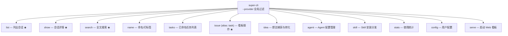
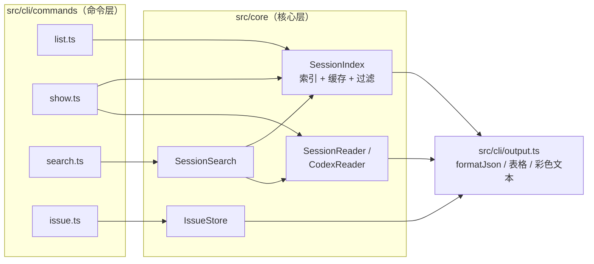

super-cli 的第一条交互入口是命令行。本页带你从零开始俯瞰整个 CLI：命令是如何注册的、`list` / `show` / `search` / `issue` 四组核心命令分别做什么、每条命令背后经过哪些核心模块，以及贯穿所有命令的 `--json` 输出机制为什么是为 Agent 而设计的。读完本页，你就能在日常开发中熟练使用这十几条命令，并理解它们的代码组织方式——为后续深入 [Session 索引引擎](8-session-suo-yin-yin-qing-ttl-huan-cun-mtime-shi-xiao-yu-hou-tai-yu-re) 与 [Issue 看板](12-issue-shu-ju-mo-xing-json-chi-jiu-hua-zhuang-tai-you-xian-ji-yu-biao-qian) 打下基础。

## 命令全景：12 个子命令的注册骨架

整个 CLI 由 [Commander.js](https://github.com/tj/commander.js) 驱动。入口文件 `src/cli/index.ts` 创建一个 `program`，把程序命名为 `super-cli`，声明一个**全局选项** `--provider <name>`（用于只看某一家的会话），然后依次调用 12 个 `registerXxxCommand(program)` 函数把子命令挂上去。发布到 npm 后，`package.json` 的 `bin` 字段把 `super-cli` 这个命令名指向打包产物 `./dist/cli/index.js`，全局安装后即可直接敲 `super-cli list`。

Sources: [index.ts](src/cli/index.ts#L16-L37) [package.json](package.json#L6-L7)

下面的命令树展示了全部 12 个子命令，加粗高亮的四组（`list`、`show`、`search`、`issue`）是本页的主角，其余命令在此仅作定位，细节分属其他章节：



每个命令的实现独立放在 `src/cli/commands/` 下的同名文件中，导出一个 `registerXxxCommand` 函数——这是本项目 CLI 层唯一且重复出现的组织模式：**注册与实现同文件、命令文件只做参数解析与输出、重活交给 `src/core/` 的核心模块**。

Sources: [index.ts](src/cli/index.ts#L24-L35)

## list：第一条命令，会话列表与过滤

`super-cli list` 是你装好工具后应该敲的第一条命令。它从 `SessionIndex` 拿到全部会话元数据，套用过滤条件后，交给统一的格式化函数输出。所有可用选项如下：

| 选项 | 含义 | 默认值 |
|---|---|---|
| `-p, --project <path>` | 按项目路径过滤（子串匹配，不区分大小写） | 无 |
| `-s, --since <date>` | 只看该日期之后有活动的会话（YYYY-MM-DD） | 无 |
| `-u, --until <date>` | 只看该日期之前开始的会话 | 无 |
| `-b, --branch <name>` | 按 git 分支精确过滤 | 无 |
| `-l, --limit <n>` | 最多返回几条 | 20 |
| `--offset <n>` | 跳过前 N 条（配合 limit 做分页） | 0 |
| `--json` | 输出 JSON | 关闭 |

Sources: [list.ts](src/cli/commands/list.ts#L6-L16)

命令的 `action` 只有短短十几行：读取全局 `--provider`，实例化 `SessionIndex`，调用 `getAllSessions()` 拿到 `SessionMetadata[]`，最后 `console.log(formatSessionList(...))`。默认的人类可读输出是一张由 `cli-table3` 渲染的表格，七列分别是：截短 8 位的会话 ID、项目路径末两段、日期、分支、消息数（用户 + 助手）、标签、首条用户消息。空结果时打印灰色的 "No sessions found." 而非报错。

Sources: [list.ts](src/cli/commands/list.ts#L17-L31) [output.ts](src/cli/output.ts#L13-L38)

值得注意的是 `getAllSessions()` 内部的过滤与排序逻辑全部在核心层完成：先按 provider / project / branch / 时间过滤，再按 `lastTimestamp` 降序（默认 `date-desc`）排序，最后才做 offset/limit 切片。也就是说，CLI 命令文件里没有任何业务判断——这正是"命令薄、核心厚"分层的体现。索引如何构建、缓存如何失效属于 [Session 索引引擎](8-session-suo-yin-yin-qing-ttl-huan-cun-mtime-shi-xiao-yu-hou-tai-yu-re) 的主题。

Sources: [session-index.ts](src/core/session-index.ts#L154-L191)

## show：前缀定位、对话回放与工具统计

`super-cli show <session-id>` 展示单个会话。它最贴心的设计是**支持 ID 前缀**：session ID 是一长串 UUID，但你只需输入开头几位。`findSessionByPrefix()` 会在索引中收集所有以前缀开头的会话——恰好匹配 1 个则返回，多于 1 个则抛出 "Ambiguous session ID prefix" 错误，0 个则由命令层打印红色错误并以退出码 1 退出。

Sources: [show.ts](src/cli/commands/show.ts#L16-L23) [session-index.ts](src/core/session-index.ts#L204-L213)

`show` 有三种视图，由选项开关决定：

| 调用方式 | 行为 | 输出形态 |
|---|---|---|
| `super-cli show abc123` | 默认（或 `--summary`）只看元数据 | 键值对清单：项目、分支、CWD、时间、模型、消息数、token 用量、标签 |
| `super-cli show abc123 --messages` | 逐条回放对话 | 按角色着色（User 绿 / Assistant 蓝），每条消息截断到 500 字符，工具调用显示为 `[Tool: 名称]` |
| `super-cli show abc123 --tools` | 统计工具调用频次 | 按次数降序的 `工具名: 次数` 清单 |

Sources: [show.ts](src/cli/commands/show.ts#L25-L53) [output.ts](src/cli/output.ts#L40-L66)

`--tools` 的统计逻辑是一个纯粹的本地函数 `extractToolUsage()`：遍历助手消息的 content 数组，把所有 `type === 'tool_use'` 的块按 `name` 计数并降序排列；`--messages` 则通过 `SessionReader.readSession()` 流式读入整个会话文件后由 `printConversation()` 渲染。会话文件（JSONL）如何被逐行解析是 [异构 Session 文件解析](9-yi-gou-session-wen-jian-jie-xi-jsonl-liu-shi-du-qu-yu-ge-shi-chai-yi) 的内容，这里只需知道：**`show` 永远基于 `SessionIndex` 定位、基于 Reader 读取**。

Sources: [show.ts](src/cli/commands/show.ts#L57-L94)

## search：跨会话全文检索

`super-cli search <query>` 在所有（或过滤后的）会话中做正则全文搜索。它的执行管线是两段式的：先用 `SessionIndex.getAllSessions()` 按 project / since 缩小候选会话范围，再对每个候选会话调用 `streamSession()` 流式读取消息，用大小写不敏感（默认）的正则逐条匹配 user / assistant 消息文本。

| 选项 | 含义 | 默认值 |
|---|---|---|
| `-p, --project <path>` | 限定项目 | 无 |
| `-s, --since <date>` | 限定起始日期 | 无 |
| `-m, --max <n>` | 全局命中上限 | 50 |
| `--case-sensitive` | 区分大小写 | 关闭 |
| `--json` | 输出 JSON | 关闭 |

Sources: [search.ts](src/cli/commands/search.ts#L6-L26) [session-search.ts](src/core/session-search.ts#L13-L49)

输出按会话分组：每个会话显示 ID 前缀、项目末两段和总命中数，其下最多列出 5 条命中（user 命中绿色、assistant 命中蓝色），每条带时间戳和上下文摘要——摘要截取命中点前 50 到后 100 个字符，两侧补 `...`，换行压成空格。命中总数达到 `--max` 后循环即停止，避免扫描全部历史。命中高亮的细节可进一步阅读 [跨 Session 全文搜索与命中高亮实现](11-kua-session-quan-wen-sou-suo-yu-ming-zhong-gao-liang-shi-xian)。

Sources: [output.ts](src/cli/output.ts#L68-L84) [session-search.ts](src/core/session-search.ts#L95-L106)

## issue：一整个看板命令族

`issue` 是体量最大的命令组，本身不带行为，只作为父命令承载 17 个子命令，并注册了别名 **`task`**——`super-cli task list` 与 `super-cli issue list` 完全等价。按用途可分成三类：

| 类别 | 子命令 | 说明 |
|---|---|---|
| 读操作 | `list` / `show <id>` / `comment <id>`（不带 --add 时为列出） / `runs <id>` | 过滤、查详情、看评论与活动流、看执行历史 |
| 写操作 | `create` / `update` / `move` / `claim` / `archive` / `restore` / `delete` / `bind` / `unbind` / `comment --add` / `relate` / `unrelate` | 建卡、改字段、换状态列、认领、归档、绑定会话、评论、建关系 |
| 执行 | `run <id> --agent <profile>` / `stop <id>` | 无头启动 Agent 执行任务并等待结束 / 停止 |

Sources: [issue.ts](src/cli/commands/issue.ts#L82-L86)

几个高频用法：`issue create` 必须提供 `--title` 和 `--project`（任务必须有归属项目），可选优先级（`none|urgent|high|medium|low`）与逗号分隔的标签；`issue move <id> <status>` 把卡片移到 7 个状态列之一；`issue claim <id> --session-id <sid>` 是为 Agent 设计的一步认领——把 `todo` 卡移到 `in_progress` 并同时绑定会话；`issue show <id> --comments --activity` 一次带出评论与变更历史。

Sources: [issue.ts](src/cli/commands/issue.ts#L155-L180) [issue.ts](src/cli/commands/issue.ts#L208-L238) [issue.ts](src/cli/commands/issue.ts#L105-L153)

写操作普遍支持 **`--if-version <n>` 乐观锁**：不传时命令会先读出当前版本号再提交（即"读-改-写"两步），传了则严格校验，不匹配即失败。失败时错误不是普通文本，而是结构化 JSON 加**差异化退出码**：版本冲突（`VERSION_CONFLICT`）退出码为 2，卡片不存在（`ISSUE_NOT_FOUND`）或状态非法（`ISSUE_STATE`）退出码为 1。这一机制保证多个 Agent 并发操作同一张卡片时不会互相覆盖，原理详见 [乐观锁机制：version 字段与多 Agent 并发写安全](13-le-guan-suo-ji-zhi-version-zi-duan-yu-duo-agent-bing-fa-xie-an-quan)，Agent 的操作纪律见 [Issue 状态机与 Agent 工作流纪律](14-issue-zhuang-tai-ji-yu-agent-gong-zuo-liu-ji-lu-claim-move-comment)。

Sources: [issue.ts](src/cli/commands/issue.ts#L14-L24) [issue.ts](src/cli/commands/issue.ts#L77-L80) [issue-store.ts](src/core/issue-store.ts#L16-L35)

```bash
# 一个典型的版本冲突输出（stderr，退出码 2）：
{
  "error": {
    "code": "VERSION_CONFLICT",
    "message": "issue version mismatch: expected 3, current 4"
  }
}
```

## --json：为人眼与 Agent 设计的双轨输出

几乎所有命令都带 `--json`，这不是简单的"多打印一种格式"，而是一套贯穿全 CLI 的统一模式，由 `src/cli/output.ts` 集中实现：

- **`formatJson(data)`** 是唯一出口：`JSON.stringify(data, null, 2)`，两空格缩进的标准 JSON；
- 三个格式化函数 `formatSessionList` / `formatSessionDetail` / `formatSearchResults` 的**第一行都是同一个分支**——`if (opts.json) return formatJson(...)`，人类可读的表格 / 彩色文本只在 JSON 关闭时才构造；
- `issue` 命令族同样如此，且连**错误**也走 JSON（见上一节），配合退出码构成完整的机器可读契约。

Sources: [output.ts](src/cli/output.ts#L9-L11) [output.ts](src/cli/output.ts#L13-L14) [issue.ts](src/cli/commands/issue.ts#L26-L32)

| 维度 | 默认输出 | `--json` 输出 |
|---|---|---|
| 目标读者 | 人类（终端） | 脚本 / Agent |
| 形态 | cli-table3 表格、chalk 彩色文本 | 两空格缩进 JSON |
| 截断 | ID 取 8 位、消息截 500 字符、表格列定宽 | **无截断**，字段完整 |
| 空结果 | 灰色提示 "No sessions found." | `[]`（合法 JSON） |
| 错误 | 红色文本 | `{ "error": { "code", "message" } }` + 退出码 |

Sources: [output.ts](src/cli/output.ts#L16-L37) [output.ts](src/cli/output.ts#L40-L41)

JSON 模式下输出的数据结构就是核心层的类型定义：`list` / `show` 输出 `SessionMetadata[]` 或单个 `SessionMetadata`（含 `sessionId`、`provider`、`project`、`models`、token 统计等 20 个字段）；`search` 输出 `SearchResult[]`（每个含 `sessionId`、`project`、`hits`、`totalHits`）；`issue` 输出完整的 `Issue` 实体。例如管道组合 `super-cli list --json | jq '.[0].sessionId'` 可直接取出第一条会话 ID，供 `show` 的前缀参数使用——这是把 super-cli 嵌入自动化工作流的基本手法。

Sources: [types.ts](src/core/types.ts#L55-L76) [types.ts](src/core/types.ts#L287-L298)

## 全局 --provider：一次过滤八家 CLI 工具

`--provider` 定义在 `program` 顶层，必须在子命令**之前**书写（如 `super-cli --provider claude-code list`）。各命令文件通过 `program.opts()` 读取它并传入核心层。合法取值共 8 家：

| provider id | 对应工具 |
|---|---|
| `claude-code` | Claude Code |
| `qoder` | Qoder |
| `codex` | Codex |
| `kimi` | Kimi CLI |
| `pi` | Pi |
| `opencode` | OpenCode |
| `workbuddy` | WorkBuddy |
| `traecode` | TraeCode |

Sources: [index.ts](src/cli/index.ts#L18-L22) [list.ts](src/cli/commands/list.ts#L17-L21) [providers.ts](src/core/providers.ts#L31-L96)

## 数据流总览：命令层 → 核心层 → 输出层

把前面四组命令放回同一张图，就能看清 CLI 的分工——命令文件负责"解析参数 + 选输出格式"，核心模块负责"建索引 + 读文件"，二者通过 `SessionIndex` 这个统一入口衔接：



## 上手练习与下一步阅读

建议按以下顺序在终端里实际敲一遍，形成肌肉记忆：① `super-cli list` 看到表格 → ② `super-cli list --json | jq '.[0].sessionId'` 取一个 ID 前缀 → ③ `super-cli show <前缀> --messages` 回放对话 → ④ `super-cli search "关键词" --max 10` 检索 → ⑤ `super-cli issue create --title "试用" --project $(pwd)` 建第一张卡 → ⑥ `super-cli issue move <ID> in_progress` 移动它。

想继续深入，可以沿两条线走：**数据侧**先读 [Session 索引引擎：TTL 缓存、mtime 失效与后台预热](8-session-suo-yin-yin-qing-ttl-huan-cun-mtime-shi-xiao-yu-hou-tai-yu-re)，理解 `list` 背后的索引如何又快又新；**看板侧**先读 [Issue 数据模型：JSON 持久化、状态、优先级与标签](12-issue-shu-ju-mo-xing-json-chi-jiu-hua-zhuang-tai-you-xian-ji-yu-biao-qian)，再配 [乐观锁机制](13-le-guan-suo-ji-zhi-version-zi-duan-yu-duo-agent-bing-fa-xie-an-quan) 理解 `--if-version`。若想换到可视化界面，直接跳转 [Web 看板五分钟上手：serve 启动与界面导览](4-web-kan-ban-wu-fen-zhong-shang-shou-serve-qi-dong-yu-jie-mian-dao-lan)；想在本地改代码验证这些命令，参考 [开发环境与调试技巧：dev 热重载、typecheck 与测试](5-kai-fa-huan-jing-yu-diao-shi-ji-qiao-dev-re-zhong-zai-typecheck-yu-ce-shi)。