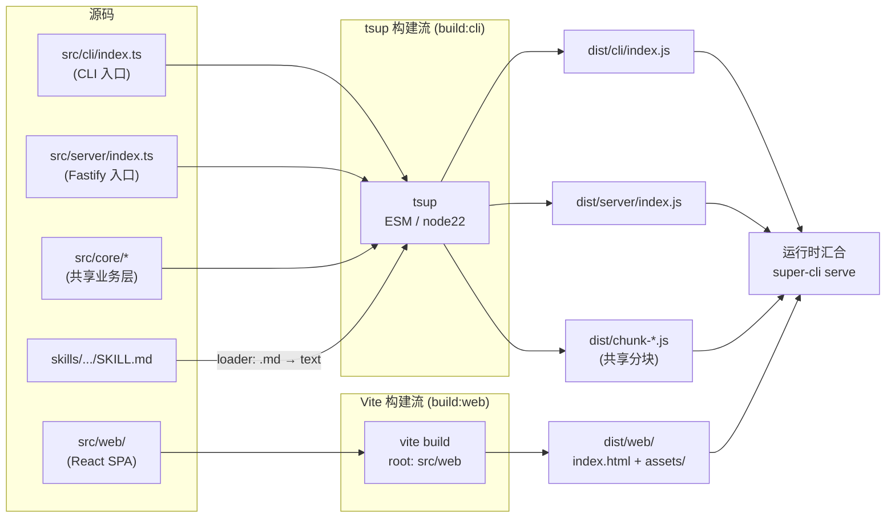
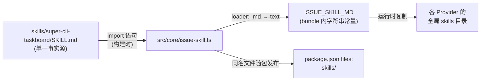
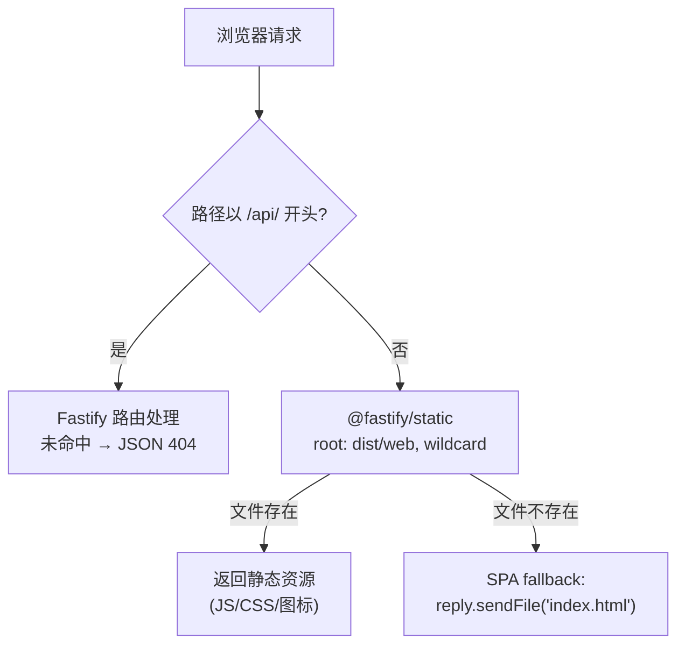
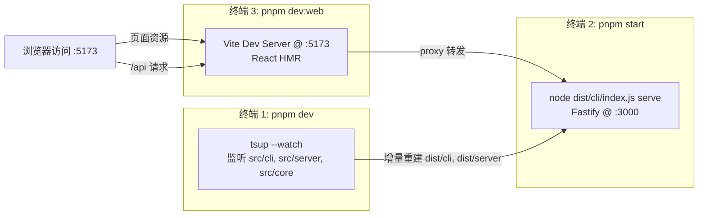

super-cli 是一个同时面向**终端**与**浏览器**的单包应用：CLI 命令与 Fastify 服务运行在 Node.js ≥ 22 上，而 Web 看板是一个 React SPA。这两类运行环境的模块解析规则、目标平台、依赖树完全不同，因此项目没有强行用单一打包器统一处理，而是采用**双构建流**架构——tsup 负责 CLI/Server 两条 Node 入口，Vite 负责 Web 前端，两者共享同一个 `dist/` 输出目录，并在 `serve` 命令启动时于运行时汇合。本页拆解这条构建管线的设计动机、关键配置与产物契约。

## 为什么需要两条构建流

从第一性原理看，这个仓库里存在两套编译目标：`src/cli` 与 `src/server` 依赖 `commander`、`fastify`、`chalk` 等 Node 生态库，需要保留 Node 平台语义；`src/web` 依赖 `react`、`react-dom`、`tailwindcss`，面向 DOM 与浏览器。若把前端也交给 tsup，就会失去 HMR、资源哈希、CSS 处理等 Vite 生态能力；若把 CLI 交给 Vite，则需绕过其浏览器导向的默认值。双流各自使用最贴合目标的工具，是典型的**按运行时分治**策略。

两条流在构建期互不感知，唯一的"契约"是 `dist/` 目录布局：tsup 写入 `dist/cli`、`dist/server` 与共享分块，Vite 写入 `dist/web`，运行时由服务端静态托管把两者缝合起来。

Sources: [package.json](package.json#L28-L38), [tsup.config.ts](tsup.config.ts#L1-L20), [src/web/vite.config.ts](src/web/vite.config.ts#L1-L17)

## 构建编排：package.json 中的脚本矩阵

整条管线的入口是 `package.json` 的 scripts 字段。`build` 采用串行 `build:cli && build:web`——先跑 tsup 再跑 Vite；`prepublishOnly` 钩子直接引用完整 `build`，保证发布到 npm 的包永远携带新鲜产物。

| 脚本 | 命令 | 职责 |
|---|---|---|
| `build` | `pnpm build:cli && pnpm build:web` | 完整构建，Node 侧在前、Web 侧在后 |
| `build:cli` | `tsup` | 打包 CLI 与 Server 两个 Node 入口 |
| `build:web` | `vite build --config src/web/vite.config.ts` | 构建 React SPA 到 `dist/web` |
| `dev` | `tsup --watch` | Node 侧增量监听构建 |
| `dev:web` | `vite dev --config src/web/vite.config.ts` | 前端开发服务器（含 API 代理） |
| `start` | `node dist/cli/index.js` | 运行构建产物 |
| `prepublishOnly` | `pnpm build` | 发布前强制全量构建 |

两个细节值得注意。其一，`build:web` 显式指定 `--config src/web/vite.config.ts`，因为 Vite 默认只在项目根目录寻找 `vite.config.ts`，而这里的配置文件与前端源码一起放在 `src/web` 下。其二，`engines` 声明 `node >= 22`，与 tsup 的 `target: 'node22'` 形成呼应——构建目标与运行时约束是同一枚硬币的两面。

Sources: [package.json](package.json#L28-L49), [README.md](README.md#L163-L172)

## tsup 流水线：双入口、共享分块与产线约束

tsup 配置文件虽只有 20 行，但每一项都对应一个明确的工程决策。最核心的是 `entry` 双入口声明：`src/cli/index.ts` 打包为 `dist/cli/index.js`（即 `bin` 字段指向的可执行文件），`src/server/index.ts` 打包为 `dist/server/index.js`（由 `serve` 命令通过动态 `import` 按需加载）。`format: ['esm']` 配合根 `package.json` 的 `"type": "module"`，全程使用原生 ESM，与源码中 `.js` 后缀的 NodeNext 导入风格一致。

| 配置项 | 取值 | 设计意图 |
|---|---|---|
| `entry` | `cli/index` + `server/index` | 双入口：一个供 `bin` 执行，一个供 serve 按需加载 |
| `format` / `target` / `platform` | `esm` / `node22` / `node` | 原生 ESM，锁定 Node 22 运行时 |
| `splitting` | `true` | CLI 与 Server 共享的 `core/*` 提取为公共分块 |
| `clean` | `['!web', '!web/**']` | 清空 dist 但**负向排除** `dist/web` |
| `dts` | `false` | 应用而非类库，无需产出类型声明 |
| `external` | `react`, `react-dom` | 防止浏览器侧运行时被误打进 Node bundle |
| `loader` | `{ '.md': 'text' }` | 将 Markdown 文件以字符串内联 |
| `outDir` | `dist` | 与 Vite 输出共居一个 dist 根 |

`splitting: true` 的效果可以在真实产物中直接验证：`dist/cli/index.js` 约 59KB、`dist/server/index.js` 约 120KB，两者都引用同一个 53KB 的 `chunk-Z6SJDMW6.js`，该分块再转发引用 `session-index-UYJTOWOR.js`——即 CLI 与 Server 各自 import 的 `src/core/session-index.ts` 被提取为只打包一次的共享代码。若关闭 splitting，`core` 层会被完整复制进两个入口，体积近乎翻倍。

Sources: [tsup.config.ts](tsup.config.ts#L1-L20), [src/core/session-index.ts](src/core/session-index.ts#L1-L1)

### clean 负向排除：两条流共居一个 dist 的关键

`clean: ['!web', '!web/**']` 是整条双构建流最精妙的一行。tsup 构建前默认清空整个 `outDir`，这会连带删掉上一次 Vite 构建的 `dist/web`。通过传入**以 `!` 开头的负向 glob**，tsup 在清理时排除 `web` 子树，使两条构建流可以任意顺序、任意次数执行而互不破坏。源码中的注释明确记录了这一约束："Clean the CLI/Server output but never wipe dist/web (the vite SPA build)."。与之呼应，Vite 侧的 `emptyOutDir: true` 只清空 `dist/web` 自身，同样不会波及 Node 侧产物——两边都遵守"只清自己的领地"。

Sources: [tsup.config.ts](tsup.config.ts#L13-L15), [src/web/vite.config.ts](src/web/vite.config.ts#L8-L11)

### loader: '.md' → text：构建期内联 Skill 文档

`src/core/issue-skill.ts` 第一行有一条特殊导入：`import skillMd from '../../skills/super-cli-taskboard/SKILL.md'`。这条路径**跳出了 `src/` 目录**，直接引用仓库根部的 Skill 源文件，因此无法依赖常规的 ts 编译流程。tsup 的 `loader: { '.md': 'text' }` 让 esbuild 把该文件按纯文本读取并以字符串常量内联进 bundle；配套的 `src/core/assets.d.ts` 提供了 `declare module '*.md'` 的环境声明，让 `tsc` 类型检查放行这类导入。

这个设计实现了"构建期内联、单一事实源"：`super-cli skill install` 无需在运行时去定位文件系统中的 SKILL.md，文档内容直接随 JS 产物分发；同时 `skills/` 目录也出现在 `files` 白名单里，供需要阅读源文件的场景使用。

Sources: [src/core/issue-skill.ts](src/core/issue-skill.ts#L1-L8), [src/core/assets.d.ts](src/core/assets.d.ts#L1-L4), [tsup.config.ts](tsup.config.ts#L19-L19)

## Vite 流水线：以 src/web 为根的 SPA 构建

Vite 配置同样极简，三个关键点构成完整契约。`root: resolve(__dirname)` 将构建根设为 `src/web` 本身，这样 `index.html` 中的 `<script type="module" src="/src/main.tsx">` 会按相对路径解析到同目录的前端源码；`build.outDir` 指向仓库根的 `dist/web`，`emptyOutDir: true` 允许 Vite 清理这个位于 root 之外的目录（Vite 默认对 root 外的 outDir 拒绝清空，必须显式授权）；`server.proxy` 把开发期的 `/api` 请求转发到 `http://localhost:3000`。

开发期与生产期的 API 地址因此天然统一：前端代码只写相对路径 `/api/...`，开发时由 Vite 代理转发到本地 Fastify 服务，生产时由同一个 Fastify 服务直接托管——前端无需任何环境切换逻辑。

Sources: [src/web/vite.config.ts](src/web/vite.config.ts#L1-L17), [src/web/index.html](src/web/index.html#L1-L14)

## 汇合点：serve 运行时托管 dist/web

两条构建流最终在 `src/server/index.ts` 汇合。这里有一个依赖构建布局的路径推导：tsup 产出的 `dist/server/index.js` 在运行时通过 `fileURLToPath(import.meta.url)` 计算自身位置，`join(__dirname, '..', 'web')` 由此解析为 `dist/web`——**源码里写的是相对路径，产物里落点是构建布局**，这正是双流必须共享 `dist/` 根目录的原因。若 web 目录不存在（只跑了 `build:cli`），服务会降级启动并打印警告提示执行 `pnpm build:web`，API 能力不受影响。

`setNotFoundHandler` 中的分支逻辑是这套托管方案的品质细节：`/api/` 前缀的未命中请求返回结构化 JSON 404（供前端程序化处理），只有前端路由才回退到 `index.html`，避免"API 报错返回 HTML"这类经典事故。而 `serve` 命令本身对 Server 模块使用动态 `import('../../server/index.js')`——纯 CLI 用户（如只跑 `super-cli list`）永远不会加载 Fastify 与全部路由代码，启动路径保持轻量。

Sources: [src/server/index.ts](src/server/index.ts#L59-L82), [src/cli/commands/serve.ts](src/cli/commands/serve.ts#L16-L17)

## 双 TypeScript 配置：类型检查的边界划分

构建是双流的，类型检查也必须是双流的。根 `tsconfig.json` 面向 Node 侧（`module: NodeNext`、`declaration: true`），`include` 覆盖 `src/**/*.ts` 但**显式排除 `src/web`**；`src/web/tsconfig.json` 则面向浏览器（`lib` 含 DOM、`jsx: react-jsx`、`moduleResolution: bundler`、`noEmit: true`——前端转译完全交给 Vite/esbuild，tsc 只负责编辑器与 IDE 的类型反馈）。若不拆分，同一份代码将被迫同时满足 Node 与 DOM 两套 lib 约束，`process` 与 `document` 会互相报错。

Sources: [tsconfig.json](tsconfig.json#L23-L24), [src/web/tsconfig.json](src/web/tsconfig.json#L1-L15)

## 产物布局与发布契约

双构建流的最终产物是一个结构化的 `dist/` 目录，其布局直接构成 npm 发布契约——`package.json` 的 `bin` 与 `files` 字段逐项对应目录树：

| 产物路径 | 来源 | 在包中的角色 |
|---|---|---|
| `dist/cli/index.js` | tsup（cli 入口） | `bin.super-cli` 指向的可执行文件，保留 shebang |
| `dist/server/index.js` | tsup（server 入口） | serve 命令动态加载的 Fastify 服务 |
| `dist/chunk-*.js` | tsup（splitting） | CLI/Server 共享的分块，`files` 中以通配符收录 |
| `dist/web/index.html + assets/` | Vite | 前端 SPA，`@fastify/static` 的托管根 |

两点值得展开。其一，`src/cli/index.ts` 首行的 `#!/usr/bin/env node` shebang 会被 tsup 原样保留在产物首行，这是 `bin` 字段能在 Unix 环境直接执行的前提。其二，`files` 白名单之外，`.npmignore` 作为第二道防线再排除 `src/`、`src/web/`、`tsup.config.ts` 等源文件——双保险确保只有构建产物、skills 与文档进入发布包。此外 `react`/`react-dom` 刻意留在 devDependencies（而非 dependencies），因为它们已被 Vite 打进 `dist/web` 产物，消费端安装时无需再拉取。

Sources: [package.json](package.json#L6-L19), [src/cli/index.ts](src/cli/index.ts#L1-L1), [.npmignore](.npmignore#L1-L7)

## 开发工作流：两个进程，一条代理

日常开发的典型形态是**三终端并行**：`pnpm dev` 让 tsup 监听 Node 侧变更并增量重建；`pnpm start`（或 `node dist/cli/index.js serve`）运行刚重建的产物提供 API；`pnpm dev:web` 启动 Vite 开发服务器，享受前端热更新，同时把 `/api` 代理到 `localhost:3000`。前端改代码即时生效，Node 侧改代码则由 tsup 秒级重建、重启 serve 进程后生效——两种热更新粒度各归其位。

这条工作流的关键在于：开发者**不需要**在开发期执行 `build:web`，`dist/web` 只在需要验证生产形态（如测试 serve 命令托管 SPA）或发布前才由完整 `pnpm build` 产出。

Sources: [package.json](package.json#L28-L38), [src/web/vite.config.ts](src/web/vite.config.ts#L12-L16), [README.md](README.md#L163-L172)

## 小结

双构建流的本质是一组环环相扣的契约：tsup 与 Vite 通过 `clean` 负向排除与 `emptyOutDir` 划定各自在 `dist/` 中的领地；tsup 通过双入口与 splitting 让 CLI 与 Server 共享 `core` 层代码；`.md` loader 把仓库根部的 Skill 文档内联为构建期字符串；服务端在运行时以 `import.meta.url` 推导出 `dist/web` 并以 SPA fallback 方式托管前端。理解了这些契约，构建脚本的每一行都不再是魔法。

想继续深入这条链路的上下游，可以按以下路径阅读：

- 构建产物的质量如何被验证、包如何发布到 npm → [测试策略与 npm 发布流程](31-ce-shi-ce-lue-yu-npm-fa-bu-liu-cheng)
- 本地开发与调试的完整环境搭建 → [开发环境与调试技巧：dev 热重载、typecheck 与测试](5-kai-fa-huan-jing-yu-diao-shi-ji-qiao-dev-re-zhong-zai-typecheck-yu-ce-shi)
- `serve` 启动后三层如何协作 → [三层架构：CLI、Fastify 服务与 React 前端如何协作](6-san-ceng-jia-gou-cli-fastify-fu-wu-yu-react-qian-duan-ru-he-xie-zuo)
- 被托管的 React SPA 内部结构 → [React 应用架构：单页路由与视图组织](22-react-ying-yong-jia-gou-dan-ye-lu-you-yu-shi-tu-zu-zhi)