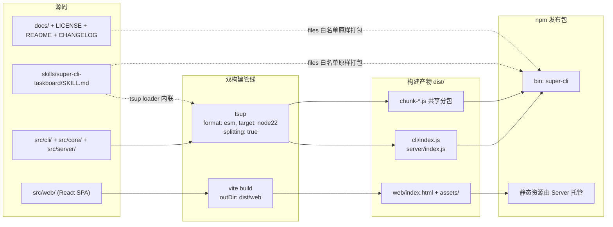
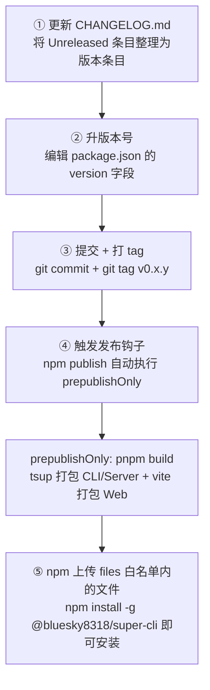

本页是"工程化实践"章节的收官篇，聚焦两个问题：**这个项目如何保证代码质量**，以及**一个 TypeScript CLI 工具如何从源码目录变成 npm 上的可安装包**。与常见教程不同的是，这里呈现的是对仓库的真实考古结果——包括"测试框架已配置但测试文件尚不存在"这类诚实但少见的现状。如果你还不了解项目的双构建体系（tsup + Vite），建议先阅读[双构建流：tsup 打包 CLI/Server 与 Vite 构建 Web](30-shuang-gou-jian-liu-tsup-da-bao-cli-server-yu-vite-gou-jian-web)。

Sources: [package.json](package.json#L1-L19)

## 测试策略：轨道已铺好，列车待发车

先说一个可能出乎意料的事实：`package.json` 中已经声明了 `"test": "vitest"` 脚本并安装了 `vitest@^3.2.1`，`AGENTS.md` 也明确记录"测试：Vitest"这一技术选型，但**全仓库目前不存在任何一个 `*.test.ts` 或 `*.spec.ts` 文件，也没有 `vitest.config.ts` 配置文件**。这意味着测试基础设施是"先行铺设"状态——框架、脚本、运行约定全部就绪，只等第一份测试用例落地。一旦有人添加 `foo.test.ts`，`pnpm test` 即可零配置运行（Vitest 对 `*.test.ts` 有默认匹配规则）。

Sources: [package.json](package.json#L28-L38), [AGENTS.md](AGENTS.md#L29), [AGENTS.md](AGENTS.md#L40-L45)

那么在没有单元测试的情况下，代码靠什么保证质量？答案是**三道实际的门禁**，它们共同构成了当前的质量防线：

| 门禁 | 命令 | 验证内容 | 覆盖范围 |
|------|------|----------|----------|
| 类型检查 | `pnpm typecheck` | TypeScript strict 模式全量类型推导 | `src/**/*`，**不含** `src/web/` |
| 全量构建 | `pnpm build` | tsup + Vite 双管线编译成功 | 后端 + 前端全部源码 |
| 冒烟基准 | `test-build.ts` / `test-build.js` | SessionIndex 完整构建并计时 | 核心索引引擎 |

Sources: [package.json](package.json#L28-L38), [tsconfig.json](tsconfig.json#L23-L24), [AGENTS.md](AGENTS.md#L34-L43)

其中 typecheck 的边界值得初学者注意：根目录 `tsconfig.json` 通过 `"exclude": ["node_modules", "dist", "src/web"]` 明确将前端代码排除在 `tsc --noEmit` 之外。这不是疏忽，而是架构决定——前端有独立的 Vite 构建流程（Vite 内部的 esbuild/TS 插件负责类型转换），双构建流在前端这条线上"绕过"了根 tsconfig。因此 typecheck 验证的是 CLI、core、Server 三层的类型正确性，前端类型问题由 `pnpm build:web` 暴露。

Sources: [tsconfig.json](tsconfig.json#L1-L24), [AGENTS.md](AGENTS.md#L90)

两个 `test-build` 脚本是一对手动冒烟工具，展示了"源码直跑"与"产物验证"的对照关系：`test-build.ts` 直接从 `./src/core/session-index.js` 导入源码，用于开发中快速测量索引构建耗时；`test-build.js` 则从 `./dist/server/index.js` 导入**构建产物**，用于发布前验证打包后的代码能否正常工作。两者逻辑完全一致——实例化 `SessionIndex`、强制刷新构建全量索引、用 `console.time` 打印耗时。

Sources: [test-build.ts](test-build.ts#L1-L10), [test-build.js](test-build.js#L1-L10)

| 对比维度 | test-build.ts | test-build.js |
|----------|---------------|---------------|
| 导入来源 | `./src/core/session-index.js`（源码） | `./dist/server/index.js`（构建产物） |
| 使用时机 | 开发中性能观测 | 构建后冒烟验证 |
| 运行方式 | `tsx`/`node --experimental-strip-types` 等源码执行 | `node test-build.js`（需先 `pnpm build:cli`） |
| 验证目标 | 索引逻辑与性能基线 | 打包产物（含分包 chunk）完整性 |

## npm 发布基础设施：一次提交的考古

git 历史显示，本项目的发布基础设施并非渐进演化，而是由一次提交集中搭建：`73f3b1d "chore: prepare for npm publish"`。这次提交一口气完成了五件事——为 `package.json` 添加 `files`、`repository`、`homepage`、`bugs` 字段；添加 `prepublishOnly` 脚本；在 tsup 构建中关闭生产环境 sourcemap；创建 `.npmignore`；扩充 `.gitignore` 的防御性排除项（`.env`、密钥文件、`.npmrc` 等，防止意外把本机凭据发上 npm）。

Sources: [.gitignore](.gitignore#L1-L18), [.npmignore](.npmignore#L1-L9), [tsup.config.ts](tsup.config.ts#L13-L19)

同一时期的另两次提交记录了包名的演进：`c55031c "chore: rename package to @bluesky8318/super-cli"` 将包名改为带 scope 的形式（scope 包是 npm 上防止命名冲突的标准做法），随后 `b6a3291 "docs: update install instructions to npm registry"` 同步更新了 README 中的安装命令。今天 README 提供两条安装路径：用户走 `npm install -g @bluesky8318/super-cli`，贡献者走 `pnpm install && pnpm build && pnpm link --global` 本地链接。

Sources: [README.md](README.md#L48-L60), [package.json](package.json#L2-L3)

## 包内容控制：白名单 + 黑名单的双保险

npm 发布时"哪些文件进包"由两层机制控制，理解它们的优先级关系是关键：**`files` 白名单是第一道也是决定性的关卡**——只有列出的路径（及 `README`、`LICENSE`、`package.json` 等 npm 强制包含的文件）会进入发布包；`.npmignore` 则是第二道纵深防御，即使有文件漏过白名单（或位于白名单目录内部），仍可被进一步剔除。

Sources: [package.json](package.json#L9-L19), [.npmignore](.npmignore#L1-L9)

`files` 白名单的每一项都有明确用途：

| 白名单条目 | 内容 | 用途 |
|------------|------|------|
| `dist/cli` | `index.js` | `bin` 入口，安装后的 `super-cli` 命令 |
| `dist/server` | `index.js` | `serve` 子命令启动的 Fastify 服务 |
| `dist/web` | `index.html` + `assets/` | React SPA 静态资源，由 Server 托管 |
| `dist/chunk-*.js` | tsup splitting 产生的共享分包 | `dist/cli`、`dist/server` 共享的代码块 |
| `skills` | `super-cli-taskboard/SKILL.md` | 随包分发的 agent skill 源文件 |
| `docs` | issue 工作流等文档 | agent 工作流文档随包分发 |
| `LICENSE` / `README.md` / `CHANGELOG.md` | 元信息文件 | npm 包页面展示 |

Sources: [package.json](package.json#L6-L19), [tsup.config.ts](tsup.config.ts#L3-L7)

`chunk-*.js` 这一条特别值得注意：tsup 配置了 `splitting: true`（ESM 代码分割），CLI 与 Server 共享的 `core/` 数据层会被抽取为形如 `chunk-FKJO3VBH.js` 的共享分包放在 `dist/` 根目录。如果白名单只写 `dist/cli` 和 `dist/server` 而漏掉 `dist/chunk-*.js`，安装后的命令会因找不到分包而直接崩溃——这是代码分割项目发布时最容易踩的坑，通配符 `chunk-*.js` 正是为此而设（注意 chunk 文件名中的哈希每次构建都会变化，必须用通配符匹配）。

Sources: [tsup.config.ts](tsup.config.ts#L3-L11)

`.npmignore` 中的条目则是"防泄漏清单"：`**/*.map` 剔除任何 sourcemap（tsup 已配置 `sourcemap: false`，双保险）；`src/`、`src/web/`、`tsup.config.ts`、`tsconfig.json` 防止源码和构建配置混入；`AGENTS.md`、`CLAUDE.md`、`.qoder/` 是面向 AI agent 的仓库内部指引，与包的使用者无关。

Sources: [.npmignore](.npmignore#L1-L9)

## 构建链与发布产物的映射关系

下图描述了从源码到 npm 包的完整数据流，先阅读图例再理解文字：源码目录（左侧）经过双构建管线（中间）产出 `dist/` 产物（右侧），最终被 `files` 白名单筛入发布包。

Sources: [tsup.config.ts](tsup.config.ts#L1-L20), [vite.config.ts](vite.config.ts#L5-L11), [package.json](package.json#L6-L19)

图中有一条容易忽略的虚线路径：`SKILL.md` 有两条进入发布包的通道。第一条是**构建时内联**——tsup 配置了 `loader: { '.md': 'text' }`，`issue-skill.ts` 通过 `import skillMd from '../../skills/super-cli-taskboard/SKILL.md'` 把 Markdown 文件作为文本常量打进 bundle；运行时 `skill install` 命令实际使用的是这个内联副本（`ISSUE_SKILL_MD` 常量），并不读磁盘。第二条是**原样打包**——`files` 白名单中的 `skills` 条目让源文件也随包分发，供使用者直接查阅。二者互为冗余，保证了"源码即事实源"与"运行时零外部依赖"同时成立。

Sources: [src/core/issue-skill.ts](src/core/issue-skill.ts#L1-L8), [src/core/skill-installer.ts](src/core/skill-installer.ts#L25-L27), [tsup.config.ts](tsup.config.ts#L19)

## 发布流程：手动五步曲

本项目**没有 CI/CD 流水线**（仓库中不存在 `.github` 目录），发布完全由维护者手动执行。git 考古还原出的发布约定非常精简：一次"仅改 `package.json` 版本号一行"的提交（如 `a025bb0 "0.2.0"`、`ed07130 "0.2.1"`），加一个对应的 git tag（`v0.2.0`、`v0.2.1`），然后执行 `npm publish`。完整流程如下：

Sources: [package.json](package.json#L28-L38), [CHANGELOG.md](CHANGELOG.md#L1-L7)

流程中最巧妙的一环是 `prepublishOnly` 钩子：npm 在每次 `publish` 前**强制执行**此脚本，任何失败都会中止发布。这里配置为 `pnpm build`，意味着"发布的内容一定是当前源码的完整构建产物"，从根本上杜绝了"忘了构建就发布旧代码"的经典事故。与之配套的是构建产物的清理策略——tsup 的 `clean` 选项使用了否定模式 `['!web', '!web/**']`，只清理 CLI/Server 的输出而**绝不触碰** `dist/web/`；因为构建顺序是先 `build:cli` 后 `build:web`，若 tsup 清空整个 `dist/`，后构建的前端产物虽然无恙，但 tsup 自身的 `**/*` 清理规则会连带抹掉上一次的 `dist/web`，否定模式正是为了规避这一点。前端侧则由 Vite 的 `emptyOutDir: true` 负责清理自己的输出目录。

Sources: [package.json](package.json#L37), [tsup.config.ts](tsup.config.ts#L13-L15), [vite.config.ts](vite.config.ts#L8-L10)

## 版本管理约定与 CHANGELOG 现状

`CHANGELOG.md` 声明遵循 [Keep a Changelog](https://keepachangelog.com/zh-CN/) 格式，采用"Unreleased 区累积、发版时整理"的惯例。对初学者而言，理解"版本号、CHANGELOG、git tag"三者的一致性是版本管理的核心纪律。本仓库的客观现状是一个值得借鉴的反面参照：`package.json` 当前版本为 `0.2.1`，git 中也存在 `v0.2.0`、`v0.2.1` 两个 tag，但 CHANGELOG 中只有 `[Unreleased]` 和 `[0.1.0]` 两个条目——0.2.x 的变更实际累积在 `[Unreleased]` 区中尚未归档。

Sources: [CHANGELOG.md](CHANGELOG.md#L3-L7), [package.json](package.json#L3)

从 git 历史看，版本相关的提交记录如下：

| 提交 | 内容 | 性质 |
|------|------|------|
| `73f3b1d` | chore: prepare for npm publish（发布基础设施） | 一次性搭建 |
| `c55031c` | chore: rename package to @bluesky8318/super-cli | 包名迁移 |
| `a025bb0` | "0.2.0"（仅改 package.json 一行） | 版本提交 |
| `b6a3291` | docs: update install instructions to npm registry | 文档同步 |
| `ed07130` | "0.2.1"（仅改 package.json 一行） | 版本提交 |

这种"版本号即提交信息"的极简风格没有对错之分，但它依赖维护者的自律：没有 CI 强制校验版本号与 CHANGELOG 的一致性，也没有 npm `version` 命令自动生成 commit + tag（`npm version patch` 可以自动完成这两步）。如果未来引入自动化，`prepublishOnly` 钩子已经预留了扩展点——例如可以将其扩展为"build && typecheck && test"的组合，让发布前自动跑通全部质量门禁，与本页开头铺垫的 Vitest 轨道衔接。

Sources: [package.json](package.json#L28-L38)

## 小结与阅读路径

回顾本页的核心事实：**测试层面**，Vitest 框架与运行约定已就绪但用例待补，实际质量由 strict 类型检查（后端三层）、双管线全量构建、`test-build` 冒烟基准三道门禁保障，typecheck 刻意不覆盖 `src/web`；**发布层面**，`files` 白名单 + `.npmignore` 双重控制包内容，`prepublishOnly` 钩子强制"发布即完整构建"，`chunk-*.js` 通配符保证代码分割产物不缺件，版本发布以"单行提交 + git tag"的手动约定执行。这套体系对个人维护的 CLI 工具而言足够精简可靠，其预留的扩展点（Vitest 轨道、prepublishOnly 组合化）则为团队化演进留好了接口。

建议继续阅读相邻章节完成工程化实践的知识闭环：

- 回顾构建细节：[双构建流：tsup 打包 CLI/Server 与 Vite 构建 Web](30-shuang-gou-jian-liu-tsup-da-bao-cli-server-yu-vite-gou-jian-web)
- 回到开发环境与调试：[开发环境与调试技巧：dev 热重载、typecheck 与测试](5-kai-fa-huan-jing-yu-diao-shi-ji-qiao-dev-re-zhong-zai-typecheck-yu-ce-shi)
- 了解随包分发的 skill 如何被消费：[super-cli-taskboard Skill 的分发与跨 Provider 安装](17-super-cli-taskboard-skill-de-fen-fa-yu-kua-provider-an-zhuang)