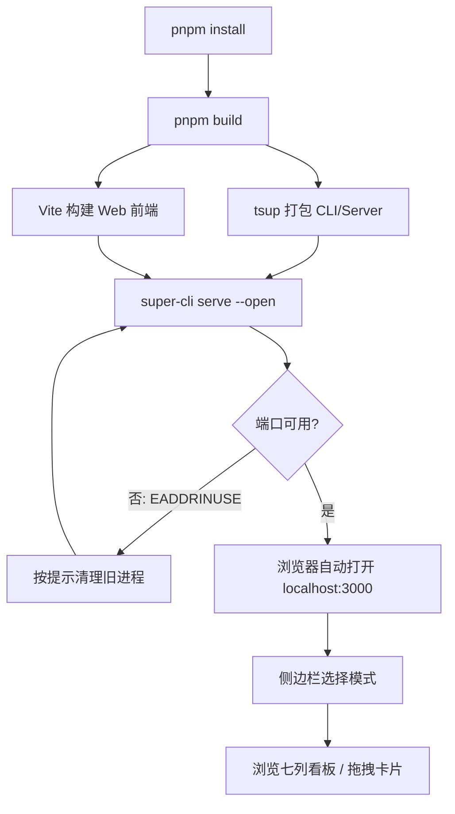
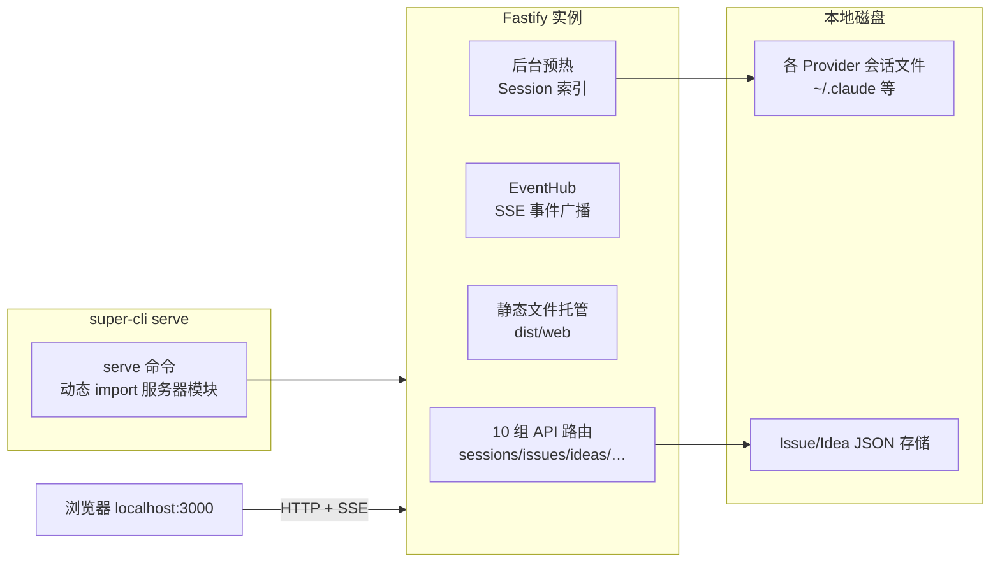

如果你已经安装了 super-cli，却还只用过命令行的 `list` 和 `show`，那么这篇文章将带你用五分钟完成第一次 Web 看板体验：从敲下 `super-cli serve`，到认识界面上的每一个区域，再到理解看板为什么能在别的 Agent 修改数据时自动刷新。本文是纯上手教程，不涉及源码深挖——每一步只讲"怎么做"和"你会在屏幕上看到什么"，底层机制会在结尾给出继续阅读的路线图。

## 启动前的准备

super-cli 的 Web 界面由两部分组成：一个用 **Fastify** 编写的 HTTP 服务器，以及一套预先构建好的 **React** 静态页面。`serve` 命令负责把两者串起来，因此启动前需要确认两件事：Node.js 版本不低于 22（`package.json` 中 `engines` 字段的硬性要求），以及 `dist/` 目录中已经存在构建产物。如果你是通过 npm 全局安装的，产物会随包一起分发；如果是源码方式运行，请先执行 `pnpm install && pnpm build`，它会依次完成 CLI/Server 的 tsup 打包和 Web 前端的 Vite 构建（`pnpm build:cli` 与 `pnpm build:web` 两个子任务）。

Sources: [package.json](package.json#L14-L26)

构建产物落位后，仓库内的 `dist/web` 目录就是前端的全部静态文件。Vite 配置中明确将输出目录指向 `resolve(__dirname, '../..', 'dist/web')`，服务器启动时会优先查找这个位置——这解释了为什么"忘记构建前端"是最常见的启动失败原因之一（后文排查表会再次提到）。

Sources: [vite.config.ts](src/web/vite.config.ts#L1-L19)

## 第一步：五分钟启动流程

整个上手过程可以用下面的流程图概括——从构建到看到看板，正常情况下不需要两分钟，剩下三分钟留给界面探索：



核心命令只有一条，加上 `--open` 参数可以在启动成功后自动唤起系统浏览器：

```bash
super-cli serve --port 3000 --open
```

这是 README 的 Web Dashboard 章节给出的标准启动方式。首次启动时你会在终端看到绿色的 `Server running at http://localhost:3000` 提示；如果端口被占用，程序不会静默失败，而是直接打印一段带修复命令的错误提示后退出。

Sources: [README.md](README.md#L127-L133), [serve.ts](src/cli/commands/serve.ts#L26-L32)

`serve` 是通过 Commander 注册的众多子命令之一，与 `list`、`show`、`issue` 等平级。理解这一点很重要：Web 看板不是独立应用，而是 CLI 的一个"入口形态"，它读取的数据和命令行读取的完全是同一份磁盘文件，两边看到的内容天然一致。

Sources: [index.ts](src/cli/index.ts#L24-L35)

## serve 命令参数速查

`serve` 只暴露三个选项，刻意保持了最小配置面：

| 参数 | 简写 | 默认值 | 作用 |
|---|---|---|---|
| `--port <n>` | `-p` | `3000` | HTTP 服务监听端口 |
| `--host <host>` | 无 | `0.0.0.0` | 绑定地址；默认绑定所有网卡，局域网内其他设备也能访问 |
| `--open` | 无 | 关闭 | 启动成功后自动打开浏览器 |

例如希望只在本机访问、且换一个端口：`super-cli serve --port 8080 --host 127.0.0.1`。

Sources: [serve.ts](src/cli/commands/serve.ts#L8-L10)

参数中藏着一段值得新手注意的容错逻辑：当操作系统返回 `EADDRINUSE` 错误码（端口已被占用）时，命令不会抛出一长串 Node 堆栈，而是翻译成人话——告诉你"可能有一个旧的 super-cli serve 进程仍在运行"，并直接给出清理命令 `lsof -ti :<port> | xargs kill`。这是 CLI 对开发者体验的一次典型打磨，遇到报错时照着终端提示复制执行即可。

Sources: [serve.ts](src/cli/commands/serve.ts#L18-L25)

## 启动的瞬间发生了什么

在你按下回车到浏览器打开之间，服务器内部完成了一次紧凑的初始化。下图是这次初始化的全貌（深入版本见后续架构篇）：



三个细节对新手最有价值。其一，服务器启动后会在**后台**预热 Session 索引——代码注释写得很清楚："Warm the session index in the background so the first page load does not wait for a cold full scan"，也就是说即使你有成百上千条历史会话，首页也不会白屏等待全量扫描。其二，前端静态目录通过 `join(__dirname, '..', 'web')` 定位到打包后的 `dist/web`，如果该目录不存在，服务器照常启动 API，但访问页面会收到明确提示。其三，所有非 `/api/` 开头的未知路径都会回退到 `index.html`——这是单页应用（SPA）路由的标准做法，而 API 路径缺失则返回真正的 JSON 404，两者泾渭分明。

Sources: [index.ts](src/server/index.ts#L27-L69), [index.ts](src/server/index.ts#L71-L85)

## 界面导览：认识每一个区域

页面加载完成后，你看到的是一个左右分栏的经典看板布局：

```
┌─────────────┬──────────────────────────────────────┐
│  super-cli  │  工具栏：搜索 / 排序 / 视图切换 / 主题  │
│─────────────│──────────────────────────────────────│
│ ▸ 想法      │                                      │
│ ▸ 任务      │      主内容区（看板 / 卡片 / 列表）      │
│ ▾ 灵感      │                                      │
│   微信看板   │                                      │
│ ▾ 管理库    │                              ┌───────┤
│   技能权限   │                              │右侧详情 │
│   系统配置   │                              │ 面板   │
│─────────────│                              └───────┤
│ 项目列表     │                                      │
└─────────────┴──────────────────────────────────────┘
                                          💡 右下角：想法快速捕获
```

### 左侧导航：五种模式

侧边栏顶部定义了五个应用模式，由 App 组件的 `appMode` 状态统一管理：

| 导航项 | 模式标识 | 内容 |
|---|---|---|
| 想法 | `ideas` | Idea 收集箱，应用启动默认模式 |
| 任务 | `task` | Issue/Session 双页签看板，核心工作区 |
| 灵感 → 个人微信看板 | `inspiration` | 微信时间线聚合视图 |
| 管理库 → 技能·权限·连接器 | `config` | 各 Provider 的 Skills / MCP / Rules 配置浏览 |
| 管理库 → 系统配置 | `system` | super-cli 自身配置 |

两个分组导航（"灵感"、"管理库"）默认折叠，点击组名即可展开，包含当前激活子项的分组会自动保持展开状态——状态由 `collapsedNav` 这个 Set 精确控制。另外，当前模式会同步写进 URL 查询参数（如 `?mode=task`），刷新页面或分享链接都能还原视图状态。

Sources: [App.tsx](src/web/src/App.tsx#L124-L129), [App.tsx](src/web/src/App.tsx#L718-L778)

### 项目列表：数据的第一层过滤

导航下方是项目区，标题右侧的小按钮可在"按时间排序"与"按数量排序"之间切换。列表中的第一项永远是"全部项目"，选中某个具体项目后，主内容区的数据会随之过滤。同样地，选中的项目会写入 URL 的 `?project=p1` 参数——注意这里用的是短 ID 而非完整路径，旧版分享链接中的完整路径也依然兼容。

Sources: [App.tsx](src/web/src/App.tsx#L781-L790), [App.tsx](src/web/src/App.tsx#L138-L148)

### 任务模式：双页签 × 三视图

"任务"是整个看板的核心，它内部再分两个页签——**任务**（Issue 看板）与**会话**（Session 看板），页签选择持久化在 localStorage 中，下次打开自动恢复。每个页签下又有三种视图切换按钮：看板视图（按状态分列）、卡片视图（网格平铺，可按日期分组）、列表视图（紧凑行式），视图偏好同样通过 localStorage 记忆。

Sources: [App.tsx](src/web/src/App.tsx#L164-L165), [App.tsx](src/web/src/App.tsx#L971-L976), [App.tsx](src/web/src/App.tsx#L1086-L1096)

Issue 看板由七根状态列组成，每列有专属颜色与计数：

| 列 Key | 中文标签 | 颜色 |
|---|---|---|
| `backlog` | 需求池 | 灰 `#6b7280` |
| `todo` | 待办 | 琥珀 `#f59e0b` |
| `in_progress` | 进行中 | 蓝 `#3b82f6` |
| `in_review` | 待复查 | 紫 `#8b5cf6` |
| `blocked` | 阻塞 | 红 `#ef4444` |
| `done` | 已完成 | 绿 `#10b981` |
| `canceled` | 已取消 | 浅灰 `#9ca3af` |

Session 看板复用同一套七列布局，只是卡片换成了会话——每个 Session 会根据自身派生状态映射进对应列（例如 `review` 状态映射到"待复查"列），映射函数就定义在常量文件末尾。这意味着你可以在同一张看板上俯瞰所有 Provider（Claude Code、Qoder、Codex 等 8 家）的会话进展，每张卡片角落的彩色缩写徽标（CC、QD、CX……）标识了它属于哪家 CLI 工具。

Sources: [constants.ts](src/web/src/constants.ts#L25-L33), [constants.ts](src/web/src/constants.ts#L43-L51), [constants.ts](src/web/src/constants.ts#L14-L23)

### 拖拽移动：卡片到状态的物理操作

在 Issue 看板视图里，卡片是原生 HTML5 拖拽的：按住任意 Issue 卡片拖到目标列释放，前端会立即调用 `moveIssue` 接口提交状态变更。这里有一个新手容易忽略但设计上很讲究的细节——提交时会携带卡片当前的 `version` 版本号；如果服务端发现版本不匹配（说明别人已经先改过这张卡），返回 409，前端会弹出"数据已被修改，正在刷新"并自动重新拉取列表，而不是静默覆盖他人的修改。这就是**乐观锁**在界面上的直接体现。

Sources: [App.tsx](src/web/src/App.tsx#L444-L461), [IssueCard.tsx](src/web/src/components/IssueCard.tsx#L38-L43)

### 详情面板、主题与快速捕获

选中一张卡片后，右侧详情面板展开，可以查看 Issue 的完整信息、评论与活动流（会话页签下则是对话记录）。右上角有三个主题按钮——☀️ 亮色、🌙 暗色、🌑 深蓝，选择持久化到 localStorage 的 `theme` 键。最后，界面右下角常驻一个 💡 悬浮按钮，随时点开就能用一句话记录想法，支持 ⌘/Ctrl + Enter 快捷保存——这是"想法先捕获、后整理"工作流的前端入口。

Sources: [App.tsx](src/web/src/App.tsx#L921-L923), [App.tsx](src/web/src/App.tsx#L71-L118)

## 为什么看板会自己刷新：SSE 一分钟认知

保持页面打开，然后另开一个终端执行一条 `super-cli issue` 命令——你会发现看板在不到一秒内自动更新了。这背后的机制是 **Server-Sent Events**：页面加载后立即通过 `EventSource('/api/events')` 建立一条长连接；服务端的 `EventHub` 维护所有连接的客户端，任何 Issue/Idea/Agent 变更都会以 `issue.created`、`issue.moved` 等命名事件广播出去。前端订阅了 13 类事件，但并不逐条处理——而是把事件"防抖"合并成一次 300ms 后的列表刷新，避免短时间内多条事件触发多次全量请求；断线重连时（`onopen` 第二次触发）也会主动做一次全量刷新补偿丢失的事件。

Sources: [App.tsx](src/web/src/App.tsx#L324-L351), [events.ts](src/server/events.ts#L28-L58), [issues.ts](src/server/routes/issues.ts#L339-L341)

对新手而言，只需要记住一条行为预期：**页面开着就行，数据永远接近实时**。服务端每 20 秒还会向所有连接写入一行 keep-alive 注释帧，防止中间层掐断空闲连接。

Sources: [events.ts](src/server/events.ts#L33-L39)

## 常见问题排查

| 症状 | 原因 | 解决办法 |
|---|---|---|
| 终端报 `EADDRINUSE`，端口被占用 | 旧的 serve 进程仍在运行 | 执行提示中的 `lsof -ti :3000 \| xargs kill`，或换端口 `-p 3001` |
| 访问页面返回 `Web UI not built. Run: pnpm build:web` | `dist/web` 目录不存在 | 源码运行场景下执行 `pnpm build:web`（全局安装的包已内置产物） |
| 首次打开会话列表较慢 | Session 索引正在后台预热 | 等待几秒后刷新；索引带 TTL 缓存，之后访问不再全量扫描 |
| 看板不自刷新 | SSE 连接被代理/防火墙拦截 | 确认浏览器直连 serve 进程；EventSource 会自动重连并补偿刷新 |
| 拖拽卡片弹出"数据已被修改" | 其他 Agent 并发修改了同一 Issue（409 冲突） | 这是乐观锁保护，无需操作，前端已自动刷新最新数据 |

Sources: [serve.ts](src/cli/commands/serve.ts#L18-L25), [index.ts](src/server/index.ts#L59-L82), [App.tsx](src/web/src/App.tsx#L444-L461)

顺带一提，如果你是开发者并希望改造前端：`pnpm dev:web` 会启动 Vite 开发服务器（带热重载），它把 `/api` 请求代理到 `localhost:3000` 的 serve 进程——一边跑 `super-cli serve`，一边跑 `pnpm dev:web`，即可享受完整的前端热更新开发体验。

Sources: [vite.config.ts](src/web/vite.config.ts#L14-L18)

## 下一步阅读

界面导览到这里就完整了。按照知识递进关系，推荐按以下顺序继续：

- 想理解 serve 启动的这颗"黑盒"内部构造 → [三层架构：CLI、Fastify 服务与 React 前端如何协作](6-san-ceng-jia-gou-cli-fastify-fu-wu-yu-react-qian-duan-ru-he-xie-zuo)
- 想搞懂看板七列背后的数据与状态流转 → [Issue 数据模型：JSON 持久化、状态、优先级与标签](12-issue-shu-ju-mo-xing-json-chi-jiu-hua-zhuang-tai-you-xian-ji-yu-biao-qian) 和 [Issue 状态机与 Agent 工作流纪律（claim / move / comment）](14-issue-zhuang-tai-ji-yu-agent-gong-zuo-liu-ji-lu-claim-move-comment)
- 对拖拽时弹出的"数据已被修改"感兴趣 → [乐观锁机制：version 字段与多 Agent 并发写安全](13-le-guan-suo-ji-zhi-version-zi-duan-yu-duo-agent-bing-fa-xie-an-quan)
- 想深入刚才一分钟认知的 SSE 机制 → [SSE 实时事件推送：EventHub 设计与事件类型](16-sse-shi-shi-shi-jian-tui-song-eventhub-she-ji-yu-shi-jian-lei-xing) 与 [前端实时同步：消费 SSE 事件流更新看板](24-qian-duan-shi-shi-tong-bu-xiao-fei-sse-shi-jian-liu-geng-xin-kan-ban)
- 准备参与前端开发 → [React 应用架构：单页路由与视图组织](22-react-ying-yong-jia-gou-dan-ye-lu-you-yu-shi-tu-zu-zhi) 和 [看板 / 卡片 / 列表三视图实现与拖拽交互](23-kan-ban-qia-pian-lie-biao-san-shi-tu-shi-xian-yu-tuo-zhuai-jiao-hu)