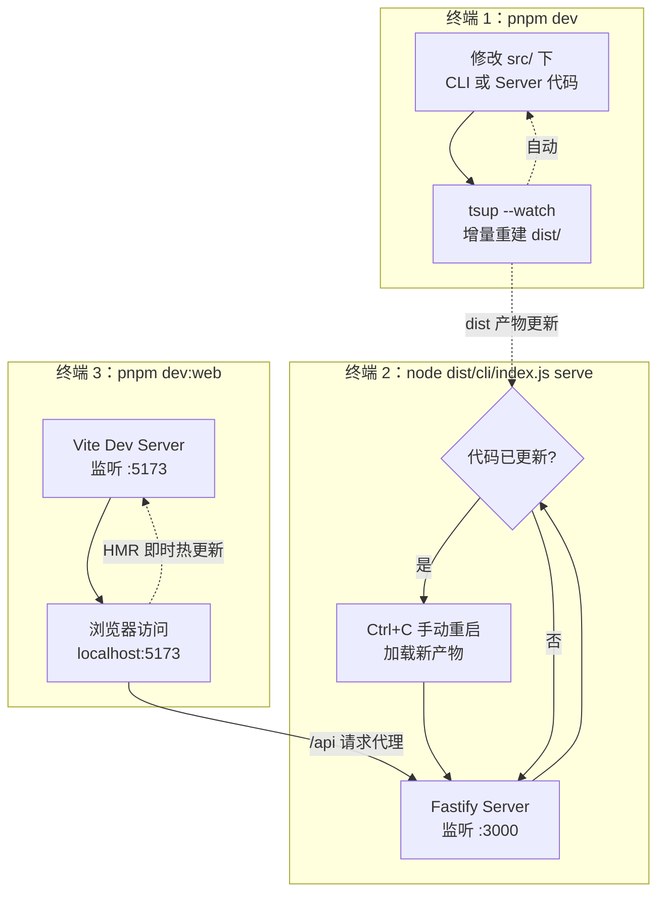

本页面向初次接触 super-cli 的开发者，完整讲清三件事：**`pnpm dev` 热重载到底重载了什么**（以及它没有重载什么）、`pnpm typecheck` 背后的双 tsconfig 分工与一个容易踩的覆盖盲区、以及当前测试基础设施的真实状态。读完本页，你可以搭建起一套"三个终端"的高效调试工作流，并在端口冲突、Web UI 缺失等常见问题上快速自救。开始前请确认 Node.js ≥ 22（项目 `engines` 字段的硬性要求），并通过 `pnpm install` 完成依赖安装。

## 一、开发脚本全景：package.json 里的六个入口

所有开发命令都定义在 `package.json` 的 `scripts` 字段中，没有隐藏的 makefile 或额外任务运行器。先建立整体认知，后面再逐个深入：

| 命令 | 实际执行 | 作用范围 | 变更生效方式 |
|---|---|---|---|
| `pnpm dev` | `tsup --watch` | CLI + Server（TypeScript 后端） | 自动重建产物，进程需手动重启 |
| `pnpm dev:web` | `vite dev --config src/web/vite.config.ts` | React 前端 | Vite HMR，浏览器即时热更新 |
| `pnpm test` | `vitest` | 预留的单元测试框架 | — |
| `pnpm typecheck` | `tsc --noEmit` | CLI / Core / Server（不含 web） | 仅检查，不产出文件 |
| `pnpm build` | `pnpm build:cli && pnpm build:web` | 完整构建 | 产出 `dist/` |
| `pnpm start` | `node dist/cli/index.js` | 运行构建产物 | — |

注意一个关键区分：`dev` 和 `dev:web` 是**两个独立命令**，项目没有引入 `concurrently` 之类的并行运行器，开发时需要开两个（或三个）终端分别执行。这与很多"一条命令全启动"的项目不同，但也让每个进程的日志各自独立、便于阅读。

Sources: [package.json](package.json#L28-L38)

## 二、后端热重载：`pnpm dev` 的真实语义

执行 `pnpm dev` 后，tsup 进入 watch 模式，监听 `src/cli/index.ts` 和 `src/server/index.ts` 两个入口引用到的全部源码文件，任何一处改动都会**增量重新编译到 `dist/` 目录**。构建产物是 ESM 格式、目标 `node22`、开启代码分割（`splitting: true`），意味着共享的 `src/core` 模块会被抽成公共 chunk，CLI 与 Server 复用同一份代码。

这里有一个初学者最容易误解的点，必须明确：**`tsup --watch` 只负责"重新编译文件"，不会自动重启正在运行的 Node 进程**。也就是说，如果你在第三个终端跑着 `node dist/cli/index.js serve`，改完代码后 `dist/` 里的文件虽然更新了，但内存中运行的还是旧代码——你需要手动 `Ctrl+C` 停掉再重新启动，才能加载新产物。所以严格来说这是"自动重建 + 手动重启"的半热重载循环，而非 nodemon 式的全自动重启。README 中将其描述为"CLI/Server 热重载（tsup --watch）"，指的就是这个重建机制。

Sources: [package.json](package.json#L32), [tsup.config.ts](tsup.config.ts#L3-L20), [README.md](README.md#L156-L165)

### tsup 配置中的三个防御性细节

tsup 配置文件很短，但有三处值得理解的工程决策。其一是 `clean: ['!web', '!web/**']`：tsup 每次构建默认会清空输出目录，而 `dist/web` 存放的是 Vite 构建的前端 SPA——这两条取反规则保护前端产物不被后端构建误删，否则每次 `pnpm build:cli` 都会静默摧毁 `dist/web`。其二是 `loader: { '.md': 'text' }`：项目里的 Markdown 文件（如 Skill 定义）会被内联为字符串参与打包，这对 `skill-installer` 这类需要读取内置 Markdown 的模块至关重要。其三是 `external: ['react', 'react-dom']`：React 仅作为前端 devDependency 存在，不进入后端 bundle。

Sources: [tsup.config.ts](tsup.config.ts#L13-L19)

## 三、前端热重载：`pnpm dev:web` 与 API 代理

前端开发服务器由 `pnpm dev:web` 启动，使用 `src/web/vite.config.ts` 这份独立配置。它做了三件事：通过 `@vitejs/plugin-react` 启用 React Fast Refresh（改组件代码时浏览器局部热更新、不丢组件状态）；把 `root` 设为 `src/web` 目录本身；以及在开发模式下把所有 `/api` 请求**代理到 `http://localhost:3000`**——这正是 Fastify 后端的默认端口。这条代理是前后端联调的关键：浏览器访问 Vite 的 5173 端口，页面请求 `/api/...` 时由 Vite 转发给本地的 super-cli server，前端因此无需任何 CORS 或 baseURL 配置即可调试真实接口。

与后端不同，前端是真正的即时热更新：改 `src/web/src` 下的 `.tsx` 文件，浏览器立刻刷新，无需重启任何进程。生产构建时，Vite 会把产物输出到 `dist/web` 并清空该目录（`emptyOutDir: true`），供 Fastify 以静态资源方式托管——那是[双构建流](30-shuang-gou-jian-liu-tsup-da-bao-cli-server-yu-vite-gou-jian-web)页面的主题。

Sources: [src/web/vite.config.ts](src/web/vite.config.ts#L5-L17), [package.json](package.json#L33)

## 四、推荐的调试工作流：三个终端的编排

理解了两个 watch 进程的边界后，完整调试工作流可以编排如下。前提说明：下图描述的是从源码改动到浏览器看到效果之间的**进程协作关系**，其中"手动重启 serve"是唯一需要人工干预的环节。

三个终端的职责边界清晰：终端 1 负责"编译"，终端 2 负责"运行后端"，终端 3 负责"运行前端与代理"。如果你只调试前端界面（不改后端逻辑），甚至可以跳过终端 1，只要终端 2 里有一个已构建好的 server 在跑即可。反过来，如果你只调试 CLI 命令，`pnpm dev` 重建后直接执行 `node dist/cli/index.js <命令>` 就能验证最新代码，无需 server 参与。

serve 命令本身还提供两个实用参数：`-p/--port`（默认 3000）与 `--host`（默认 `0.0.0.0`，即允许局域网访问），以及 `--open` 启动后自动打开浏览器。这些在[Web 看板五分钟上手](4-web-kan-ban-wu-fen-zhong-shang-shou-serve-qi-dong-yu-jie-mian-dao-lan)页面有面向使用者的完整介绍。

Sources: [package.json](package.json#L32-L33), [src/cli/commands/serve.ts](src/cli/commands/serve.ts#L8-L10)

## 五、typecheck：双 tsconfig 分工与覆盖盲区

`pnpm typecheck` 执行 `tsc --noEmit`，即只做类型检查、不产出任何文件——它比构建快得多，适合在提交前快速验证类型正确性。但这里存在一个**新手必须知道的覆盖盲区**：项目有两份 tsconfig，根目录的 `tsconfig.json` 明确 `"exclude": ["node_modules", "dist", "src/web"]`，所以 `tsc --noEmit` 默认只检查 CLI、Core、Server 三块后端代码；React 前端由 `src/web/tsconfig.json` 单独管理（启用 `jsx: react-jsx`、DOM 类型库、`bundler` 模块解析）。两份配置的差异源于运行环境根本不同——后端跑在 Node 22、用 NodeNext 模块解析，前端跑在浏览器、由 Vite 接管打包。

实操结论：改完后端代码跑 `pnpm typecheck` 即可；如果同时改了前端 `.tsx` 文件，需要显式再跑一次 `npx tsc -p src/web/tsconfig.json` 才能覆盖前端类型（该 tsconfig 已自带 `noEmit: true`）。另外，根配置定义了 `@core/*`、`@cli/*`、`@server/*` 三个路径别名，且开启了 `strict` 严格模式——任何隐式 `any` 或可空值未处理都会被 typecheck 拦下。

Sources: [package.json](package.json#L36), [tsconfig.json](tsconfig.json#L2-L24), [src/web/tsconfig.json](src/web/tsconfig.json#L1-L15)

## 六、测试现状：vitest 已就绪，但当前零测试文件

如实说明现状：`package.json` 中 `test` 脚本指向 `vitest`，`vitest` 也已列入 devDependencies，基础设施完全就绪——但目前仓库中**不存在任何 `*.test.ts` 或 `*.spec.ts` 文件**，也没有 `vitest.config.*` 配置。此时直接运行 `pnpm test`，vitest 会因找不到测试文件而报错，这不是你的环境出了问题。vitest 的默认约定是把测试文件放在源码旁边（如 `src/core/session-index.test.ts`），从零开始补测试时直接按此命名创建文件即可被自动发现。

在正式测试缺位的情况下，仓库里有两个**手动冒烟脚本**承担着事实上的验证职责，都位于根目录：`test-build.ts` 直接 import 源码模块 `src/core/session-index.js`，用 `console.time('buildIndex')` 计时执行一次带 `forceRefresh: true` 的全量索引构建，用于人工观察索引引擎性能与正确性；`test-build.js` 则是它的产物版本，从 `dist/server/index.js` 导入，用于验证构建结果。这类脚本不具备断言能力，只是开发者的快速 sanity check，不能替代正式测试。

Sources: [package.json](package.json#L34-L35), [test-build.ts](test-build.ts#L1-L10), [test-build.js](test-build.js#L1-L10)

## 七、常见问题排查速查表

以下问题都能在源码中找到直接线索，按出现频率排序：

| 症状 | 根因 | 处置 |
|---|---|---|
| 启动 serve 报"端口 3000 已被占用" | 旧的 super-cli serve 进程残留 | 按 serve 命令内置提示执行 `lsof -ti :3000 \| xargs kill`，或用 `-p` 换端口 |
| 浏览器访问 3000 端口返回 "Web UI not built. Run: pnpm build:web" | `dist/web` 目录不存在，Fastify 找不到静态资源 | 执行 `pnpm build:web`；开发前端时改用 `pnpm dev:web` 走 5173 端口 |
| 改了后端代码但接口行为没变 | `tsup --watch` 只重建文件，运行中的进程仍是旧代码 | 手动重启终端 2 的 serve 进程 |
| 前端页面里 `/api` 请求全部失败 | Vite 代理目标 `localhost:3000` 上没有 server 在跑 | 先在另一终端启动 serve，再访问 5173 |
| `pnpm test` 报 "No test files found" | 仓库当前没有 vitest 测试文件 | 属预期行为，按 `*.test.ts` 命名约定新建测试即可 |
| `pnpm build` 后前端又消失了 | 构建顺序问题（`build:cli` 在前） | 正常情况下 tsup 的 `clean: ['!web']` 会保护 `dist/web`；确认未手动改动该配置 |

其中前两条在源码中有直接的容错处理：serve 命令捕获 `EADDRINUSE` 错误后输出中文提示与具体的 kill 命令建议；server 启动时探测 `dist/web` 是否存在，缺失时既在服务端日志发出警告，又在非 API 路径的 404 响应里返回带修复命令的 JSON 提示，API 路径则始终返回规范的 JSON 404 而非 SPA 页面。

Sources: [src/cli/commands/serve.ts](src/cli/commands/serve.ts#L19-L23), [src/server/index.ts](src/server/index.ts#L59-L82), [tsup.config.ts](tsup.config.ts#L13-L15)

## 八、调试时的两个附加观察点

有两个源码层面的行为模式值得调试时留意。第一，Fastify 以 `logger: false` 初始化，**生产与开发模式都不输出请求日志**，排查接口问题时建议直接用 `curl http://localhost:3000/api/...` 观察响应，而不是找服务端日志。第二，server 启动时会在后台预热 Session 索引（`void index.buildIndex().catch(() => {})`），且错误被静默吞掉——如果首屏数据异常，可以考虑用上文提到的 `test-build.ts` 冒烟脚本独立验证索引构建是否正常，这也是该脚本存在的价值之一。

Sources: [src/server/index.ts](src/server/index.ts#L27-L28), [src/server/index.ts](src/server/index.ts#L50-L52)

## 延伸阅读

本页聚焦"如何在本地高效开发与排错"，三个方向的后续深入可以按此顺序展开：想理解 tsup 与 Vite 两套构建为何并存、产物如何被 npm 发布流程消费，阅读[双构建流：tsup 打包 CLI/Server 与 Vite 构建 Web](30-shuang-gou-jian-liu-tsup-da-bao-cli-server-yu-vite-gou-jian-web)；想了解测试体系与发布如何衔接，阅读[测试策略与 npm 发布流程](31-ce-shi-ce-lue-yu-npm-fa-bu-liu-cheng)；而如果你还没跑通过第一次 `serve`，请先回到[快速开始：安装、构建与本地运行](2-kuai-su-kai-shi-an-zhuang-gou-jian-yu-ben-di-yun-xing)补齐前置步骤。