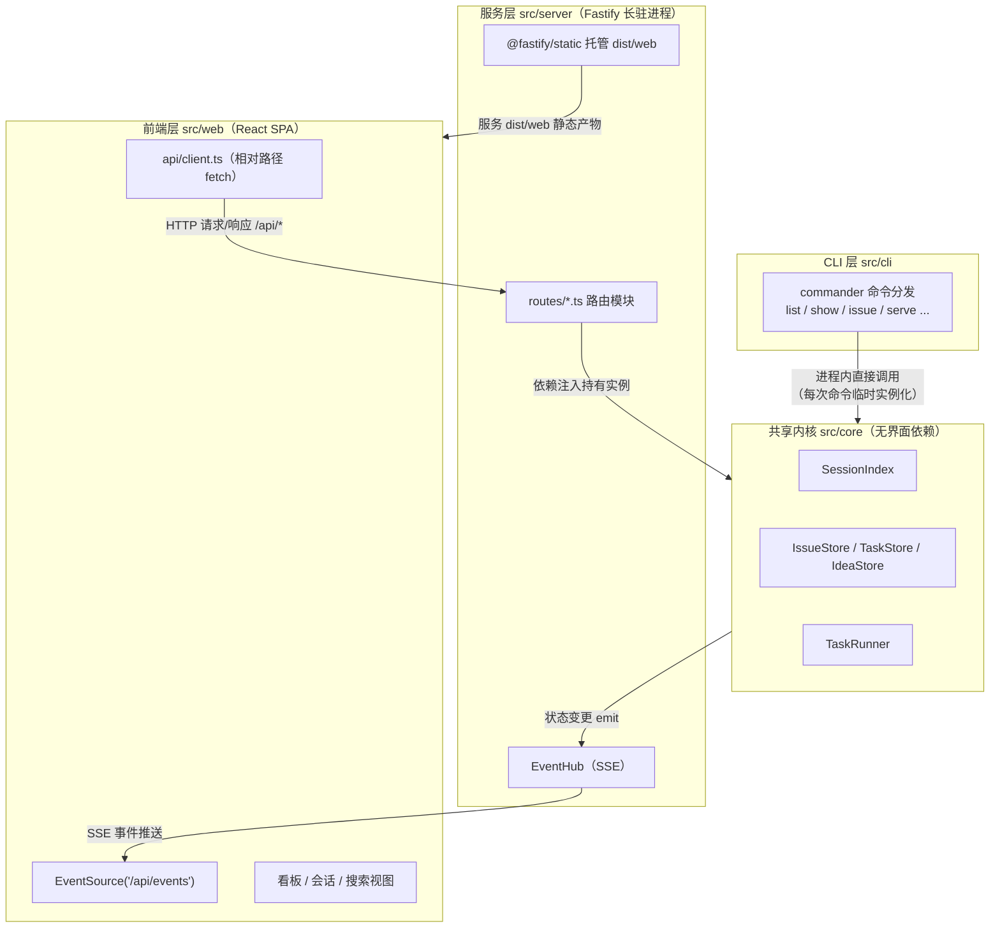
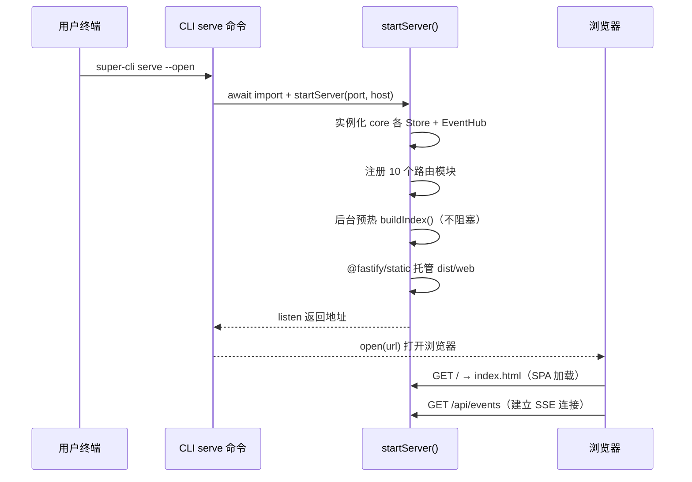
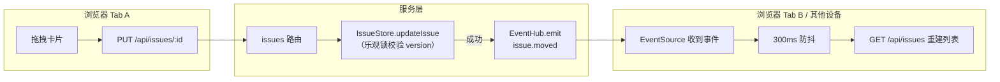
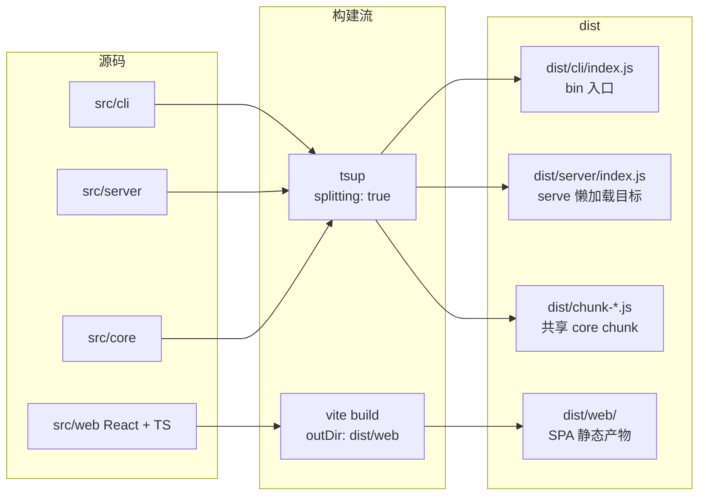

super-cli 并非单一程序，而是**三种交付形态共享一个领域内核**的复合体：终端里的 `super-cli` 命令、本地 HTTP 服务的 `/api/*` 接口、以及浏览器中的 React 看板，三者最终操作的是同一套数据——各 AI CLI 工具的 Session 文件与项目本地的 Issue JSON 存储。本文解释这三层各自的职责边界、它们之间唯一的两条通信通道（HTTP 请求/响应 + SSE 推送），以及构建系统如何把三个独立编译的产物装配成一个可发布的 npm 包。理解这张全局地图后，后续所有专题（Provider 适配、Session 索引、Issue 看板、前端实现）都能在图中找到自己的坐标。

## 全局视图：一个共享内核，三种交付形态

架构的核心事实是：**`src/core` 是纯粹的领域层，不依赖任何界面技术**。它包含 SessionIndex（会话索引）、IssueStore / TaskStore / IdeaStore（JSON 持久化）、TaskRunner（无头执行）等模块，只做文件读写与业务规则。CLI 命令和 Fastify 路由都是这个内核的"消费者"——CLI 在命令执行时临时实例化内核对象，服务端则长驻持有它们。前端 React 完全不接触内核，只通过 HTTP 与 SSE 与服务层对话。

三条协作路径中，最容易被忽视的是第三条：**服务层同时是 API 提供者和静态文件服务器**。生产模式下 Fastify 用 `@fastify/static` 直接托管 Vite 构建出的 `dist/web` 目录，浏览器与 API 同源，整套系统只需一个端口、一个进程。

| 维度 | CLI 层 | 服务层 | 前端层 |
|---|---|---|---|
| 运行环境 | Node.js 子进程（命令即进程） | Node.js 长驻进程 | 浏览器 |
| 生命周期 | 命令执行完即退出 | `serve` 启动后常驻 | 页面加载至关闭/刷新 |
| 访问内核方式 | 进程内直接 import，临时实例化 | 进程内持有长生命周期实例 | 不访问，仅经 HTTP/SSE |
| 依赖技术 | commander、chalk | Fastify、@fastify/cors、@fastify/static | React 19、Vite、Tailwind |
| 构建工具 | tsup（与 server 共享配置） | tsup | Vite 独立构建 |
| 产物位置 | `dist/cli/index.js` | `dist/server/index.js` | `dist/web/` |

Sources: [package.json](package.json#L50-L78)、[src/server/index.ts](src/server/index.ts#L27-L57)

## 第一层 CLI：进程入口与命令分发

CLI 层的入口是 `src/cli/index.ts`：它用 commander 创建 program、注册 11 个命令（list、show、search、issue、idea、agent、skill、stats、config、tasks、serve），最后 `program.parse()` 交出控制权。注意这个文件**不 import 任何 core 模块**——每个命令自己导入所需的内核类。以 `super-cli list` 为例，`list.ts` 在 action 中临时 `new SessionIndex()`、执行查询、用 `formatSessionList` 输出后进程随即退出。这种"每命令一次性实例"的模式是 CLI 层的标志性特征：无需缓存管理，代价是每次冷启动都要全量扫描（这也正是服务层要做索引预热的原因，见后文）。

`serve` 命令是三层架构的衔接点，它做了两件讲究的事。第一，**懒加载**：通过 `await import('../../server/index.js')` 动态引入服务端模块，意味着执行 `super-cli list` 时 Fastify 及其插件永远不会被加载进内存，普通命令保持轻量。第二，**错误转译**：捕获 `EADDRINUSE` 并给出可操作的中文提示（如何 kill 旧进程），将底层 Node 错误转化为用户语言；`--open` 选项再通过 `open` 包自动拉起浏览器，完成"CLI → 服务 → 浏览器"的启动闭环。默认绑定 `0.0.0.0:3000`，允许局域网访问。

Sources: [src/cli/index.ts](src/cli/index.ts#L16-L37)、[src/cli/commands/list.ts](src/cli/commands/list.ts#L1-L30)、[src/cli/commands/serve.ts](src/cli/commands/serve.ts#L11-L33)

## 第二层 Fastify：长驻进程与 HTTP 门面

`startServer()` 是服务层的组合根（composition root），它一次性完成四类装配。**内核实例化**：创建 SessionIndex、TaskStore、IssueStore、IdeaStore、AgentStore、TaskRunner、EventHub——与 CLI 不同，这些实例伴随进程存活全程，索引缓存因此能跨请求复用。**事件桥接**：`taskRunner.setEventListener` 把无头执行的事件转发给 EventHub 广播（过滤掉过于嘈杂的 `run.output`），使浏览器能实时看到 Agent 运行状态。**路由注册**：十个 `register*Routes` 函数各自接收 `(app, store, hub, ...)` 参数——这是教科书式的构造器注入，路由模块不持有全局单例，依赖关系在组合根一目了然。**索引预热**：`void index.buildIndex().catch(() => {})` 在后台启动全量扫描，注释明确说明目的是让首次页面加载不必等待冷扫描。

路由模块的模式以 `routes/issues.ts` 为代表，体现三层协作中的**领域错误 → HTTP 语义**翻译规则：`sendError` 将 `VersionConflictError` 映射为 409、`IssueNotFoundError` 映射为 404、`IssueStateError` 映射为 400，未知错误原样抛出交给框架。写操作成功后立即调用 `hub.emit('issue.created', ...)` 向所有 SSE 客户端广播。另一个细节是 `actorFrom`：通过 `x-super-cli-actor` 请求头区分 `user / agent / cli` 三类写入者——这意味着 HTTP API 不仅服务浏览器，也是 AI Agent 经由 taskboard Skill 回写看板的通道（Agent 以 CLI 之外的第三类客户端身份复用同一服务层）。

SPA 托管部分有一个必须精读的分支逻辑。`@fastify/static` 以 `dist/web` 为根、开启 wildcard；随后 `setNotFoundHandler` 区分两类 404：`/api/` 前缀的未命中返回真实 JSON 错误（API 消费者需要确定性语义），其余路径回退 `sendFile('index.html')` 支撑前端路由；若 `dist/web` 不存在则直接提示执行 `pnpm build:web`——代码注释明确写了这条约束：API 404 必须是真 404，只有前端路径才做 SPA fallback。

Sources: [src/server/index.ts](src/server/index.ts#L32-L57)、[src/server/index.ts](src/server/index.ts#L59-L82)、[src/server/routes/issues.ts](src/server/routes/issues.ts#L16-L35)、[src/server/routes/issues.ts](src/server/routes/issues.ts#L50-L71)

## 第三层 React：浏览器中的消费者

前端入口极简：`main.tsx` 用 `createRoot` 渲染 `<App />`，无路由库（视图切换由 App 内部状态驱动，详见前端架构专页）。与三层协作直接相关的是两个设计。**相对路径 API 客户端**：`api/client.ts` 中所有函数都以 `const API_BASE = '/api'` 为前缀发起 fetch，不硬编码主机名——生产模式下与服务同源直接命中，开发模式下由 Vite dev server 的 `server.proxy` 把 `/api` 转发到 `localhost:3000`，前端代码在两种模式下零修改。整个 client 是一层薄封装：每个后端接口对应一个导出函数，统一处理查询参数拼接与 JSON 解析。

**SSE 消费**位于 `App.tsx`：`new EventSource('/api/events')` 建立长连接后，对 13 种事件名（issue 增删改、评论、relation、run、idea.promoted）统一挂载同一个 `scheduleRefresh`——不是逐事件刷新，而是**300ms 防抖合并**为一次"重新拉取 Issue 列表 + 递增刷新 key"。`es.onopen` 里还处理了断线重连语义：非首次打开时触发全量刷新，防止断连期间漏掉事件。这里体现的分工哲学是：SSE 只传"发生了什么"的轻量信号（`{issueId, runId, status, at}`），完整数据始终由前端主动 fetch 获取——推送负责失效通知，拉取负责状态重建，避免了在 SSE 通道里传输大载荷。

服务端的 EventHub 实现与之严格对应：持有 `Set<FastifyReply['raw']>` 客户端集合，每 20 秒向所有客户端写入 `: keep-alive` 注释帧（`unref` 保证定时器不阻止进程退出），`emit` 将事件序列化为 `event: <type>\ndata: <json>\n\n` 标准帧广播。值得注意的是 `/api/events` 路由注册在 `routes/issues.ts` 内——SSE 端点与它服务最多的领域（Issue 看板）放在同一模块，属于务实而非教条的组织选择。

Sources: [src/web/src/main.tsx](src/web/src/main.tsx#L6-L10)、[src/web/src/api/client.ts](src/web/src/api/client.ts#L1-L32)、[src/web/src/App.tsx](src/web/src/App.tsx#L324-L351)、[src/server/events.ts](src/server/events.ts#L28-L58)、[src/server/routes/issues.ts](src/server/routes/issues.ts#L339-L339)

## 三层协作的完整闭环：一次卡片拖拽的旅程

把三层串起来观察一次真实写入——用户在浏览器把一张 Issue 卡片拖到"done"列：

这张图揭示了协作的两个关键性质。其一，**同源单端口**：PUT 与 SSE 连接走同一个 Fastify 进程，无需跨域配置（`@fastify/cors` 的 `origin: true` 主要服务于开发期 Vite 代理与外部脚本场景）。其二，**扇出一致性**：Tab A 自己的更新同样会收到自己触发的 SSE 事件——防抖刷新对发起者也生效，保证多标签页、多设备、以及 Agent 经 HTTP 写入的变更收敛到同一视图。

两条通道的分工可以总结为：

| 通道 | 方向 | 传输内容 | 触发时机 | 客户端处理 |
|---|---|---|---|---|
| HTTP fetch（`/api/*`） | 前端 → 服务 | 完整查询参数 / 请求体 | 用户交互、初始化、防抖到期 | 直接 setState 渲染 |
| SSE（`/api/events`） | 服务 → 前端 | 轻量信号 `{issueId, runId, status, at}` | Store 写操作、TaskRunner 状态变化 | 防抖后重新 fetch |

Sources: [src/server/routes/issues.ts](src/server/routes/issues.ts#L57-L67)、[src/web/src/App.tsx](src/web/src/App.tsx#L329-L346)、[src/server/index.ts](src/server/index.ts#L30-L30)

## 构建协作：三种产物如何拼成一个包

三层在源码上分离，在构建上却是一次联合装配。`tsup.config.ts` 声明两个入口（`cli/index`、`server/index`），以 ESM + node22 + `splitting: true` 打包——**共享内核代码被抽到公共 chunk**，CLI 与 Server 两个入口不会各自内嵌一份 core（这正是 `package.json` 的 `files` 字段要包含 `dist/chunk-*.js` 的原因）。`clean: ['!web', '!web/**']` 是一处精心的防御：tsup 清理产物目录时会排除 `dist/web`，确保重复执行 `build:cli` 不会误删 Vite 构建的 SPA。

运行期的路径闭环在 `startServer` 中收口：`join(__dirname, '..', 'web')` 从 `dist/server` 出发定位到 `dist/web`——这个相对路径保证了无论 npm 包被安装到全局还是项目内，静态资源都能被正确找到。开发期的协作则是**双进程**形态：`pnpm dev`（tsup watch）热重建 CLI/Server，`pnpm dev:web` 启动 Vite dev server（默认 5173 端口）并将 `/api` 代理到 3000——前端改动秒级生效，服务端改动由 tsup watch 重建后重启 serve 进程生效。

Sources: [tsup.config.ts](tsup.config.ts#L3-L19)、[package.json](package.json#L6-L13)、[package.json](package.json#L28-L38)、[src/server/index.ts](src/server/index.ts#L59-L69)、[src/web/vite.config.ts](src/web/vite.config.ts#L8-L16)

## 设计权衡：为什么是这种切分

这套架构的几个决策值得作为模式记忆。**内核先行**：core 不 import fastify/react/commander 中任何一个，所有界面依赖方向都是内向的，这让"命令行工具长出 Web 界面"成为纯增量改动而非重构。**懒加载边界**：serve 对 server 的动态 import 把 Web 技术栈的成本隔离在真正需要它的执行路径上。**单端口同源**：省去生产环境的反向代理、CORS 复杂度与双进程运维，代价是 API 与静态资源共享同一事件循环——对本地工具场景完全合理。**拉推分离**：SSE 只发信号不发数据，任何事件风暴最多触发一次防抖后的 refetch，把一致性收敛成本压到最低。

同时要认清边界：`actorFrom` 的请求头标识意味着服务层信任客户端自报身份（本地工具可接受，公网部署则需加固）；`fastifyStatic` 的 `origin: true` CORS 策略同样属于"本地优先"的取舍。

## 延伸阅读

- 数据如何被读取：[多 Provider 抽象：注册表设计与 8 家 CLI 工具适配](7-duo-provider-chou-xiang-zhu-ce-biao-she-ji-yu-8-jia-cli-gong-ju-gua-pei)、[Session 索引引擎：TTL 缓存、mtime 失效与后台预热](8-session-suo-yin-yin-qing-ttl-huan-cun-mtime-shi-xiao-yu-hou-tai-yu-re)
- 推送通道细节：[SSE 实时事件推送：EventHub 设计与事件类型](16-sse-shi-shi-shi-jian-tui-song-eventhub-she-ji-yu-shi-jian-lei-xing)、[前端实时同步：消费 SSE 事件流更新看板](24-qian-duan-shi-shi-tong-bu-xiao-fei-sse-shi-jian-liu-geng-xin-kan-ban)
- 第三类客户端：[super-cli-taskboard Skill 的分发与跨 Provider 安装](17-super-cli-taskboard-skill-de-fen-fa-yu-kua-provider-an-zhuang)、[无头执行管线：TaskRunner 从 spawn 到会话自动绑定](19-wu-tou-zhi-xing-guan-xian-taskrunner-cong-spawn-dao-hui-hua-zi-dong-bang-ding)
- 前端与构建：[React 应用架构：单页路由与视图组织](22-react-ying-yong-jia-gou-dan-ye-lu-you-yu-shi-tu-zu-zhi)、[双构建流：tsup 打包 CLI/Server 与 Vite 构建 Web](30-shuang-gou-jian-liu-tsup-da-bao-cli-server-yu-vite-gou-jian-web)