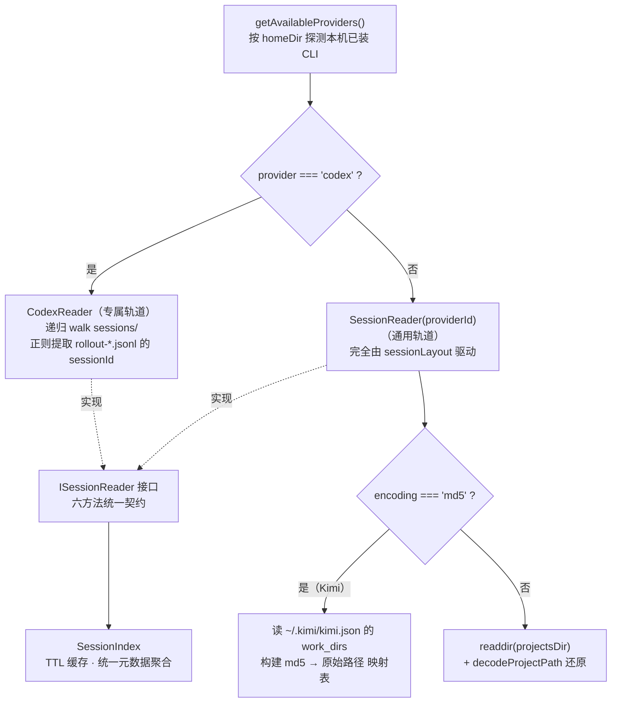
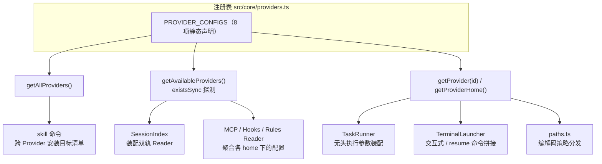

super-cli 的核心命题之一，是让 **Claude Code、Codex、Qoder、Kimi、Pi、OpenCode、WorkBuddy、TraeCode** 这八家异构 AI CLI 工具在同一块看板下被统一观测、统一启动、统一配置。本文拆解支撑这一目标的中枢设计：一份仅 122 行的声明式注册表 `src/core/providers.ts`，以及围绕它生长出的路径编解码分发、双轨 Session Reader、能力分级与消费者网络。理解这一层，是理解 super-cli 所有"跨 Provider"特性的前置条件。

## 一、设计取舍：数据驱动的声明式注册表

面对八家 CLI 的差异，super-cli 没有选择类继承体系（如 `abstract class BaseProvider` + 八个子类），而是选择了**纯数据描述**：一个静态数组 `PROVIDER_CONFIGS`，每项是一个 `ProviderConfig` 对象，把每家 CLI 的"能力快照"——启动命令、新建/恢复参数、家目录、是否接受位置参数提示、会话存储布局——一次性声明完毕。差异被收敛进两个字段级的联合类型：`SessionLayout.encoding` 描述项目目录如何编码路径（四种策略），`SessionLayout.file` 描述会话文件如何命名（三种形态）。可选字段 `sessionLayout` 与 `supportsPrompt` 的**有无本身就是语义**：没有 `sessionLayout` 意味着该 Provider 的会话暂不可被索引，没有 `supportsPrompt` 意味着启动时不能把首条提示作为位置参数传入。

Sources: [providers.ts](src/core/providers.ts#L6-L27)

这种设计的直接收益是**单点修改、全链路生效**：注册表之上只暴露四个访问函数——`getAllProviders` 返回全量、`getAvailableProviders` 用 `existsSync(homeDir)` 探测本机实际安装了哪些 CLI、`getProvider(id)` 按 ID 精确查找（未知 ID 抛错）、`getProviderHome` 快捷取家目录。下游所有模块（索引引擎、无头执行、终端启动、配置读取、Skill 安装）都只依赖这四个函数，而不感知具体某家 CLI 的存在。
Sources: [providers.ts](src/core/providers.ts#L105-L121)

## 二、注册表全景：8 家 Provider 逐项拆解

下表是 `PROVIDER_CONFIGS` 数组的完整投影，能力列（无头执行、可索引）分别来自 `agent-store.ts` 的白名单与 `sessionLayout` 字段的存在性：

| Provider ID | 名称 | 命令 | homeDir | projectsDir | 路径编码 | 会话文件 | supportsPrompt | 可索引 | 无头执行 |
|---|---|---|---|---|---|---|---|---|---|
| `claude-code` | Claude Code | `claude` | `~/.claude` | `projects` | `dash` | `uuid.jsonl` | ✅ | ✅ | ✅ |
| `qoder` | Qoder CLI | `qodercli` | `~/.qoder` | `projects` | `dash` | `uuid.jsonl` | ❌ | ✅ | ❌ |
| `codex` | Codex CLI | `codex` | `~/.codex` | —（专属 Reader） | — | `rollout-*.jsonl` | ✅ | ✅* | ✅ |
| `kimi` | Kimi CLI | `kimi` | `~/.kimi` | `sessions` | `md5` | `context.jsonl-subdir` | ✅ | ✅ | ❌ |
| `pi` | Pi CLI | `pi` | `~/.pi` | `agent/sessions` | `double-dash` | `timestamp_uuid.jsonl` | ✅ | ✅ | ✅ |
| `opencode` | OpenCode | `opencode` | `~/.opencode` | — | — | — | ❌ | ❌ | ❌ |
| `workbuddy` | WorkBuddy | `workbuddy` | `~/.workbuddy` | `projects` | `dash-no-prefix` | `uuid.jsonl` | ❌ | ✅ | ❌ |
| `traecode` | TraeCode | `traecode` | `~/.traecode` | — | — | — | ❌ | ❌ | ❌ |

（*Codex 未声明 `sessionLayout`，但通过专属 `CodexReader` 实现索引，见第四节。）类型层面的契约是一行联合类型：`CliProvider = 'claude-code' | 'qoder' | 'codex' | 'kimi' | 'pi' | 'opencode' | 'workbuddy' | 'traecode'`，八家 Provider 在整个代码库中以此为唯一标识流通。
Sources: [providers.ts](src/core/providers.ts#L29-L103) [types.ts](src/core/types.ts#L1)

三处条目值得特别标注。**Claude Code 与 Qoder** 是唯二在 `newArgs` 中默认携带 `--dangerously-skip-permissions` 的 Provider——这是无值守执行（headless run）的前置条件，Qoder 的布局与 Claude Code 完全同构（`projects` 目录 + `dash` 编码 + `uuid.jsonl`），可以视为"兼容 Claude Code 存储格式的镜像条目"。**Pi** 的 `resumeArgs` 是八家中唯一的"有逻辑"实现：其会话文件名为 `<timestamp>_<uuid>.jsonl`，但 CLI 恢复时只认裸 UUID，因此在拼接参数前用 `id.slice(id.indexOf('_') + 1)` 剥掉时间戳前缀。**Codex** 则完全不声明 `sessionLayout`——它的会话存储是嵌套目录加 `rollout-` 前缀文件名的结构，无法用三维模型描述，注册表干脆留空，把解析职责移交给了专属 Reader。
Sources: [providers.ts](src/core/providers.ts#L31-L57) [providers.ts](src/core/providers.ts#L69-L77)

## 三、SessionLayout 三维模型：目录、编码与文件形态

`SessionLayout` 是整个抽象中最精巧的部分——它用一个不超过三字段的对象，把"某家 CLI 把会话转录存在磁盘的哪个位置、以什么方式组织"压缩成了机器可分发的描述符。四个消费者据此完成差异化行为，无需任何 `if (provider === 'xxx')` 式的硬编码：

| 维度 | 取值 | 含义 | 使用方 |
|---|---|---|---|
| `projectsDir` | 如 `projects` / `sessions` / `agent/sessions` | homeDir 下按项目分目录的容器 | `getProjectsDir()` 拼接扫描根 |
| `encoding` | `dash` | `/` → `-`，保留前导 `-`（如 `-Users-alice-...`） | Claude Code、Qoder |
| | `dash-no-prefix` | 同上但去掉前导 `-` | WorkBuddy |
| | `double-dash` | 首尾双横线包裹（`--Users-alice-...--`） | Pi |
| | `md5` | 路径的 MD5 十六进制摘要，单向不可逆 | Kimi |
| `file` | `uuid.jsonl` | 扁平文件，文件名即 sessionId | Claude Code、Qoder、WorkBuddy |
| | `context.jsonl-subdir` | 每会话一个子目录，内含 `context.jsonl` | Kimi |
| | `timestamp_uuid.jsonl` | 复合文件名，basename 整体作 sessionId | Pi |

落到磁盘上，同一个项目 `/Users/alice/work/super-cli` 在五家可索引 Provider 下的目录形态示意如下（编码规则由 `encodeProjectPath` 推导）：

```
~/.claude/projects/-Users-alice-work-super-cli/<uuid>.jsonl
~/.qoder/projects/-Users-alice-work-super-cli/<uuid>.jsonl
~/.workbuddy/projects/Users-alice-work-super-cli/<uuid>.jsonl
~/.pi/agent/sessions/--Users-alice-work-super-cli--/<timestamp>_<uuid>.jsonl
~/.kimi/sessions/e3b0c44298fc1c149afbf4c8996fb924/<sessionId>/context.jsonl
~/.codex/sessions/**/rollout-20250601T000000-<uuid>.jsonl   ← 专属 Reader 递归扫描
```

编解码的分发点在 `paths.ts`：`encodeProjectPath` / `decodeProjectPath` 先查 `getProvider(provider).sessionLayout?.encoding ?? 'dash'`，再进入 switch 分支；`getSessionFilePath` 则按 `layout.file === 'context.jsonl-subdir'` 决定是拼 `<dir>/<sessionId>/context.jsonl` 还是 `<dir>/<sessionId>.jsonl`。值得注意的是 `md5` 分支的解码是**空操作**——注释明确说明单向哈希必须由调用方经由 Provider 自己的映射文件还原（Kimi 的还原机制见下节）。
Sources: [providers.ts](src/core/providers.ts#L6-L14) [paths.ts](src/core/paths.ts#L112-L133) [paths.ts](src/core/paths.ts#L61-L77)

## 四、双轨 Reader：通用布局引擎与 Codex 特化

会话索引层没有为八家 Provider 写八个解析器，而是收敛为**一个接口、两个实现**。`ISessionReader` 定义了六方法契约（列项目、列会话、流式读、整读、读元数据、读活跃会话），`SessionIndex` 在构造时遍历 `getAvailableProviders()`，按一条规则分流：`p.id === 'codex' ? new CodexReader() : new SessionReader(p.id)`——即 Codex 走专属轨道，其余七家（包括暂无布局的三家）共用通用轨道，通用 Reader 遇到 `sessionLayout` 为空时所有方法优雅返回空集合。



通用轨道 `SessionReader` 有两处针对三维模型的内部分支。其一在 `listProjects`：遇到 `md5` 编码时不直接 `readdir` 解码（哈希不可逆），而是读取 `~/.kimi/kimi.json` 中的 `work_dirs` 列表，对每条真实路径调用 `encodeProjectPath` 正向计算出哈希，再回头 `stat` 验证对应目录是否存在——用"正向重算"绕过了"逆向解码"的不可能问题。其二在 `listProjectSessions`：`context.jsonl-subdir` 形态下遍历子目录并探测 `context.jsonl` 的存在，而 `uuid.jsonl` 与 `timestamp_uuid.jsonl` 两种形态统一取"basename 去掉 `.jsonl` 后缀"作为 sessionId，仅由 Pi 的 `resumeArgs` 在恢复时负责剥离时间戳。专属轨道 `CodexReader` 则自建逻辑：递归遍历 `~/.codex/sessions` 收集所有 `.jsonl` 文件，用正则 `rollout-[\dT-]+-(.+)\.jsonl` 从文件名提取线程 ID。
Sources: [session-index.ts](src/core/session-index.ts#L9-L18) [session-index.ts](src/core/session-index.ts#L64-L79) [session-reader.ts](src/core/session-reader.ts#L16-L49) [session-reader.ts](src/core/session-reader.ts#L145-L159) [codex-reader.ts](src/core/codex-reader.ts#L22-L51)

## 五、消费者网络：注册表的单点分发

注册表的价值在于它是**唯一的事实源**——全代码库没有任何模块硬编码某个具体 CLI 的命令或路径，一切差异都经由 `getProvider` / `getAvailableProviders` 分发。整个消费网络如下：



**启动链**上有两个消费者。`TerminalLauncher` 负责"交互式"：resume 场景拼 `command + resumeArgs(sessionId)`，新建场景拼 `command + newArgs`，并在 `supportsPrompt` 为真时追加位置参数提示。`TaskRunner` 负责"无头"，它在注册表默认参数之上再做一层 Provider 特化——`buildHeadlessArgs` 内一个显式 switch：Claude Code 追加 `-p <prompt> --output-format json`，Codex 用 `exec` 子命令加 `--json`，Pi 用 `--mode json` 并注入预生成的 `--session-id`（因为 Pi 的会话 ID 由调用方而非 CLI 进程产生），其余五家直接抛 `RunStateError`。连模型参数（`buildModelArgs`）和会话 ID 提取（`extractSessionId`）也遵循同一模式：Codex 用 `-c model="..."` 而别家用 `--model`；stdout 解析时 Claude Code 读 `session_id` 字段，Codex 读 `thread.started` 事件的 `thread_id`，Pi 则直接复用预注入的 ID。
Sources: [terminal-launcher.ts](src/core/terminal-launcher.ts#L24-L27) [terminal-launcher.ts](src/core/terminal-launcher.ts#L43-L47) [task-runner.ts](src/core/task-runner.ts#L31-L59) [task-runner.ts](src/core/task-runner.ts#L68-L86)

**配置聚合链**上，MCP、Hooks、Rules 三类 Reader 遍历 `getAvailableProviders()` 时统一执行 `filter(p => p.id !== 'codex')` 的排除——Codex 的配置模型不兼容 `settings.json` 约定，注册表的"全量"与"可用"两级过滤在此再叠加一层语义例外。Rules Reader 的全局规格表则展示了另一类适配：只有 Claude Code（`CLAUDE.md`）和 Qoder（`AGENTS.md`）拥有全局规则文件，其余 Provider 只参与项目级规则扫描（`KNOWN_PROJECT_RULE_NAMES` 名单含 `.cursorrules`、`.github/copilot-instructions.md` 等跨生态文件名）。CLI 侧的 `skill` 命令则以 `getAllProviders()` 的全量八家作为 Skill 安装目标，实现了"一次打包、处处安装"的分发策略（详见 [super-cli-taskboard Skill 的分发与跨 Provider 安装](17-super-cli-taskboard-skill-de-fen-fa-yu-kua-provider-an-zhuang)）。
Sources: [mcp-reader.ts](src/core/mcp-reader.ts#L77-L96) [hooks-reader.ts](src/core/hooks-reader.ts#L59-L63) [rules-reader.ts](src/core/rules-reader.ts#L14-L30) [skill.ts](src/cli/commands/skill.ts#L49)

## 六、有损编码与项目身份还原

`dash` 系编码是**有损压缩**：路径中的连字符与路径分隔符在编码后不可区分（`super-cli` 会被误还原为 `super/cli`）。super-cli 用三道防线补偿。第一道是启发式解码 `decodeAnyProjectPath`：当 Issue 中存储的 `projectEncoded` 不知道来自哪家 Provider 时，按形态推断——`--` 前缀按 Pi 解、32 位十六进制判定为 Kimi 哈希（原样返回）、`-` 前缀按 Claude Code 解、含 `/` 视为已解码、其余按 WorkBuddy 兜底。第二道是 `resolveIssueProjectPath` 的磁盘验证：把解码候选路径 `existsSync` 实测，命中即用。第三道是索引层的**别名映射表**：`SessionIndex.getProjects()` 按"解码后的真实路径"聚合所有 Provider 的记录，同一项目无论被几家 CLI 记录、无论以哪种编码出现，都会合并为同一行并携带 `providers[]` 与 `aliases[]` 数组，TaskRunner 解析 Issue 归属项目时以该映射表为最终兜底。
Sources: [paths.ts](src/core/paths.ts#L80-L86) [paths.ts](src/core/paths.ts#L88-L110) [session-index.ts](src/core/session-index.ts#L215-L252) [task-runner.ts](src/core/task-runner.ts#L127-L145)

## 七、扩展第九家 Provider：改动清单

得益于声明式设计，接入一家新 CLI 的成本被压缩到三个动作：在 `types.ts` 的 `CliProvider` 联合类型中追加字面量；在 `PROVIDER_CONFIGS` 数组中追加一条 `ProviderConfig`（若其会话存储能被三维模型描述则附上 `sessionLayout`，否则参考 Codex 走专属 Reader 路线）；若其 CLI 支持非交互模式，再把 ID 加入 `HEADLESS_PROVIDERS` 白名单并在 `buildHeadlessArgs` 的 switch 中补一个分支。其余路径编解码、索引装配、终端启动、MCP/Hooks 聚合、Skill 安装目标全部自动获得对新 Provider 的支持，无需逐模块修改。

| 改动点 | 文件 | 必要性 |
|---|---|---|
| 追加类型字面量 | `types.ts#L1` | 必须 |
| 追加注册条目（含 resumeArgs 等启动契约） | `providers.ts#L29-L103` | 必须 |
| 声明 `sessionLayout`（若可被三维模型描述） | `providers.ts#L6-L14` | 可索引则必须 |
| 加入 `HEADLESS_PROVIDERS` + headless 参数分支 | `agent-store.ts#L24` / `task-runner.ts#L39-L49` | 仅无头执行需要 |
| 新建专属 Reader（若布局无法声明式描述） | 参考 `codex-reader.ts` | 仅特殊存储需要 |

Sources: [providers.ts](src/core/providers.ts#L29-L103) [types.ts](src/core/types.ts#L1) [agent-store.ts](src/core/agent-store.ts#L23-L28) [task-runner.ts](src/core/task-runner.ts#L31-L49)

## 下一步阅读

注册表是分发中枢，而它驱动的三条下游管线各有专门篇章：想了解双轨 Reader 产出的元数据如何被 TTL 缓存与 mtime 失效机制管理，请读 [Session 索引引擎：TTL 缓存、mtime 失效与后台预热](8-session-suo-yin-yin-qing-ttl-huan-cun-mtime-shi-xiao-yu-hou-tai-yu-re)；想看 JSONL 流式解析如何抹平各家消息格式差异，请读 [异构 Session 文件解析：JSONL 流式读取与格式差异](9-yi-gou-session-wen-jian-jie-xi-jsonl-liu-shi-du-qu-yu-ge-shi-chai-yi)；四种路径编码的完整映射细节在 [项目路径编码：跨 Provider 的目录命名映射与解码](10-xiang-mu-lu-jing-bian-ma-kua-provider-de-mu-lu-ming-ming-ying-she-yu-jie-ma)；无头执行的完整生命周期见 [无头执行管线：TaskRunner 从 spawn 到会话自动绑定](19-wu-tou-zhi-xing-guan-xian-taskrunner-cong-spawn-dao-hui-hua-zi-dong-bang-ding)；各 home 目录下的 MCP/Rules/Hooks 配置读取细节则在 [Harness 配置读取：MCP、Rules、Hooks 与 Permissions](27-harness-pei-zhi-du-qu-mcp-rules-hooks-yu-permissions)。