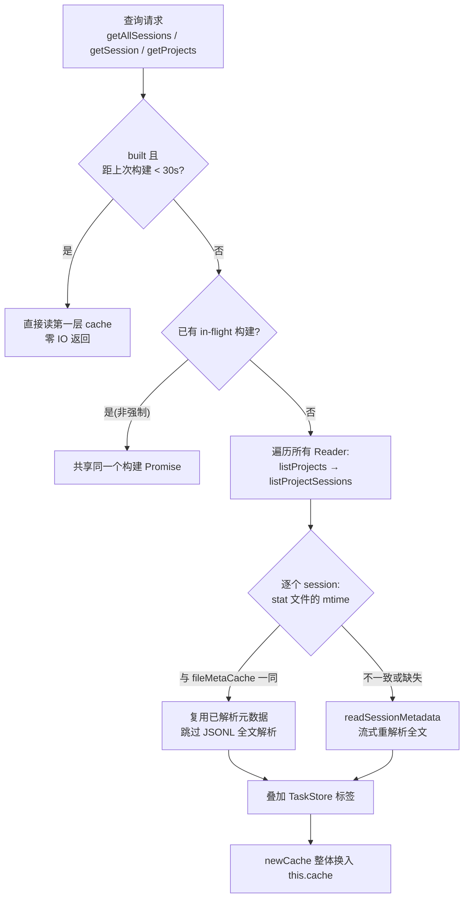

super-cli 需要同时索引 8 家 CLI 工具（Claude Code、Codex、Kimi、Pi 等）落在磁盘上的全部 session 文件，而提取每个 session 的元数据意味着**流式解析整个 JSONL 文件**——消息计数、token 累计、首末时间戳都要逐行统计。当 session 数量达到数百上千时，一次全量扫描的代价是秒级的。`SessionIndex` 就是为解决这个问题而存在的缓存引擎：它用**双层缓存**（TTL 时间窗 + 文件 mtime）把重复扫描的成本压缩到接近零，并通过服务启动时的后台预热消除首次访问的冷启动延迟。本文将拆解这套机制的完整实现，位于 [session-index.ts](src/core/session-index.ts#L54-L62)。

## 问题域：为什么需要一个"索引引擎"

在深入实现之前，先理解元数据提取到底有多贵。`SessionReader.readSessionMetadata` 对每个 session 文件执行 `for await` 逐行流式读取，统计 messageCount、userMessageCount、assistantMessageCount，累计 input/output token，捕获 firstTimestamp / lastTimestamp，并聚合出现过的所有 model 名称，见 [session-reader.ts](src/core/session-reader.ts#L169-L227)。这个过程没有任何增量手段——JSONL 是追加式日志，首条用户消息在文件头、最后时间戳在文件尾，**必须读完全文才能得到正确结果**。

雪上加霜的是数据源的异构性：不同 Provider 的项目目录编码方式不同（dash 编码、md5 编码）、session 文件命名不同（`uuid.jsonl`、`timestamp_uuid.jsonl`、`context.jsonl` 子目录），Codex 甚至采用递归遍历的 `rollout-*.jsonl` 布局。`SessionIndex` 在构造时通过 Provider 注册表发现可用工具，为 codex 分配专用的 `CodexReader`、其余分配通用 `SessionReader`，将这层差异完全封装在 reader 多态之后，见 [session-index.ts](src/core/session-index.ts#L64-L79)（Provider 注册表本身的设计详见 [多 Provider 抽象](7-duo-provider-chou-xiang-zhu-ce-biao-she-ji-yu-8-jia-cli-gong-ju-gua-pei)，JSONL 格式差异详见 [异构 Session 文件解析](9-yi-gou-session-wen-jian-jie-xi-jsonl-liu-shi-du-qu-yu-ge-shi-chai-yi)）。

两种 Reader 实现了同一套鸭子类型接口（`ISessionReader` 在索引文件中声明，包含 `listProjects`、`listProjectSessions`、`readSessionMetadata`、`getSessionFileStats` 等方法），关键的是**两者都提供 `getSessionFileStats`**，返回 `{ size, mtime }`——这正是 mtime 缓存策略能够跨 Provider 统一生效的契约基础，见 [session-index.ts](src/core/session-index.ts#L9-L18) 与 [codex-reader.ts](src/core/codex-reader.ts#L22-L52)。

## 核心设计：双层缓存架构

`SessionIndex` 的状态字段揭示了它的双层结构，见 [session-index.ts](src/core/session-index.ts#L54-L62)：

```typescript
private cache: Map<string, SessionMetadata> = new Map();          // 第一层：结果缓存
private fileMetaCache = new Map<string, { mtimeMs: number; metadata: SessionMetadata }>();  // 第二层：解析缓存
private built = false;                                            // TTL 层状态
private lastBuildTime = 0;
private readonly ttlMs: number;                                   // 默认 30_000ms
private inflight: Promise<void> | null = null;                    // 并发去重
```

**第一层是 TTL 缓存**（`cache` + `built` + `lastBuildTime`）：它决定的是"要不要发起一次目录树重扫"。在上次构建后 30 秒内，所有查询请求直接命中内存中的元数据 Map，连 `readdir` 都不会执行。`invalidateCache()` 方法通过重置 `built = false` 和 `lastBuildTime = 0` 强制下一次访问触发重建，见 [session-index.ts](src/core/session-index.ts#L81-L84)。

**第二层是 mtime 缓存**（`fileMetaCache`）：它决定的是"重扫时，哪些 session 文件需要重新解析"。每个 sessionId 映射到 `{ mtimeMs, metadata }`，重建过程中先取文件当前的 `stat().mtime`，与缓存值相等则直接复用已解析的元数据（浅拷贝），**跳过昂贵的全文件流式解析**；不相等才调用 `readSessionMetadata` 重新解析并更新缓存，见 [session-index.ts](src/core/session-index.ts#L117-L126)。



这两层的分工可以用一张表清晰对比，值得注意的是它们的**失效独立性**：

| 维度 | 第一层：TTL 缓存 | 第二层：mtime 缓存 |
|---|---|---|
| 缓存对象 | 全量 `SessionMetadata` Map | 单 session 的解析结果 + 文件 mtime |
| 回答的问题 | 是否需要重扫目录树 | 该文件是否需要重新解析 |
| 失效条件 | 30 秒过期 / `invalidateCache()` 调用 | 文件 mtime 变化 |
| 生命周期 | 每次重建整体替换 | **跨重建存活，从不主动清空** |
| 典型节省 | 省掉 `readdir` 目录遍历 | 省掉 JSONL 全文流式解析 |

关键洞察在于第二层"从不主动清空"：即使 `invalidateCache()` 或 `forceRefresh` 触发了一次彻底重建，`fileMetaCache` 依然保留——因为**重建目录索引不需要重新解析内容未变的文件**。mtime 是文件系统提供的免费真相源，`getSessionFileStats` 只需一次 `stat` 系统调用（对比全文件解析的数百次 readline），这是整个引擎中最高的杠杆点，见 [session-reader.ts](src/core/session-reader.ts#L272-L280)。

## 构建流程：并发去重、换血交换与标签叠加

`buildIndex` 是所有查询的隐式前置步骤——`getAllSessions`、`getSession`、`findSessionByPrefix`、`getProjects` 每个方法的第一行都是 `await this.buildIndex()`，保证调用者永远面对一份已就绪的索引。它的完整逻辑浓缩在 20 行内，见 [session-index.ts](src/core/session-index.ts#L86-L101)。

**并发去重**是最精巧的部分：Web 看板页面加载时，前端的多个请求（sessions 列表、projects 统计、stats 汇总）几乎同时到达，如果没有保护，每个请求都会独立触发一次全量扫描。`inflight` 字段持有当前构建中的 Promise，后来的非强制调用者直接复用它（`return this.inflight`），**N 个并发请求共享同一次磁盘扫描**；强制刷新的调用者则先 `await` 当前构建完成再发起自己的构建，见 [session-index.ts](src/core/session-index.ts#L89-L100)。构建结束时用 `finally` 块将 `inflight` 归位为 `null`，且带了 `this.inflight === task` 的相等性检查，避免误清掉后来者启动的新构建，见 [session-index.ts](src/core/session-index.ts#L96-L100)。

**换血式缓存交换**（swap semantics）：`doBuildIndex` 从不原地修改 `this.cache`，而是构建一个全新的 `newCache`，全部完成后一次性赋值 `this.cache = newCache`，见 [session-index.ts](src/core/session-index.ts#L107-L141)。这保证了任何时刻读取者看到的都是一份完整的索引快照——不会出现"查到一半时 Map 中一半是新数据一半是旧数据"的撕裂状态。对已删除的 session，由于新 Map 中不再有对应条目，换血机制天然实现了过期条目的清除（这正是 fileMetaCache 不需要主动清理的另一半原因：真正失效的条目不会被新 Map 引用）。

**标签叠加层的顺序设计**暗藏一个容易忽略的正确性细节：TaskStore 中用户为 session 设置的 `label` 和 `tags` 会在元数据组装完成后覆盖写入，见 [session-index.ts](src/core/session-index.ts#L128-L132)：

```typescript
const cached = this.fileMetaCache.get(sessionId);
if (cached && cached.mtimeMs === mtimeMs && mtimeMs !== 0) {
  metadata = { ...cached.metadata };        // 复制的仍是"原始"元数据
} else { ... }

const taskLabel = labels[sessionId];
if (taskLabel) {
  metadata.label = taskLabel.label;         // 标签在缓存命中后才叠加
  metadata.tags = taskLabel.tags;
}
```

如果把标签写进 `fileMetaCache`，会出 bug：session 文件的 mtime 没变，但用户改了任务标签——缓存命中时返回的将是旧标签。当前实现保证标签**每次构建都从 TaskStore 现取**，与文件 mtime 这条失效轴完全解耦。同样值得注意 L122 的 `{ ...cached.metadata }` 浅拷贝：调用方对返回对象的修改不会污染缓存内部状态。

**逐 session 的容错边界**：整个双层遍历包在 `try/catch` 中，单个 session 文件损坏、被删除或无权限读取时只跳过该条目，不中断整体构建，见 [session-index.ts](src/core/session-index.ts#L115-L136)。这符合读外部数据的防御性原则——磁盘上的文件随时可能被并发的 CLI 进程创建、追加或删除。

还有一个 mtime 为 0 的边界处理：`stats` 为 `null`（文件已消失）时 `mtimeMs` 取 0，而判定条件中 `mtimeMs !== 0` 确保值为 0 的缓存永不命中，强制走一次真实解析（大概率抛错被跳过），避免用一个可能过期的缓存掩盖文件已删除的事实，见 [session-index.ts](src/core/session-index.ts#L117-L125)。

## 后台预热：消除首次访问的冷启动

`startServer` 在注册完核心路由后、注册统计路由前，执行了这样一行，见 [server/index.ts](src/server/index.ts#L50-L57)：

```typescript
// Warm the session index in the background so the first page load does not
// wait for a cold full scan of all provider session files.
void index.buildIndex().catch(() => {});
```

`void` + `.catch()` 的组合是"发射后不管"（fire-and-forget）的标准写法：Promise 的 rejection 被静默吞掉（后续查询触发重建时还能重试），而**不 await** 意味着 `app.listen` 立即返回、服务先行可用。效果是：用户打开浏览器的几秒里，首次全量扫描已在后台并行完成，第一个 API 请求大概率直接命中刚建好的缓存，而不是等待冷扫描。

**实例生命周期决定了缓存策略的实际受益方**。Server 进程中的 `index` 是长驻单例（L32 创建，注册给全部 5 组路由共享），TTL 窗口和 mtime 缓存在进程生命期内持续复利——见 [server/index.ts](src/server/index.ts#L32-L57)。而 CLI 命令（`list`、`show`、`stats`、`tasks` 等）每次执行都 `new SessionIndex()` 创建全新实例，进程结束即销毁，两层缓存实际上都帮不上忙，见 [list.ts](src/cli/commands/list.ts#L19)。这不是设计疏漏，而是合理的分层：CLI 是一次性查询，缓存无处安放；**索引引擎的复杂度全部服务于长驻的 Web 服务场景**。

唯一的主动失效入口是 `POST /api/refresh` 路由：它调用 `invalidateCache()` 重置 TTL 状态，下一次任意查询即触发重建（重建时 mtime 层照常工作），给前端提供了"手动刷新"按钮的后端支撑，见 [refresh.ts](src/server/routes/refresh.ts#L4-L9)。整体失效时机全景如下：

| 触发方式 | 作用层 | 行为 |
|---|---|---|
| 30 秒 TTL 自然过期 | 第一层 | 下次查询触发重扫；未变文件走 mtime 复用 |
| `POST /api/refresh` | 第一层 | 立即置 `built=false`，效果等同过期 |
| session 文件被追加/修改 | 第二层 | 重扫时 mtime 不匹配，单文件重新解析 |
| session 文件被删除 | 第二层 | `stat` 返回 null → mtime 为 0 → 缓存不命中，条目随换血消失 |

## 缓存之上的查询 API 层

缓存就绪后，`SessionIndex` 暴露的查询方法都是纯内存操作。`getAllSessions` 支持 provider、project（子串匹配）、branch、since/until 时间窗、model 共 6 个过滤维度，外加 `date-desc/date-asc` 排序与 offset/limit 分页——全部基于缓存数组完成，无一次额外磁盘 IO，见 [session-index.ts](src/core/session-index.ts#L154-L191)。

`getSession` 与 `findSessionByPrefix` 提供了 UX 友好的**短 ID 前缀匹配**：先精确命中，再做 `startsWith` 前缀扫描；`findSessionByPrefix` 在多个命中时抛出带匹配数量的歧义错误（`Ambiguous session ID prefix`），这是 CLI `--session abc123` 这类短参数能安全工作的基础，见 [session-index.ts](src/core/session-index.ts#L193-L213)。

`getProjects` 展示了跨 Provider 聚合的价值：由于不同工具对同一项目路径采用不同编码（如 `-` 与 `/` 的映射差异，详见[项目路径编码](10-xiang-mu-lu-jing-bian-ma-kua-provider-de-mu-lu-ming-ming-ying-she-yu-jie-ma)），索引层以**解码后的项目路径为 key** 分组，把 Claude Code 和 Codex 各自记录的同一项目合并为一行，同时累积 `providers` 集合、目录别名集合与总 session 数，按 sessionCount 降序输出，见 [session-index.ts](src/core/session-index.ts#L215-L252)。

引擎还附带两个纯函数。`inferSessionStatus` 实现了状态推导的优先级链：显式 tag（backlog/in_progress/review/done/cancelled）最优先 → 活跃 session 列表命中次之 → 按最后时间戳的时效推断（≤4 小时视为 in_progress，≤72 小时为 backlog，更久且消息数 ≥5 判定为 done），见 [session-index.ts](src/core/session-index.ts#L22-L40)。`sessionStatusToColumn` 则把推导出的 session 状态映射到 Issue 看板的列状态，注意 Issue 自身的状态是显式字段、从不经过这条推导链，见 [session-index.ts](src/core/session-index.ts#L44-L52)。

## 小结

`SessionIndex` 的设计本质上回答了三个递进的问题：**何时重扫**（TTL，30 秒窗口 + 手动失效）、**重扫时读什么**（mtime 精确到单文件，未变即跳过解析）、**扫描期间如何自处**（inflight 共享、换血交换、逐条容错）。双层失效轴的解耦——文件 mtime 管内容、TTL 管目录结构、TaskStore 现取管标签——让每种数据源只在真正变化时付出代价，其余全部复用。配合服务启动时的 fire-and-forget 预热，用户感知层面几乎不存在索引的存在感。

理解了索引如何组织元数据后，两个自然延伸方向是：元数据背后的 JSONL 流式解析细节（[异构 Session 文件解析](9-yi-gou-session-wen-jian-jie-xi-jsonl-liu-shi-du-qu-yu-ge-shi-chai-yi)），以及建立在这些 session 之上的跨文件全文搜索（[跨 Session 全文搜索与命中高亮实现](11-kua-session-quan-wen-sou-suo-yu-ming-zhong-gao-liang-shi-xian)）。