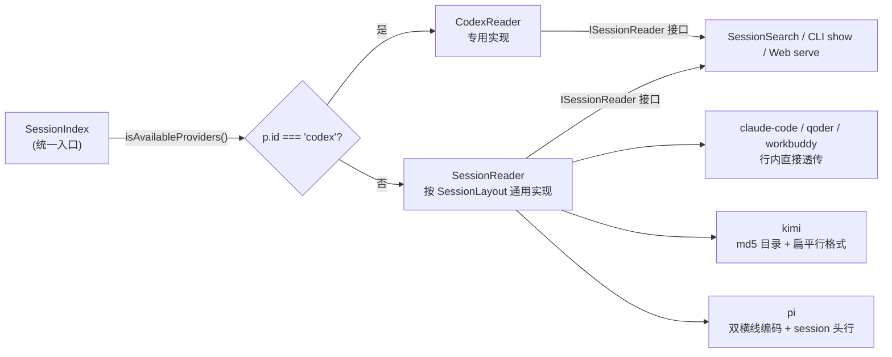
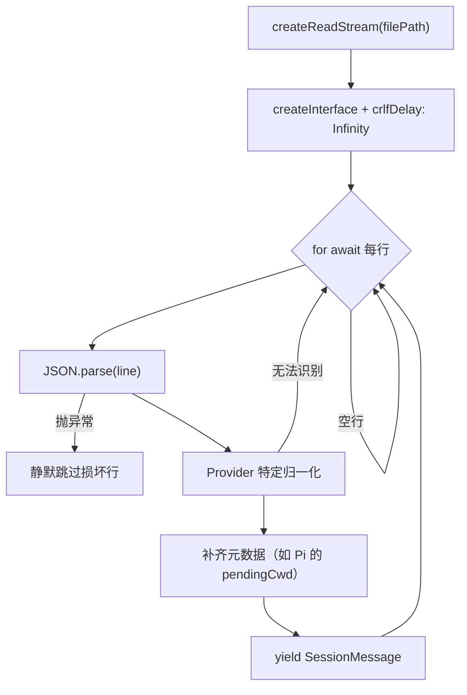

当 super-cli 需要同时理解 8 家 CLI Agent 工具的会话记录时，它面临的第一个现实是：没有任何两家把 Session 存成一模一样的样子。本文深入解析 super-cli 如何用一个统一的读取接口消化这些异构数据——从磁盘布局描述、JSONL 流式读取管线，到各 Provider 行级格式的归一化策略，以及针对 Codex、Kimi、Pi 三家"格式离经叛道者"的专门处理。

## 存储布局全景：SessionLayout 抽象

super-cli 把"一家 CLI 的 Session 存在哪儿、怎么命名"这个问题提炼为一个纯数据结构 `SessionLayout`，包含三个维度：`projectsDir`（项目根目录）、`encoding`（项目目录名如何编码项目路径）、`file`（Session 文件命名模式）。每家 Provider 在注册表中声明自己的布局，没有 `sessionLayout` 的 Provider 则意味着"暂时无法索引其会话"。

从注册表可以清晰看到四类编码（`dash`、`dash-no-prefix`、`double-dash`、`md5`）与三类文件模式（`uuid.jsonl`、`context.jsonl-subdir`、`timestamp_uuid.jsonl`）的组合：

| Provider | sessionLayout | 项目目录编码 | Session 文件形态 |
|---|---|---|---|
| Claude Code | `projects` + `dash` + `uuid.jsonl` | `-Users-alice-work-foo` | `<uuid>.jsonl` |
| Qoder CLI | `projects` + `dash` + `uuid.jsonl` | 同 Claude | `<uuid>.jsonl` |
| Kimi CLI | `sessions` + `md5` + `context.jsonl-subdir` | 32 位 md5 哈希 | `<sessionId>/context.jsonl` |
| Pi CLI | `agent/sessions` + `double-dash` + `timestamp_uuid.jsonl` | `--Users-alice-work-foo--` | `<timestamp>_<uuid>.jsonl` |
| WorkBuddy | `projects` + `dash-no-prefix` + `uuid.jsonl` | `Users-alice-work-foo` | `<uuid>.jsonl` |
| Codex / OpenCode / TraeCode | 无 `sessionLayout` | — | Codex 走专用读取器 |

这个声明式设计让路径解析完全由数据驱动：`getSessionFilePath()` 只需查表判断是"目录下平铺的 `.jsonl` 文件"还是"子目录里的 `context.jsonl`"，`encodeProjectPath()` / `decodeProjectPath()` 同样按 `encoding` 分支处理四种命名方案。

Sources: [providers.ts](src/core/providers.ts#L6-L27), [providers.ts](src/core/providers.ts#L29-L103), [paths.ts](src/core/paths.ts#L61-L77), [paths.ts](src/core/paths.ts#L126-L137)

## 双读取器架构：为什么 Codex 需要专属实现

`SessionIndex` 在构建索引时为每个可用的 Provider 实例化一个读取器，唯一的分支判断发生在构造处：`codex` 走 `CodexReader`，其余全部走通用的 `SessionReader`。两者共同满足 `ISessionReader` 接口定义的七个方法契约——`listProjects`、`listProjectSessions`、`streamSession`、`readSession`、`readSessionMetadata`、`readActiveSessions`、`getSessionFileStats`——上游的索引、搜索、CLI 命令全部面向该接口编程，完全不感知背后是哪种文件格式。

Codex 之所以无法用 `SessionLayout` 表达，根因在于它的目录结构与项目**没有对应关系**：Session 文件按日期嵌套存放（`sessions/YYYY/MM/DD/rollout-<时间戳>-<uuid>.jsonl`），指向哪个项目的信息不在路径里，而在文件**内容**里。因此 `CodexReader` 不得不递归遍历整棵目录树找出所有 `.jsonl` 文件，再读取每个文件的首行 `session_meta` 来确定归属——这是"目录即索引"范式完全失效的场景，值得一个独立实现。

Sources: [session-index.ts](src/core/session-index.ts#L9-L18), [session-index.ts](src/core/session-index.ts#L64-L79), [codex-reader.ts](src/core/codex-reader.ts#L25-L47), [codex-reader.ts](src/core/codex-reader.ts#L49-L52)

## JSONL 流式读取管线：常量内存的逐行消费

两类读取器的核心读取逻辑共享同一个模式：`createReadStream` 打开文件 → `createInterface`（readline）按行切分 → `for await...of` 异步迭代。这个组合的关键价值在于**常量内存**——Claude Code 的会话文件动辄数十 MB 甚至更大，如果一次性 `readFile` 进内存再解析，多次并发索引会轻易压垮 Node 进程；而流式管线在任意时刻只持有一行的字符串。

管线对脏数据的防御是刻意设计：每一行的 `JSON.parse` 都被 try/catch 包裹，损坏的行直接跳过而不中断整个会话的读取；空行也被 `if (!line.trim()) continue` 过滤。这对 JSONL 尤其重要——它是**追加写**的日志型格式，进程崩溃或并发写入完全可能留下半截行，流式解析必须做到"局部容错、整体继续"。

`AsyncGenerator<SessionMessage>` 这个返回类型让消费端也享有流式语义：`readSession()` 在生成器上循环收集为完整数组，`SessionSearch.searchInSession()` 逐条匹配关键词，而 `readSessionMetadata()` 则把同一条流"归约"成统计元数据——三种消费形态共用一条底层管线，无需重复实现解析逻辑。

Sources: [session-reader.ts](src/core/session-reader.ts#L79-L106), [session-reader.ts](src/core/session-reader.ts#L134-L140), [codex-reader.ts](src/core/codex-reader.ts#L117-L139), [session-search.ts](src/core/session-search.ts#L51-L80)

## 行级格式差异：从三种方言到统一消息模型

打开不同 Provider 的 JSONL 文件，每行的 JSON 结构差异显著。`SessionReader.normalizeMessage()` 是通用读取器的**归一化层**，把各家方言翻译成 Claude 风格的 `SessionMessage`（即整个系统内流通的标准消息形状）：

| Provider | 原始行结构 | 归一化策略 |
|---|---|---|
| claude-code / qoder / workbuddy | `{type, message: {role, content, model, usage}, timestamp, cwd, ...}` | **原样透传**：`return raw as unknown as SessionMessage` |
| kimi | 扁平结构 `{role, content, timestamp}`，没有外层 `message` 包装 | 手工搬运字段到 `message: {role, content}` |
| pi | 事件包装 `{type: 'message', message: {role, content, model}, timestamp}` | 校验 `type === 'message'` 且 role 为 user/assistant 后重组 |
| codex | 信封结构 `{timestamp, type, payload}` | 由 `CodexReader.translateMessage()` 单独处理 |

值得注意的取舍是：对 Claude 系的三家做直通转换（而非逐字段拷贝），是因为它们的行结构**就是** `SessionMessage` 的超集——多余字段（如 `uuid`、`parentUuid`、`isSidechain`）在类型上是可选的，透传既零成本又保留完整信息。而 Kimi 和 Pi 的结构差异足够大，必须显式重组。

Codex 的行级差异更为极端：一条用户消息可能是 `{type: 'response_item', payload: {role: 'user', content: [{type: 'input_text', text: '...'}]}}`。`translateMessage()` 只保留 `response_item` 且 role 为 user/assistant 的行，同时把 Codex 特有的内容块类型（`input_text` / `output_text` / `text`）统一翻译成 Claude 风格的 `{type: 'text', text}` 块，其余类型的内容块（工具调用等）被丢弃。

Sources: [session-reader.ts](src/core/session-reader.ts#L108-L132), [codex-reader.ts](src/core/codex-reader.ts#L141-L171), [types.ts](src/core/types.ts#L23-L53), [types.ts](src/core/types.ts#L5-L14)

## 离经叛道者专题：三个必须特判的格式陷阱

**Kimi 的 md5 目录**是一次性哈希——`md5(projectPath)` 无法逆向还原路径。通用读取器的对策是"借道配置文件"：读取 `~/.kimi/kimi.json` 中的 `work_dirs` 列表（其中保存了原始路径），对每个路径正向计算 md5 建立映射表，从而反推出 `encoded → decoded` 的对应关系。这个映射按读取器实例缓存（`md5PathMap`），避免每次列项目都重读配置。项目的发现方式也随之改变：不是 `readdir` 后逐个解码，而是遍历映射表、对每个哈希目录 `stat` 确认存在后才收录。

**Pi 的 cwd 缺失**源于双重问题：`double-dash` 编码本身是有损的（路径中的 `-` 与分隔符无法区分，见"项目路径编码"一节的深入讨论），而 Pi 只在文件**首行的 `session` 元数据事件**中记录真实 `cwd`。`streamSession()` 维护一个 `pendingCwd` 状态：遇到 `type: 'session'` 的头行就暂存其 `cwd`，等第一条真实消息产出时附加到消息上——这样下游的 `readSessionMetadata` 能从消息流中自然取回项目真实路径，绕过了不可靠的目录名解码。

**Codex 的模型归属**则是一个跨行状态问题：模型名不在消息行里，而在独立的 `turn_context` 事件行中。`CodexReader.streamSession()` 用一个 `currentModel` 变量贯穿整个流——先翻译当前行（用之前记录的模型），再检查本行是否是 `turn_context` 并更新模型。由于 `turn_context` 总是在每轮 `response_item` 之前出现，这个顺序保证了 assistant 消息能正确关联到当轮模型。

Sources: [session-reader.ts](src/core/session-reader.ts#L21-L39), [session-reader.ts](src/core/session-reader.ts#L142-L159), [session-reader.ts](src/core/session-reader.ts#L84-L99), [codex-reader.ts](src/core/codex-reader.ts#L124-L138), [paths.ts](src/core/paths.ts#L73-L76)

## 元数据归约：一次流式扫描产出完整画像

`readSessionMetadata()` 是解析管线最重的消费者：它流过整个会话文件，边读边折叠出一份 `SessionMetadata` 画像——首尾时间戳、消息总数、用户/助手消息数、使用过的模型集合、首条用户消息（截取前 200 字符，供列表页预览）、输入/输出 token 累计（仅当行内带 `usage` 时可用，这也是 Claude 系的独有能力）。Codex 版本的实现逻辑一致但事件源不同：`cwd`/git 分支/CLI 版本取自 `session_meta`，模型集合取自 `turn_context`，消息计数取自 `response_item`，并且有个细腻的过滤——提取首条用户消息时会跳过 `<environment_context>` 和 `<skills_instructions>` 这类系统注入的合成提示，避免预览被环境信息污染。

这份画像的生成成本决定了上层的缓存策略：`SessionIndex` 以文件 `mtime` 为指纹缓存元数据（`fileMetaCache`），文件未变化时直接复用上次的全量解析结果。这也是为什么元数据归约必须写成纯函数式的流消费——它可能在任意时刻因缓存失效而被重放。

Sources: [session-reader.ts](src/core/session-reader.ts#L169-L227), [codex-reader.ts](src/core/codex-reader.ts#L181-L246), [codex-reader.ts](src/core/codex-reader.ts#L248-L261), [session-index.ts](src/core/session-index.ts#L117-L126)

## 首行探测：Codex 项目发现的最小读取策略

Codex 的 `listProjects` / `listProjectSessions` 需要知道每个文件属于哪个项目，但完整解析每个会话文件代价太高。`readFirstLine()` 提供了一个**早停流式读取**：打开流、读到第一条可解析的行后立即 `rl.close()` 并 `stream.destroy()`，只消费几 KB 就完成判断。由于 Codex 保证每个 rollout 文件的首行总是 `session_meta`（携带 `cwd`），这个"读一行就知道归属"的假设是可靠的。项目目录映射则通过 `encodeProjectPath(cwd)` 正向计算哈希键，保证与 Claude 系的项目目录命名空间互通。

Sources: [codex-reader.ts](src/core/codex-reader.ts#L54-L73), [codex-reader.ts](src/core/codex-reader.ts#L75-L91), [codex-reader.ts](src/core/codex-reader.ts#L93-L107)

## 优雅降级：解析层 never-throw 原则

纵观整个解析层，有一条贯穿始终的纪律：**任何单点失败都不应让上层感知**。目录不可读时 `listProjects` 返回空数组而非抛错（session-reader.ts 与 codex-reader.ts 中的 `catch { return [] }`）；损坏行跳过；md5 映射文件缺失时退化为"哈希即名字"。这让 super-cli 在面对半损坏的 `~/.claude`、权限受限的目录或用户手工编辑过的文件时，依然能产出可用的索引。代价是错误被静默吞掉——但对一个只读的观测型工具而言，部分数据好过没有数据，这个取舍是合理的。

Sources: [session-reader.ts](src/core/session-reader.ts#L41-L49), [session-reader.ts](src/core/session-reader.ts#L100-L104), [codex-reader.ts](src/core/codex-reader.ts#L29-L43), [session-index.ts](src/core/session-index.ts#L133-L136)

## 延伸阅读

- 想理解元数据画像如何被 TTL 缓存与后台预热消费，请继续阅读 [Session 索引引擎：TTL 缓存、mtime 失效与后台预热](8-session-suo-yin-yin-qing-ttl-huan-cun-mtime-shi-xiao-yu-hou-tai-yu-re)
- 项目目录编码（dash/md5/双横线）的完整规则与歧义处理，见 [项目路径编码：跨 Provider 的目录命名映射与解码](10-xiang-mu-lu-jing-bian-ma-kua-provider-de-mu-lu-ming-ming-ying-she-yu-jie-ma)
- 想看流式解析如何支撑跨会话搜索，见 [跨 Session 全文搜索与命中高亮实现](11-kua-session-quan-wen-sou-suo-yu-ming-zhong-gao-liang-shi-xian)
- 若想从使用者视角回顾这些数据如何暴露为 CLI 命令，可回顾 [CLI 命令全景：list、show、search、issue 与 --json 输出](3-cli-ming-ling-quan-jing-list-show-search-issue-yu-json-shu-chu)